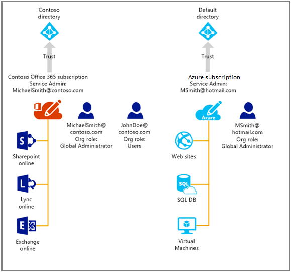

<properties
   pageTitle="Manage the directory for your Office 365 subscription in Azure | Microsoft Azure"
   description="Managing an Office 365 subscription directory using Azure Active Directory and the Azure classic portal"
   services="active-directory"
   documentationCenter=""
   authors="curtand"
   manager="femila"
   editor=""/>

<tags
   ms.service="active-directory"
   ms.devlang="na"
   ms.topic="get-started-article"
   ms.tgt_pltfrm="na"
   ms.workload="identity"
   ms.date="06/03/2016"
   ms.author="curtand"/>

# Manage the directory for your Office 365 subscription in Azure

This article describes how to manage a directory that was created for an Office 365 subscription, using the Azure classic portal. You must be either the Service Administrator or a co-administrator of an Azure subscription to sign in to the Azure classic portal. If you don’t yet have an Azure subscription, you can sign up for a [free 30-day trial](https://azure.microsoft.com/trial/get-started-active-directory/) today and deploy your first cloud solution in under 5 minutes, using this link. Be sure to use the work or school account that you use to sign in to Office 365.

After you complete the Azure subscription, you can sign in to the Azure classic portal and access Azure services. Click the Active Directory extension to manage the same directory that authenticates your Office 365 users.

If you do already have an Azure subscription, the process to manage an additional directory is also straightforward. For example, Michael Smith might have an Office 365 subscription for Contoso.com. He also has an Azure subscription that he signed up for by using his Microsoft account, msmith@hotmail.com. In this case, he manages two directories.

  Subscription |  Office 365  |  Azure
  -------------- | ------------- | -------------------------------
  Display name |  Contoso  |     Default Azure Active Directory (Azure AD) directory
  Domain name  |  contoso.com  | msmithhotmail.onmicrosoft.com

He wants to manage the user identities in the Contoso directory while he is signed in to Azure using his Microsoft account, so that he can enable Azure AD features such as multifactor authentication. The following diagram may help to illustrate the process.

In this case, the two directories are independent of each other.

## To manage two independent directories
In order for Michael Smith to manage both directories while he is signed in to Azure as msmith@hotmail.com, he must complete the following steps:

> [AZURE.NOTE]
> These steps can be completed only when a user is signed in with a Microsoft account. If the user is signed in with a work or school account, the option to **Use existing directory** isn't available. A work or school account can be authenticated only by its home directory (that is, the directory where the work or school account is stored, and that the business or school owns).

1.	Sign in to the [Azure classic portal](https://manage.windowsazure.com) as msmith@hotmail.com.
2.	Click **New** > **App services** > **Active Directory** > **Directory** > **Custom Create**.
3.	Click Use existing directory and select the **I am ready to be signed out now** checkbox.
4.	Sign in to the Azure classic portal as global admin of Contoso.onmicrosoft.com (for example, msmith@contoso.com).
5.	When prompted to **Use the Contoso directory with Azure?**, click **Continue**.
6.	Click **Sign out now**.
7.	Sign in to the Azure classic portal as msmith@hotmail.com. The Contoso directory and the Default directory appear in the Active Directory extension.

After completing these steps, msmith@hotmail.com is a global administrator in the Contoso directory.

## To administer resources as the global admin
Now let’s suppose that Jane Doe needs administer websites and database resources that are associated with the Azure subscription for msmith@hotmail.com. Before she can do that, Michael Smith needs to complete these additional steps:

1.	Sign in to the [Azure classic portal](https://manage.windowsazure.com) using the Service Administrator account for the Azure subscription (in this example, msmith@hotmail.com).
2.	Transfer the subscription to the Contoso directory: click **Settings** > **Subscriptions** > select the subscription > **Edit Directory** > select **Contoso (Contoso.com)**. As part of the transfer, any work or school accounts that are co-administrators of the subscription are removed.
3.	Add Jane Doe as co-administrator of the subscription: click **Settings** > **Administrators** > select the subscription > **Add** > type **JohnDoe@Contoso.com**.

## Next steps
For more information about the relationship between subscriptions and directories, see [How a subscription is associated with a directory](active-directory-how-subscriptions-associated-directory.md).
