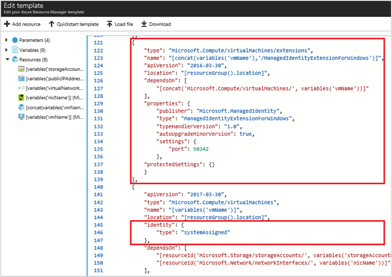

# Configure an Azure VM Managed Service Identity (MSI) using a template

## Prerequisites

[!INCLUDE [active-directory-msi-qs-configure-prereqs](../../includes/active-directory-msi-qs-configure-prereqs.md)]

## Enable MSI during creation of an Azure VM, or on an existing VM

As with the Azure portal and scripting, Azure Resource Manager templates provide the ability to deploy new/modified resources defined by an Azure resource group. Several options are available for template editing and deployment, including both locally and portal/web based. A few of which include:

  - Using a [custom template from Azure marketplace](../azure-resource-manager/resource-group-template-deploy-portal.md#deploy-resources-from-custom-template), which allows you to create a template from scratch, or base it on an existing common or [QuickStart template](https://azure.microsoft.com/documentation/templates/).
  - Deriving from an existing resource group, by exporting a template from either [the original deployment](../azure-resource-manager/resource-manager-export-template.md#view-template-from-deployment-history), or from the [current state of the deployment](../azure-resource-manager/resource-manager-export-template.md#export-the-template-from-resource-group).
  - Using a local [JSON editor (such as VS Code)](../azure-resource-manager/resource-manager-create-first-template.md), then upload/deploy using PowerShell or CLI.
  - Using Visual Studio's [Azure Resource Group project](../azure-resource-manager/vs-azure-tools-resource-groups-deployment-projects-create-deploy.md) to both create and deploy template.

Regardless of the path you take, and because templates work the same during initial deployment or redeployment, you enable MSI on a new or existing VM in the same manner. Also, by default Azure Resource Manager will do an [incremental update](../azure-resource-manager/resource-group-template-deploy.md#incremental-and-complete-deployments) to your deployment, which is assumed here:

1. After loading the template into an editor for updating, locate the `Microsoft.Compute/virtualMachines` resource of interest within the `resources` section of the template. Your properties may look slightly different from this screen shot, depending on the editor you're using and whether you are editing a template for a new deployment or existing one:

    

2. Add the `"identity"` property at the same level as the `"type": "Microsoft.Compute/virtualMachines"` property using the following syntax:

   ```JSON
   "identity": { 
       "type": "systemAssigned"
   },
   ```

3. Then add the VM MSI extension as a `resources` element using the following syntax:

>[!NOTE] 
> The example below assumes you have the `vmName` and `roleAssignmentId` variables defined in your template.
> 
> In this example, a Windows VM extension (`ManagedIdentityExtensionForWindows`) in configured, but you may also configure for Linux using `ManagedIdentityExtensionForLinux` instead.
>

   ```JSON
   { 
       "type": "Microsoft.Compute/virtualMachines/extensions",
       "name": "[concat(variables('vmName'),'/ManagedIdentityExtensionForWindows')]",
       "apiVersion": "2016-03-30",
       "location": "[resourceGroup().location]",
       "dependsOn": [
           "[concat('Microsoft.Compute/virtualMachines/', variables('vmName'))]"
       ],
       "properties": {
           "publisher": "Microsoft.ManagedIdentity",
           "type": "ManagedIdentityExtensionForWindows",
           "typeHandlerVersion": "1.0",
           "autoUpgradeMinorVersion": true,
           "settings": {
               "port": 50342
           },
           "protectedSettings": {}
       }
   }
   ```

   ```JSON
   {
       "type": "Microsoft.Compute/virtualMachines/extensions",
       "name": "myVM/MSIExtension",
       "apiVersion": "2017-03-30",
       "location": "westus",
       "properties": {
           "publisher": "Microsoft.ManagedIdentity",
           "type": "ManagedIdentityExtensionForWindows",
           "typeHandlerVersion": "1.0",
           "autoUpgradeMinorVersion": true,
           "settings": {
               "port": 50342
           }
       },
       "dependsOn": [
           "Microsoft.Compute/virtualMachines/myVM"
       ]
   },   
   ```

4. When you're done, the VM resource in your template should look like the following screen shot:

    


## Remove MSI from an Azure VM

If you have a Virtual Machine that no longer needs an MSI, you can remove the VM's MSI:

   ```JSON
   ```

## Related content

- [Managed Service Identity overview](active-directory-msi-qs-configure-portal-windows-vm.md)

## Next steps

- Assign an MSI access to Azure Resource Manager
- Get a token using Managed Service Identity 

Use the following comments section to provide feedback and help us refine and shape our content.

<!--Reference style links IN USE -->
[AAD-App-Branding]: ./active-directory-branding-guidelines.md

<!--Image references-->
[AAD-Sign-In]: ./media/active-directory-devhowto-multi-tenant-overview/sign-in-with-microsoft-light.png
