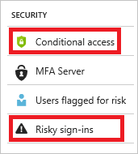

# Configure named locations in Azure Active Directory

With named locations, you can label trusted IP address ranges in your organization. Azure Active Directory uses  named locations in the context of:

- The detection of [risk events](reports-monitoring/concept-risk-events.md) to reduce the number of reported false positives.  

- [Location-based conditional access](conditional-access/location-condition.md).

This article explains, how you can configure named locations in your environment.

## Entry points

You can access the named location configuration page in the **Security** section of the Azure Active Directory page by clicking:

- **Conditional access:**

    - In the **Manage** section, click **Named locations**.
    
	    

- **Risky sign-ins:**

    - In the toolbar on the top, click **Add known IP address ranges**.

	   

## Configuration example

**To configure a named location:**

1. Sign in to the [Azure portal](https://portal.azure.com) as global administrator.

2. In the left pane, click **Azure Active Directory**.

	

3. On the **Azure Active Directory** page, in the **Security** section, click **Conditional access**.

	

4. On the **Conditional Access** page, in the **Manage** section, click **Named locations**.

	

5. On the **Named locations** page, click **New location**.

	

6. On the **New** page, do the following:

	

    a. In the **Name** box, type a name for your named location.

    b. In the **IP ranges** box, type an IP range. The IP range needs to be in the *Classless Inter-Domain Routing* (CIDR) format.  

    c. Click **Create**.

## Next steps

For more information, see:

- [Conditional access in Azure Active Directory](active-directory-conditional-access-azure-portal.md).

- [Location conditions in Azure Active Directory conditional access](conditional-access/location-condition.md)

- [Azure Active Directory risk events](reports-monitoring/concept-risk-events.md).

- [Risky sign-ins report in the Azure Active Directory portal](reports-monitoring/concept-risky-sign-ins.md).  
