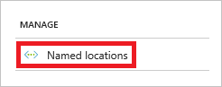
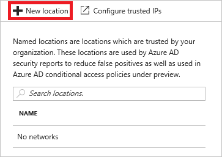
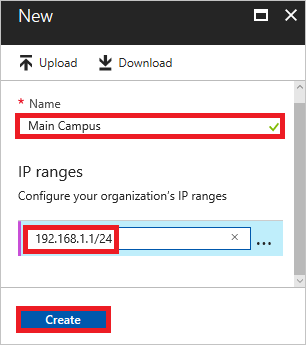
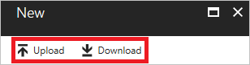

# Named locations in Azure Active Directory

With the named locations feature of Azure Active Directory, you can label trusted IP address ranges in your organizations. In your environment, you can use named locations in the context of the detection of [risk events](active-directory-reporting-risk-events.md). The feature helps reduce the number of reported false positives for the *Impossible travel to atypical locations* risk event type. 

## Configuration

To configure a named location:

1. Sign in to the [Azure portal](https://portal.azure.com) as global administrator.

2. In the left pane, click **Azure Active Directory**.

	

3. On the **Azure Active Directory** blade, in the **Security** section, click **Conditional access**.

	

4. On the **Conditional Access** blade, in the **Manage** section, click **Named locations**.

	

5. On the **Named locations** blade, click **New location**.

	

6. On the **New** blade, do the following:

	

    a. In the **Name** box, type a name for your named location.

    b. In the **IP ranges** box, type an IP range. The IP range needs to be in the *Classless Inter-Domain Routing* (CIDR) format.  

    c. Click **Create**.

## What you should know

**Bulk updates**: When you create or update named locations, for bulk updates, you can upload or download a CSV file with the IP ranges. An upload adds the IP ranges in the file to the list instead of overwriting the list.

**Limitations**: You can define a maximum of 60 named locations, with one IP range assigned to each of them. If you have just one named location configured, you can define up to 500 IP ranges for it.

## Next steps

To learn more about risk events, see [Azure Active Directory risk events](active-directory-reporting-risk-events.md).

