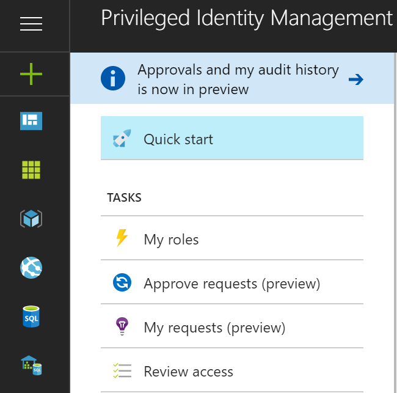
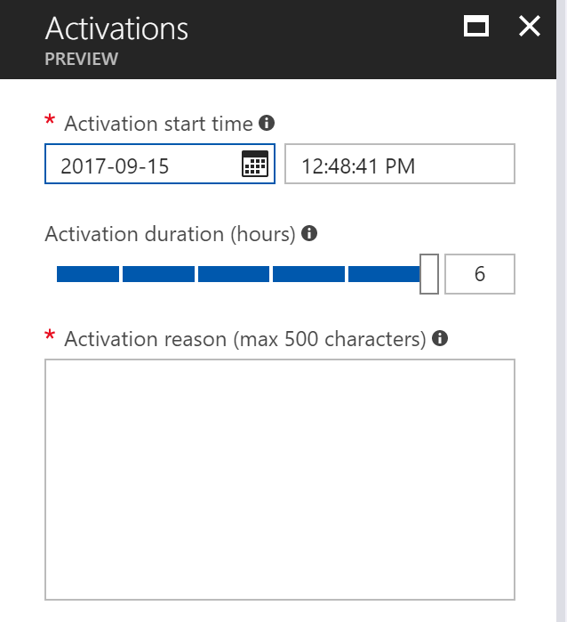
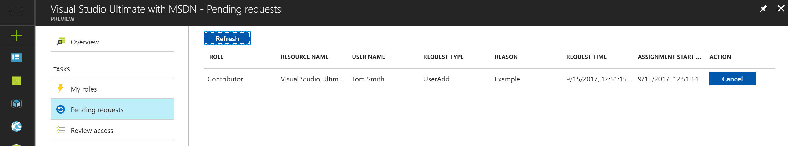
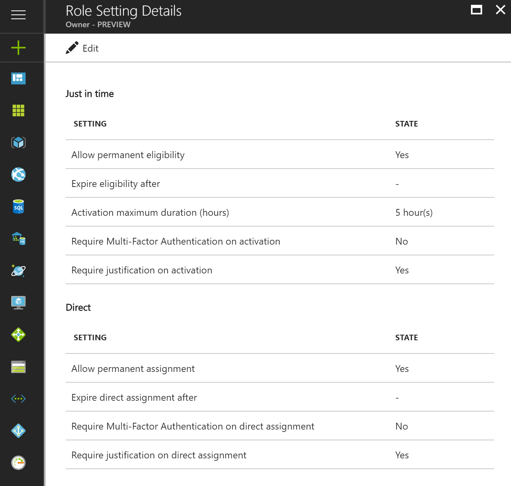

---
title: Configure Azure AD Privileged Identity Management | Microsoft Docs
description: A topic that explains what Azure AD Privileged Identity Management is and how to use PIM to improve your cloud security.
services: active-directory
documentationcenter: ''
author: barclayn
manager: mbaldwin
editor: ''

ms.assetid: c548ed2e-06e3-4eaf-a63d-0f02ee72da25
ms.service: active-directory
ms.workload: identity
ms.tgt_pltfrm: na
ms.devlang: na
ms.topic: article
ms.date: 09/18/2017
ms.author: barclayn
ms.custom: pim 
---
# What is Azure AD Privileged Identity Management?

With Azure Active Directory (AD) Privileged Identity Management, you can manage, control, and monitor access within your organization. This includes access to resources in Azure AD, Azure Resources (Preview), and other Microsoft Online Services like Office 365 or Microsoft Intune.

> [!NOTE]
> Privileged Identity Management is available to your entire organization when you license your Administrators with the Premium P2 edition of Azure Active Directory. For more information, see [Azure Active Directory editions](active-directory-editions.md).

Organizations want to minimize the number of people who have access to secure information or resources, because that reduces the chance of a malicious user getting that access, or an authorized user inadvertently impacting a sensitive resource.  However, users still need to carry out privileged operations in Azure AD, Azure, Office 365, or SaaS apps. Organizations can give users privileged access to Azure resources like Subscriptions, and Azure AD. There is a need for oversight for what those users are doing with their admin privileges. Azure AD Privileged Identity Management helps to mitigate the risk of excessive, unnecessary or misused access rights.

Azure AD Privileged Identity Management helps your organization:

- See which users are assigned privileged roles to manage Azure resources (Preview), as well as which users are assigned administrative roles in Azure AD
- Enable on-demand, "just in time" administrative access to Microsoft Online Services like Office 365 and Intune, and to Azure resources (Preview) of subscriptions, resource groups, and individual resources such as Virtual Machines 
-	See a history of administrator activation, including what changes administrators made to Azure resources (Preview)
- Get alerts about changes in administrator assignments
- Require approval to activate Azure AD privileged admin roles (Preview) 
- Review membership of administrative roles and require users to provide a justification for continued membership

In Azure AD, Azure AD Privileged Identity Management can manage the users assigned to the built-in Azure AD organizational roles, such as Global Administrator. In Azure, Azure AD Privileged Identity Management can manage the users and groups assigned via Azure RBAC roles, including Owner or Contributor.

## Just in time administrator access

Historically, you could assign a user to an admin role through the Azure portal, other Microsoft Online Services portals, or the Azure AD cmdlets in Windows PowerShell. As a result, that user becomes a **permanent admin**, always active in the assigned role. Azure AD Privileged Identity Management introduces the concept of an **eligible admin**. Eligible admins should be users that need privileged access now and then, but not all-day, every day. The role is inactive until the user needs access, then they complete an activation process and become an active admin for a predetermined amount of time. More and more organizations are choosing to use this approach for reducing or eliminating “standing admin access” to privileged roles.

## Enable Privileged Identity Management for your directory

You can start using Azure AD Privileged Identity Management in the [Azure portal](https://portal.azure.com/).

> [!NOTE]
> You must be a global administrator with an organizational account (for example, @yourdomain.com), not a Microsoft account (for example, @outlook.com), to enable Azure AD Privileged Identity Management for a directory.

1. Sign in to the [Azure portal](https://portal.azure.com/) as a global administrator of your directory.
2. If your organization has more than one directory, select your username in the upper right-hand corner of the Azure portal. Select the directory where you will use Azure AD Privileged Identity Management.
3. Select **More services** and use the Filter textbox to search for **Azure AD Privileged Identity Management**.
4. Check **Pin to dashboard** and then click **Create**. The Privileged Identity Management application opens.

If you're the first person to use Azure AD Privileged Identity Management in your directory and you navigate to Azure AD directory roles,  aand you navigate to Azure AD directory roles,  a [security wizard](active-directory-privileged-identity-management-security-wizard.md) walks you through the initial assignment experience. After that you automatically become the first **Security administrator** and **Privileged role administrator** of the directory.

For Azure AD roles, only a user who is in the Privileged Role Administrator role can manage assignments for other administrators in Azure AD PIM. You can [give other users the ability to manage directory roles in PIM](active-directory-privileged-identity-management-how-to-give-access-to-pim.md). Global Administrators, Security Administrators and Security Readers can view assignments to Azure AD roles in Azure AD PIM.
For Azure RBAC roles, only a subscription administrator, a resource owner, or a resource user access administrator can manage assignments for other administrators in Azure AD PIM.  Users who are Privileged Role Administrators, Security Administrators or Security Readers do not by default have access to view assignments to Azure RBAC roles in Azure AD PIM.

## Privileged Identity Management Overview (Entry Point)

Azure AD Privileged Identity Management supports administration of Azure AD directory roles, and roles for Azure Resources (Preview). The function of roles for Azure resources differ from administrative roles in Azure AD. Azure resource roles provide granular permissions for the resource at which they are assigned, and all subordinate resources in the resource hierarchy (known as inheritance). [Learn more about RBAC, resource hierarchy and inheritance](role-based-access-control-configure.md). PIM for both Azure AD directory roles, and Azure Resources (Preview) can be administered by accessing the appropriate link under the Manage section of the PIM Overview entry point left navigation menu.

PIM provides convenient access to activate roles, view pending activations/requests, pending approvals (for Azure AD directory roles), and reviews pending your response from the Tasks section of the left navigation menu.

When accessing any of the Tasks menu items from the Overview entry point, the resulting view contains results for both Azure AD directory roles and Azure Resource roles (Preview).

My roles contain a list of active and eligible role assignments for Azure AD directory roles, and Azure Resource roles (Preview). [Learn more about activating eligible role assignments](active-directory-privileged-identity-management-how-to-activate-role.md).

Activating roles for Azure Resources (Preview) introduces a new experience that allows eligible members of a role to schedule activation for a future date/time and select a specific activation duration within the maximum allowed by administrators.

In the event a scheduled activation is no longer required, users can cancel their pending request by navigating to pending requests from the left navigation menu and clicking the Cancel button in-line with that request.

## Privileged Identity Management admin dashboard

Azure AD Privileged Identity Manager provides an admin dashboard that gives you important information such as:

* Alerts that point out opportunities to improve security
* The number of users who are assigned to each privileged role  
* The number of eligible and permanent admins
* A graph of privileged role activations in your directory
*	The number of Just-In-Time, Time-bound, and Permanent assignments for Azure Resource roles (Preview)
*	Users and groups with new role assignments in the last 30 days (Azure Resource roles)

![PIM dashboard - screenshot][2]

## Privileged role management

With Azure AD Privileged Identity Management, you can manage the administrators by adding or removing permanent or eligible administrators to each role for Azure AD directory roles. With PIM for Azure Resources (Preview), Owners, User Access Administrators, and Global Administrators that enable management of Subscriptions in their tenant can assign users or groups to Azure resource roles as eligible (Just-In-Time access), or Time-bound (activation not required) access with a start and end date/time, or permanent (if enabled in the role settings).

![PIM add/remove administrators - screenshot][3]

## Configure the role activation settings

Using the [role settings](active-directory-privileged-identity-management-how-to-change-default-settings.md) you can configure the eligible role activation properties for Azure AD directory roles including:

* The duration of the role activation period
* The role activation notification
* The information a user needs to provide during the role activation process
* Service ticket or incident number
* [Approval workflow requirements - Preview](./privileged-identity-management/azure-ad-pim-approval-workflow.md)

![PIM settings - administrator activation - screenshot][4]

Note that in the image, the buttons for **Multi-Factor Authentication** are disabled. For certain, highly privileged roles, we require MFA for heightened protection.

Role settings for Azure Resource roles (Preview) allow administrators to configure Just-In-Time and Direct assignment settings including:

- The ability to assign user or groups to roles without an end date/time (permanent assignment)
- The default duration of an assignment (when not permanent)
- The maximum activation duration (when an eligible role member activates)
- The information a user needs to provide during the role activation (Just-In-Time assignments) or the assignment process (direct assignments)

## Role activation

To [activate a role](active-directory-privileged-identity-management-how-to-activate-role.md), an eligible admin requests a time-bound "activation" for the role. The activation can be requested using the **Activate my role** option in Azure AD Privileged Identity Management.

An admin who wants to activate a role needs to initialize Azure AD Privileged Identity Management in the Azure portal.

Role activation is customizable. In the PIM settings, you can determine the length of the activation and what information the admin needs to provide to activate the role.

![PIM administrator request role activation - screenshot][5]

## Review role activity

There are two ways to track how your employees and admins are using privileged roles. The first option is using [Directory Roles audit history](active-directory-privileged-identity-management-how-to-use-audit-log.md). The audit history logs track changes in privileged role assignments, role activation history, and and changes to settings for Azure Resource roles (Preview). 

![PIM activation history - screenshot][6]

The second option is to set up regular [access reviews](active-directory-privileged-identity-management-how-to-start-security-review.md). These access reviews can be performed by and assigned reviewer (like a team manager) or the employees can review themselves. This is the best way to monitor who still requires access, and who no longer does.

## Azure AD PIM at subscription expiration

A tenant must have an Azure AD Premium P2 (or EMS E5) trial or paid subscription in their tenant before using Azure AD PIM.  Furthermore, licenses must be assigned to the administrators of the tenant.  Specifically, licenses must be assigned to administrators in Azure AD roles managed through Azure AD PIM, administrators in Azure RBAC roles managed through Azure AD PIM, and any non-administrator users who perform access reviews.
If your organization does not renew Azure AD Premium P2 or your trial expires, the Azure AD PIM features will no longer be available in your tenant, eligible role assignments will be removed and users will no longer be able to activate roles. You can read more in the  [Azure AD PIM subscription requirements](./privileged-identity-management/subscription-requirements.md)

## Next steps

[!INCLUDE [active-directory-privileged-identity-management-toc](../../includes/active-directory-privileged-identity-management-toc.md)]

<!--Image references-->

[1]: ./media/active-directory-privileged-identity-management-configure/PIM_EnablePim.png
[2]: ./media/active-directory-privileged-identity-management-configure/PIM_Admin_Overview.png
[3]: ./media/active-directory-privileged-identity-management-configure/PIM_AddRemove.png
[4]: ./media/active-directory-privileged-identity-management-configure/PIM_Settings_w_Approval_Disabled.png
[5]: ./media/active-directory-privileged-identity-management-configure/PIM_RequestActivation.png
[6]: ./media/active-directory-privileged-identity-management-configure/PIM_ActivationHistory.png
