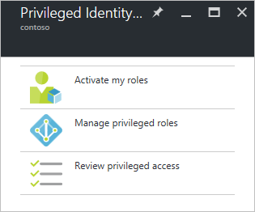

# Start using Azure AD Privileged Identity Management
With Azure Active Directory (AD) Privileged Identity Management, you can manage, control, and monitor access within your organization. This includes access to resources in Azure AD and other Microsoft online services like Office 365 or Microsoft Intune.

This article tells you how to add the Azure AD PIM app to your Azure portal dashboard.

## Add the Privileged Identity Management application
Before you use Azure AD Privileged Identity Management, you need to add the application to your Azure portal dashboard.

1. Sign in to the [Azure portal](https://portal.azure.com/) as a global administrator of your directory.
2. If your organization has more than one directory, select your username in the upper right-hand corner of the Azure portal. Select the directory where you will use PIM.
3. Select **More services** and use the Filter textbox to search for **Azure AD Privileged Identity Management**.
4. Check **Pin to dashboard** and then click **Create**. The Privileged Identity Management application opens.

If you're the first person to use Azure AD Privileged Identity Management in your directory, then the [security wizard](active-directory-privileged-identity-management-security-wizard.md) walks you through the initial assignment experience. After that, you will automatically become the first **Security administrator** and **Privileged role administrator** of the directory. Only a privileged role administrator can access this application to manage the access for other administrators.  

## Navigate to your tasks
Once Azure AD Privileged Identity Management is set up, you'll see the navigation blade whenever you open the application. Use this blade to accomplish your identity management tasks.

* **Activate my roles** takes you to the list of roles that are assigned to you. This is where you will activate any roles that you are eligible for.
* **Manage privileged roles** is the dashboard for privileged role admins to manage role assignments, change role activation settings, start access reviews, and more. The options in this dashboard are disabled for anyone who isn't a privileged role administrator.
* **Review privileged access** takes you to any pending access reviews that you need to complete, whether you're reviewing access for yourself or someone else. 

## Next steps
The [Azure AD Privileged Identity Management overview](active-directory-privileged-identity-management-configure.md) includes more details on how you can manage administrative access in your organization.

[!INCLUDE [active-directory-privileged-identity-management-toc](../../includes/active-directory-privileged-identity-management-toc.md)]

<!--Image references-->

[1]: ./media/active-directory-privileged-identity-management-configure/PIM_EnablePim.png
