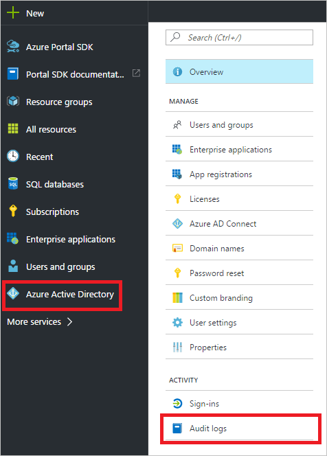
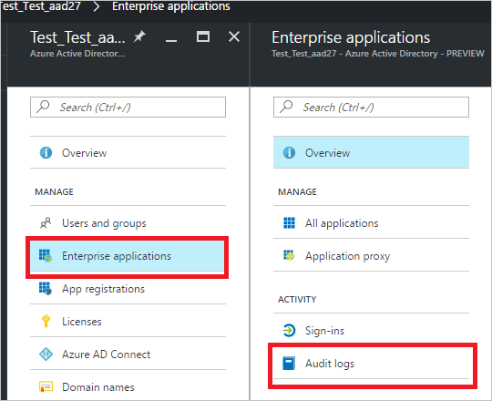

# Audit activity reports in the Azure Active Directory portal - preview

With reporting in the Azure Active Directory [preview](active-directory-preview-explainer.md), you get all the information you need to determine how your environment is doing.

The reporting architecture in Azure Active Directory consists of the following components:

- **Activity** 
    - **Sign-in activities** – Information about the usage of managed applications and user sign-in activities
    - **Audit logs** - System activity information about users and group management, your managed applications and directory activities.
- **Security** 
    - **Risky sign-ins** - A risky sign-in is an indicator for a sign-in attempt that might have been performed by someone who is not the legitimate owner of a user account. For more details, see Risky sign-ins.
    - **Users flagged for risk** - A risky user is an indicator for a user account that might have been compromised. For more details, see Users flagged for risk.

This topic gives you an overview of the audit activities.
 

## Audit logs

The audit logs in Azure Active Directory provide records of system activities for compliance.  
Your first entry point to all auditing data is **Audit logs** in the **Activity** section of **Azure Active Directory**.

An audit log has a default list view that shows:

- the date and time of the occurrence
- the initiator / actor (*who*) of an activity 
- the activity (*what*) 
- the target

You can customize the list view by clicking **Columns** in the toolbar.

This enables you to display additional fields or remove fields that are already displayed.

By clicking an item in the list view, you get all available details about it.

## Filtering audit logs

To narrow down the reported data to a level that works for you, you can filter the audit data using the following fields:

- Date range
- Initiated by (Actor)
- Category
- Activity resource type
- Activity

The **date range** filter enables to you to define a timeframe for the returned data.  
Possible values are:

- 1 month
- 7 days
- 24 hours
- Custom

When you select a custom timeframe, you can configure a start time and an end time.

The **initiated by** filter enables you to define an actor's name or its universal principal name (UPN).

The **category** filter enables you to select one of the following filter:

- All
- Core category
- Core directory
- Self-service password management
- Self-service group management
- Account provisioning
- Automated password rollover
- invited users
- MIM service

The **activity resource type** filter enables you to select one of the following filters:

- All 
- Group
- Directory
- User
- Application
- Policy
- Device
- Other

When you select **Group** as **activity resource type**, you get an additional filter category that enables you to also provide a **Source**:

- Azure AD
- O365

The **activity** filter is based on the category and Activity resource type selection you make. You can select a specific activity you want to see or choose all. 

| Activity Category| Activity Resource Type| Activity |
| :-- | :-: | :-- |
| Core Directory| Group| Delete Group Settings|
| Core Directory| Directory| Update Domain|
| Core Directory| Directory| Remove Partner From Company|
| Core Directory| User| Update Role|
| Core Directory| User| Add Role From Template|
| Core Directory| Group| Add App Role Assignment To Group|
| Core Directory| Group| Start Applying Group Based License To Users|
| Core Directory| Application| Add Service Principal|
| Core Directory| Policy| Update Policy|
| Core Directory| Policy| Add Policy To Service Principal|
| Core Directory| Device| Add Registered Owner To Device|
| Core Directory| Device| Add Registered Users To Device|
| Core Directory| Device| Update Device Configuration|
| Self-service Password Management| User| Reset Password (Self-Service)|
| Self-service Password Management| User| Unlock User Account (Self-Service)|
| Self-service Password Management| User| Reset Password (By Admin)|
| Self-service Group Management| Group| Delete A Pending Request To Join A Group|
| Account Provisioning| Application| Process Escrow|
| Automated Password Rollover| Application| Automated Password Rollover|
| Invited Users| Other| Batch Invites Processed|
| Core Directory| Directory| Remove Verified Domain|
| Core Directory| Directory| Add Unverified Domain|
| Core Directory| Directory| Add Verified Domain|
| Core Directory| Directory| Set Directory Feature On Tenant|
| Core Directory| Directory| Set Dirsyncenabled Flag|
| Core Directory| Directory| Create Company Settings|
| Core Directory| Directory| Update Company Settings|
| Core Directory| Directory| Delete Company Settings|
| Core Directory| Directory| Set Company Allowed Data Location|
| Core Directory| Directory| Set Company Multinational Feature Enabled|
| Core Directory| User| Update User|
| Core Directory| User| Delete User|
| Core Directory| Group| Remove Member From Group|
| Core Directory| Group| Set Group License|
| Core Directory| Group| Create Group Settings|
| Core Directory| Application| Update Service Principal|
| Core Directory| Application| Delete Application|
| Core Directory| Application| Update Application|
| Core Directory| Application| Remove Service Principal|
| Core Directory| Application| Add Service Principal Credentials|
| Core Directory| Application| Remove App Role Assignment From Service Principal|
| Core Directory| Application| Remove Owner From Application|
| Core Directory| Device| Remove Registered Owner From Device|
| Self-service Password Management| User| Self-Serve Password Reset Flow Activity Progress|
| Account Provisioning| Application| Administration|
| Account Provisioning| Application| Directory Operation|
| MIM Service| Group| Remove Member|
| Core Directory| Policy| Delete Policy|
| Invited Users| User| Viral Tenant Creation|
| Core Directory| Directory| Update External Secrets|
| Core Directory| Directory| Set Rights Management Properties|
| Core Directory| Directory| Update Company|
| Core Directory| User| Add User|
| Core Directory| User| Convert Federated User To Managed|
| Core Directory| User| Create Application Password For User|
| Core Directory| Group| Add Member To Group|
| Core Directory| Group| Add Group|
| Core Directory| Application| Consent To Application|
| Core Directory| Application| Add Application|
| Core Directory| Application| Add Owner To Service Principal|
| Core Directory| Application| Remove Oauth2Permissiongrant|
| Core Directory| Policy| Remove Policy Credentials|
| Core Directory| Device| Delete Device Configuration|
| Self-service Group Management| Group| Set Dynamic Group Properties|
| Self-service Group Management| Group| Update Lifecycle Management Policy|
| Account Provisioning| Application| Synchronization Rule Action|
| Invited Users| Other| Batch Invites Uploaded|
| MIM Service| Group| Add Member|
| Core Directory| User| Set License Properties|
| Core Directory| User| Restore User|
| Core Directory| User| Remove Member From Role|
| Core Directory| User| Remove App Role Assignment From User|
| Core Directory| User| Remove Scoped Member From Role|
| Core Directory| Group| Update Group|
| Core Directory| Group| Add Owner To Group|
| Core Directory| Group| Finish Applying Group Based License To Users|
| Core Directory| Group| Remove App Role Assignment From Group|
| Core Directory| Group| Set Group To Be Managed By User|
| Core Directory| Application| Add Oauth2Permissiongrant|
| Core Directory| Application| Add App Role Assignment To Service Principal|
| Core Directory| Application| Remove Service Principal Credentials|
| Core Directory| Policy| Remove Policy From Service Principal|
| Core Directory| Device| Update Device|
| Core Directory| Device| Add Device|
| Core Directory| Device| Add Device Configuration|
| Self-service Password Management| User| Change Password (Self-Service)|
| Self-service Password Management| User| User Registered For Self-Service Password Reset|
| Self-service Group Management| Group| Approve A Pending Request To Join A Group|
| Core Directory| Directory| Remove Unverified Domain|
| Core Directory| Directory| Verify Domain|
| Core Directory| Directory| Set Domain Authentication|
| Core Directory| Directory| Set Password Policy|
| Core Directory| Directory| Add Partner To Company|
| Core Directory| Directory| Promote Company To Partner|
| Core Directory| Directory| Set Partnership|
| Core Directory| Directory| Set Accidental Deletion Threshold|
| Core Directory| Directory| Demote Partner|
| Invited Users| User| Invite External User|
| Account Provisioning| Application| Import|
| Core Directory| Application| Remove Owner From Service Principal|
| Core Directory| Device| Remove Registered Users From Device|
| Core Directory| Directory| Set Company Information|
| Core Directory| Directory| Set Federation Settings On Domain|
| Core Directory| Directory| Create Company|
| Core Directory| Directory| Purge Rights Management Properties|
| Core Directory| Directory| Set Dirsync Feature|
| Core Directory| Directory| Verify Email Verified Domain|
| Core Directory| User| Change User License|
| Core Directory| User| Change User Password|
| Core Directory| User| Reset User Password|
| Core Directory| User| Add App Role Assignment Grant To User|
| Core Directory| User| Add Member To Role|
| Core Directory| User| Delete Application Password For User|
| Core Directory| User| Update User Credentials|
| Core Directory| User| Set User Manager|
| Core Directory| User| Add Scoped Member To Role|
| Core Directory| Group| Delete Group|
| Core Directory| Group| Remove Owner From Group|
| Core Directory| Group| Update Group Settings|
| Core Directory| Application| Add Owner To Application|
| Core Directory| Application| Revoke Consent|
| Core Directory| Policy| Add Policy|
| Core Directory| Device| Delete Device|
| Self-service Password Management| User| Blocked From Self-Service Password Reset|
| Self-service Group Management| Group| Request To Join A Group|
| Self-service Group Management| Group| Create Lifecycle Management Policy|
| Self-service Group Management| Group| Reject A Pending Request To Join A Group|
| Self-service Group Management| Group| Cancel A Pending Request To Join A Group|
| Self-service Group Management| Group| Renew Group|
| Account Provisioning| Application| Export|
| Account Provisioning| Application| Other|
| Invited Users| User| Redeem External User Invite|
| Invited Users| User| Viral User Creation|
| Invited Users| User| Assign External User To Application|

## Audit logs shortcuts

In addition to **Azure Active Directory**, the Azure portal provides you with two additional entry points to audit data:

- Users and groups
- Enterprise applications

For a complete list of audit report activities, see the [list of audit report events](active-directory-reporting-audit-events.md#list-of-audit-report-events).

### Users and groups audit logs

With user and group-based audit reports, you can get answers to questions such as:

- What types of updates have been applied the users?

- How many users were changed?

- How many passwords were changed?

- What has an administrator done in a directory?

- What are the groups that have been added?

- Are there groups with membership changes?

- Have the owners of group been changed?

- What licenses have been assigned to a group or a user?

If you just want to review auditing data that is related to users and groups, you can find a filtered view under **Audit logs** in the **Activity** section of the **Users and Groups**. This entry point has **Users and groups** as preselected **Activity Resource Type**.

### Enterprise applications audit logs

With application-based audit reports, you can get answers to questions such as:

* What are the applications that have been added or updated?
* What are the applications that have been removed?
* Has a service principle for an application changed?
* Have the names of applications been changed?
* Who gave consent to an application?

If you just want to review auditing data that is related to your applications, you can find a filtered view under **Audit logs** in the **Activity** section of the **Enterprise applications** blade. This entry point has **Enterprise applications** as preselected **Activity Resource Type**.

You can filter this view further down to just **groups** or just **users**.

## Next steps
See the [Azure Active Directory Reporting Guide](active-directory-reporting-guide.md).

