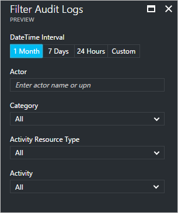
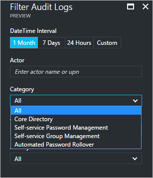
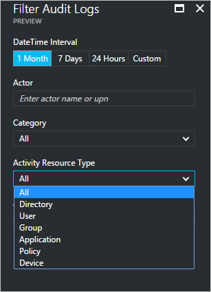
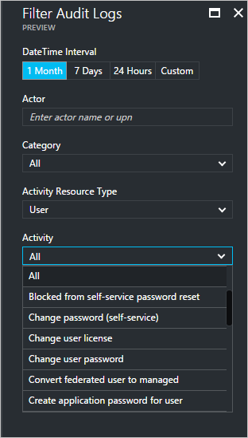
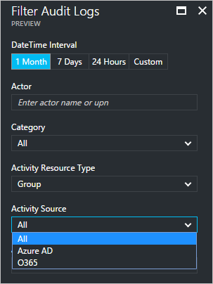
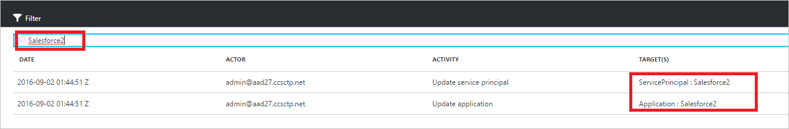

# Audit activity reports in the Azure Active Directory portal - preview

With reporting in the Azure Active Directory [preview](active-directory-preview-explainer.md), you get all the information you need to determine how your environment is doing.

The reporting architecture in Azure Active Directory consists of the following components:

- **Activity** 
    - **Sign-in activities** – Information about the usage of managed applications and user sign-in activities
    - **Audit logs** - System activity information about users and group management, your managed applications and directory activities.
- **Security** 
    - **Risky sign-ins** - A risky sign-in is an indicator for a sign-in attempt that might have been performed by someone who is not the legitimate owner of a user account. For more details, see Risky sign-ins.
    - **Users flagged for risk** - A risky user is an indicator for a user account that might have been compromised. For more details, see Users flagged for risk.

This topic gives you an overview of the audit activities.
 
## Audit logs

The audit logs in Azure Active Directory provide records of system activities for compliance.

There are three main categories for auditing related activities in the Azure portal:

- Users and groups   

- Applications

- Directory   

For a complete list of audit report activities, see the [list of audit report events](active-directory-reporting-audit-events.md#list-of-audit-report-events).

Your entry point to all auditing data is **Audit logs** in the **Activity** section of **Azure Active Directory**.

An audit log has a list view that shows the actors (*who*), the activities (*what*) and the targets.

By clicking an item in the list view, you can get more details about it.

## Users and groups audit logs

With user and group-based audit reports, you can get answers to questions such as:

- What types of updates have been applied the users?

- How many users were changed?

- How many passwords were changed?

- What has an administrator done in a directory?

- What are the groups that have been added?

- Are there groups with membership changes?

- Have the owners of group been changed?

- What licenses have been assigned to a group or a user?

If you just want to review auditing data that is related to users and groups, you can find a filtered view under **Audit logs** in the **Activity** section of **Users and Groups**.

## Application audit logs
With application-based audit reports, you can get answers to questions such as:

* What are the applications that have been added or updated?
* What are the applications that have been removed?
* Has a service principle for an application changed?
* Have the names of applications been changed?
* Who gave consent to an application?

If you just want to review auditing data that is related to applications, you can find a filtered view under **Audit logs** in the **Activity** section of **Enterprise applications**.

## Filtering audit logs
You can filter sign-ins to limit the amount of displayed data using the following fields:

- Date and time

- Actor's user principal name

- Category

- Activity resource type

- Activity

The **Category** filter enables you to narrow down the scope of your audit report based on the following categories:

- Core Directory

- Self-service Password Management

- Self-service Group Management

- Automated Password Rollover 

The content of the **Activity resource type** list, is tied to your entry point to this blade.  
If your entry point is Azure Active Directory, this list contains all possible activity types:

- Directory

- User

- Group 

- Application 

- Policy

- Device

The listed activities are scoped by activity type.
For example, if you have **User** selected as **Activity Type**, the **Activity** list only contains group related activities.   

If you select **Group** as **Activity Type**, you get an additional filter option that also enables you to filter based on the following **Activity Sources**:

- Azure AD

- O365

Another method to filter the entries of a audit log is to search for specific entries.

## Next steps
See the [Azure Active Directory Reporting Guide](active-directory-reporting-guide.md).

