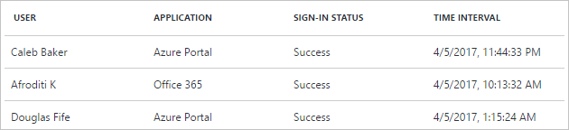
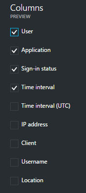
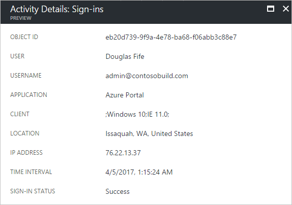
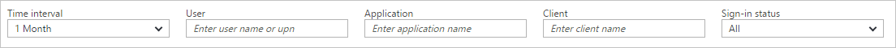
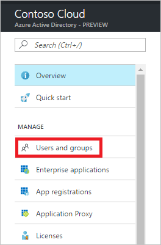
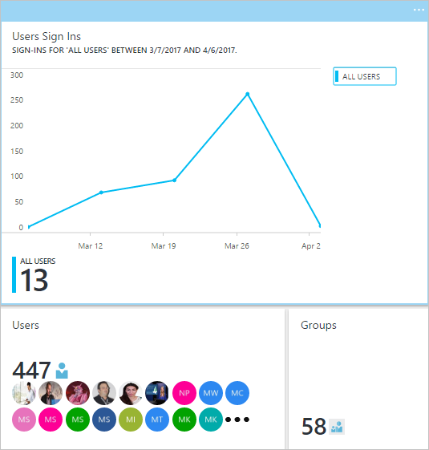
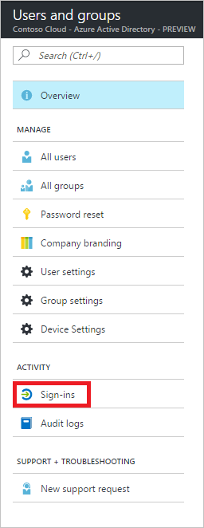
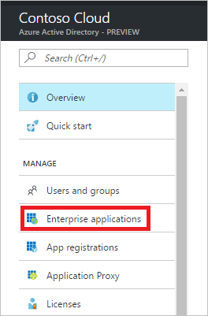
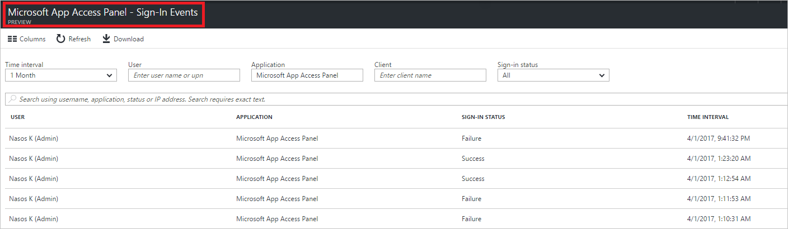

# Sign-in activity reports in the Azure Active Directory portal

With Azure Active Directory (Azure AD) reporting in the [Azure portal](https://portal.azure.com), you can get the information you need to determine how your environment is doing.

The reporting architecture in Azure Active Directory consists of the following components:

- **Activity** 
    - **Sign-in activities** – Information about the usage of managed applications and user sign-in activities
    - **Audit logs** - System activity information about users and group management, your managed applications and directory activities.
- **Security** 
    - **Risky sign-ins** - A risky sign-in is an indicator for a sign-in attempt that might have been performed by someone who is not the legitimate owner of a user account. For more details, see Risky sign-ins.
    - **Users flagged for risk** - A risky user is an indicator for a user account that might have been compromised. For more details, see Users flagged for risk.

This topic gives you an overview of the sign-in activities.

## Pre-requisite

### Who can access the data?
* Users in the Security Admin or Security Reader role
* Global Admins
* Any user (non-admins) can access their own sign-ins 

### What Azure AD license do you need to access sign-in activity?
* Your tenant must have an Azure AD Premium license associated with it to see the all up sign-in activity report

## Signs-in activities

With the information provided by the user sign-in report, you find answers to questions such as:

* What is the sign-in pattern of a user?
* How many users have users signed in over a week?
* What’s the status of these sign-ins?

Your first entry point to all sign-in activities data is **Sign-ins** in the Activity section of **Azure Active**.

An audit log has a default list view that shows:

- the related user
- the application the user has signed-in to
- the sign-in status
- the sign-in time

You can customize the list view by clicking **Columns** in the toolbar.

This enables you to display additional fields or remove fields that are already displayed.

By clicking an item in the list view, you get all available details about it.

## Filtering sign-in activities

To narrow down the reported data to a level that works for you, you can filter the sign-ins data using the following fields:

- Time interval
- User
- Application
- Client
- Sign-in status

The **time interval** filter enables to you to define a timeframe for the returned data.  
Possible values are:

- 1 month
- 7 days
- 24 hours
- Custom

When you select a custom timeframe, you can configure a start time and an end time.

The **user** filter enables you to specify the name or the user principal name (UPN) of the user you care about.

The **application** filter enables you to specify the name of the application you care about.

The **client** filter enables you to specify information about the device you care about.

The **sign-in status** filter enables you to select one of the following filter:

- All
- Success
- Failure

## Sign-in activities shortcuts

In addition to Azure Active Directory, the Azure portal provides you with two additional entry points to sign-in activities data:

- Users and groups
- Enterprise applications

### Users and groups sign-ins activities

With the information provided by the user sign-in report, you find answers to questions such as:

- What is the sign-in pattern of a user?
- How many users have users signed in over a week?
- What’s the status of these sign-ins?

Your entry point to this data is the user sign-in graph in the **Overview** section under **Users and groups**.

The user sign-in graph shows weekly aggregations of sign ins for all users in a given time period. The default for the time period is 30 days.

When you click on a day in the sign-in graph, you get a detailed list of the sign-in activities for this day.

Each row in the sign-in activities list gives you the detailed information about the selected sign-in such as:

* Who has signed in?
* What was the related UPN?
* What application was the target of the sign-in?
* What is the IP address of the sign-in?
* What was the status of the sign-in?

The **Sign-ins** option gives you a complete overview of all user sign-ins.

## Usage of managed applications

With an application-centric view of your sign-in data, you can answer questions such as:

* Who is using my applications?
* What are the top 3 applications in your organization?
* I have recently rolled out an application. How is it doing?

Your entry point to this data is the top 3 applications in your organization within the last 30 days report in the **Overview** section under **Enterprise applications**.

The app usage graph weekly aggregations of sign ins for your top 3 applications in a given time period. The default for the time period is 30 days.

If you want to, you can set the focus on a specific application.

When you click on a day in the app usage graph, you get a detailed list of the sign-in activities.

The **Sign-ins** option gives you a complete overview of all sign-in events to your applications.

## Next steps
See the [Azure Active Directory Reporting Guide](active-directory-reporting-guide.md).

