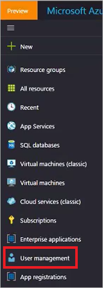
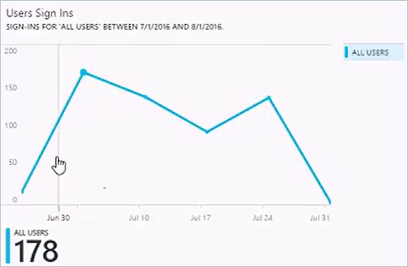
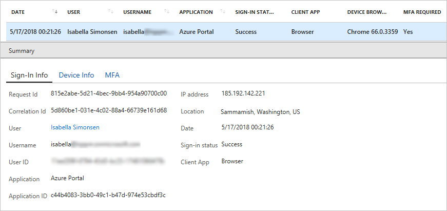
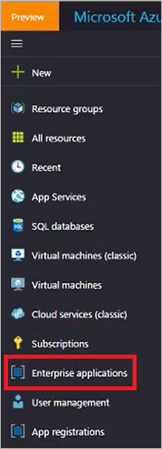
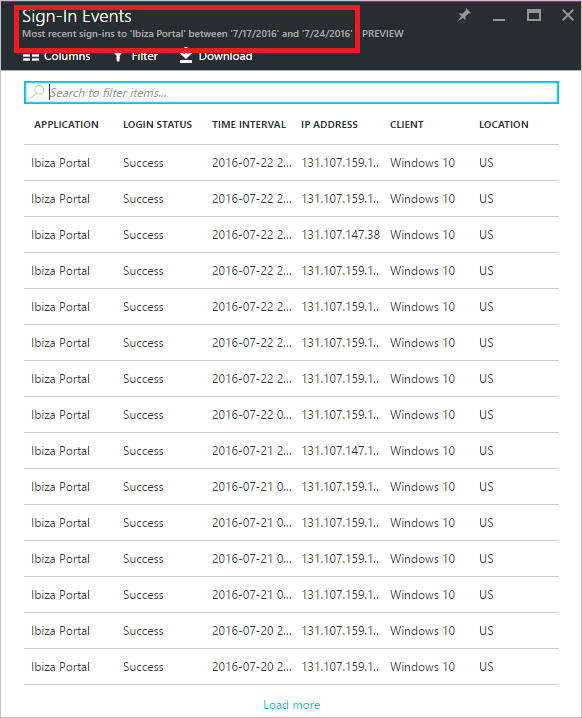
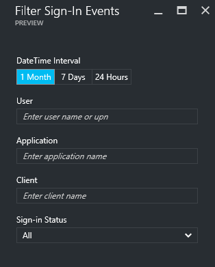
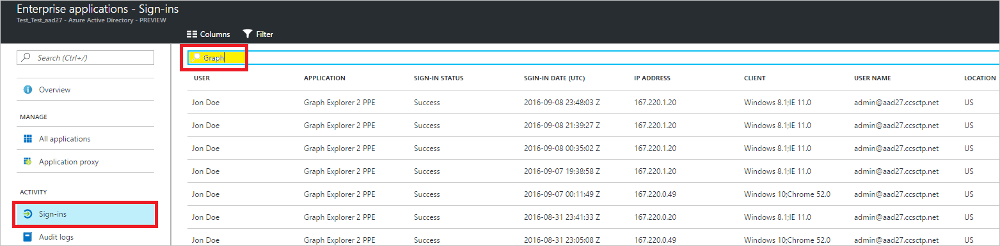

# Sign-in activity reports in the Azure Active Directory portal - preview

With reporting in the Azure Active Directory [preview](active-directory-preview-explainer.md), you get all the information you need to determine how your environment is doing.

The reporting architecture in Azure Active Directory consists of the following components:

- **Activity** 
    - **Sign-in activities** – Information about the usage of managed applications and user sign-in activities
    - **Audit logs** - System activity information about users and group management, your managed applications and directory activities.
- **Security** 
    - **Risky sign-ins** - A risky sign-in is an indicator for a sign-in attempt that might have been performed by someone who is not the legitimate owner of a user account. For more details, see Risky sign-ins.
    - **Users flagged for risk** - A risky user is an indicator for a user account that might have been compromised. For more details, see Users flagged for risk.

This topic gives you an overview of the sign-in activities.

## Signs-in activities

With the information provided by the user sign-in report, you find answers to questions such as:

* What is the sign-in pattern of a user?
* How many users have users signed in over a week?
* What’s the status of these sign-ins?

Your entry point to this data is the user sign-in graph in the **Overview** section under **Users and groups**.

 

The user sign-in graph shows weekly aggregations of sign ins for all users in a given time period. The default for the time period is 30 days.

When you click on a day in the sign-in graph, you get a detailed list of the sign-in activities.

Each row in the sign-in activities list gives you the detailed information about the selected sign-in such as:

* Who has signed in?
* What was the related UPN?
* What application was the target of the sign-in?
* What is the IP address of the sign-in?
* What was the status of the sign-in?

## Usage of managed applications

With an application-centric view of your sign-in data, you can answer questions such as:

* Who is using my applications?
* What are the top 3 applications in your organization?
* I have recently rolled out an application. How is it doing?

Your entry point to this data is the top 3 applications in your organization within the last 30 days report in the **Overview** section under **Enterprise applications**.

 

The app usage graph weekly aggregations of sign ins for your top 3 applications in a given time period. The default for the time period is 30 days.

If you want to, you can set the focus on a specific application.

When you click on a day in the app usage graph, you get a detailed list of the sign-in activities.

The **Sign-ins** option gives you a complete overview of all sign-in events to your applications.

By using the column chooser, you can select the data fields you want to display.

## Filtering sign-ins
You can filter sign-ins to limit the amount of displayed data using the following fields:

* Date and time 
* User's user principal name
* Application name
* Client name
* Sign-in status

Another method to filter the entries of the sign-in activities is to search for specific entries.
The search method enables you to scope your sign-ins around specific **users**, **groups** or **applications**.

## Next steps
See the [Azure Active Directory Reporting Guide](active-directory-reporting-guide.md).

