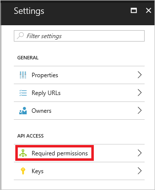
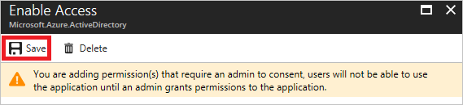
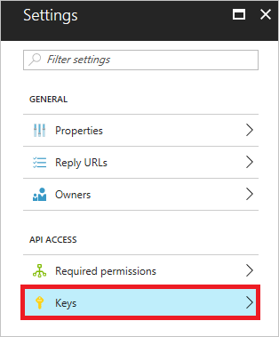

# Prerequisites to access the Azure AD reporting API

The [Azure AD reporting APIs](https://msdn.microsoft.com/library/azure/ad/graph/howto/azure-ad-reports-and-events-preview) provide you with programmatic access to the data through a set of REST-based APIs. You can call these APIs from a variety of programming languages and tools.

The reporting API uses [OAuth](https://msdn.microsoft.com/library/azure/dn645545.aspx) to authorize access to the web APIs. 

To get access to the reporting data through the API, you need to have one of the following roles assigned:

- Security Reader
- Security Admin
- Global Admin

To prepare your access to the reporting API, you must:

1. Register an application 
2. Grant permissions 
3. Gather configuration settings 

For frequently asked questions,read our [FAQ](https://docs.microsoft.com/en-us/azure/active-directory/active-directory-reporting-faq). For issues, please [file a support ticket](https://docs.microsoft.com/en-us/azure/active-directory/active-directory-troubleshooting-support-howto)

## Register an Azure Active Directory application

You need to register an app even if you are accessing the reporting API using a script. This gives you an **Application ID**, which is required for an authorization call and it enables your code to receive tokens.

To configure your directory to access the Azure AD reporting API, you must sign in to the Azure portal with an Azure administrator account that is also a member of the **Global Administrator** directory role in your Azure AD tenant.

> [!IMPORTANT]
> Applications running under credentials with "admin" privileges like this can be very powerful, so please be sure to keep the application's ID/secret credentials secure.
> 

**To register an Azure Active Directory application:**

1. In the [Azure portal](https://portal.azure.com), on the left navigation pane, click **Active Directory**.
   
     

2. On the **Azure Active Directory** blade, click **App registrations**.

     

3. On the **App registrations** blade, in the toolbar on the top, click **New application registration**.

    

4. On the **Create** blade, perform the following steps:

    

    a. In the **Name** textbox, type `Reporting API application`.

    b. As **Application type**, select `Web app / API`.

    c. In the **Sign-on URL** textbox, type `https://localhost`.

    d. Click **Create**. 

## Grant permissions 

The objective of this step is to grant your application **Read directory data** permissions to the **Windows Azure Active Directory** API.

 

**To grant your application permission to use the API:**

1. On the **App registrations** blade, in the apps list, click **Reporting API application**.

2. On the **Reporting API application** blade, in the toolbar on the top, click **Settings**. 

    

3. On the **Settings** blade, click **Required permissions**. 

    

4. On the **Required permissions** blade, in the **API** list, click **Windows Azure Active Directory**. 

    

5. On the **Enable Access** blade, select **Read directory data**. 

    

6. In the toolbar on the top, click **Save**.

    

## Gather configuration settings 
This section shows you how to get the following settings from your directory:

* Domain name
* Client ID
* Client secret

You need these values when configuring calls to the reporting API. 

### Get your domain name

**To get your domain name:**

1. In the [Azure portal](https://portal.azure.com), on the left navigation pane, click **Active Directory**.
   
     

2. On the **Azure Active Directory** blade, click **Domain names**.

     

3. Copy your domain name from the list of domains.

### Get your application's client ID

**To get your application's client ID:**

1. In the [Azure portal](https://portal.azure.com), on the left navigation pane, click **Active Directory**.
   
     

2. On the **App registrations** blade, in the apps list, click **Reporting API application**.

3. On the **Reporting API application** blade, at the **Application ID**, click **Click to copy**.

     

### Get your application's client secret
To get your application's client secret, you need to create a new key and save its value upon saving the new key because it is not possible to retrieve this value later anymore.

**To get your application's client secret:**

1. In the [Azure portal](https://portal.azure.com), on the left navigation pane, click **Active Directory**.
   
     

2. On the **App registrations** blade, in the apps list, click **Reporting API application**.

3. On the **Reporting API application** blade, in the toolbar on the top, click **Settings**. 

    

4. On the **Settings** blade, in the **APIR Access** section, click **Keys**. 

    

5. On the **Keys** blade, perform the following steps:

    

    a. In the **Description** textbox, type `Reporting API`.

    b. As **Expires**, select **In 2 years**.

    c. Click **Save**.

    d. Copy the key value.

## Next Steps
* Would you like to access the data from the Azure AD reporting API in a programmatic manner? Check out [Getting started with the Azure Active Directory Reporting API](active-directory-reporting-api-getting-started.md).
* If you would like to find out more about Azure Active Directory reporting, see the [Azure Active Directory Reporting Guide](active-directory-reporting-guide.md).  

