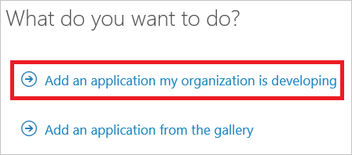
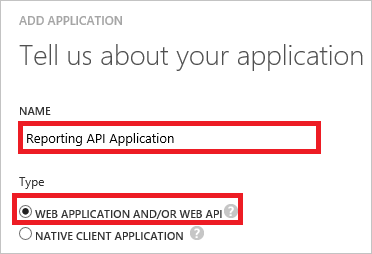
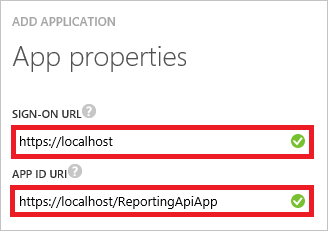
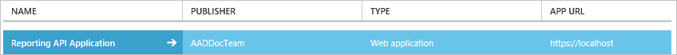
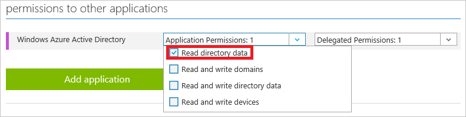
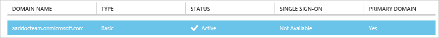
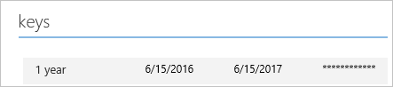

# Prerequisites to access the Azure AD reporting API
The [Azure AD reporting APIs](https://msdn.microsoft.com/library/azure/ad/graph/howto/azure-ad-reports-and-events-preview) provide you with programmatic access to the data through a set of REST-based APIs. You can call these APIs from a variety of programming languages and tools.

The reporting API uses [OAuth](https://msdn.microsoft.com/library/azure/dn645545.aspx) to authorize access to the web APIs. 

To prepare your access to the reporting API, you must:

1. Create an application in your Azure AD tenant 
2. Grant the application appropriate permissions to access the Azure AD data
3. Gather configuration settings from your directory

For questions, issues or feedback, please contact [AAD Reporting Help](mailto:aadreportinghelp@microsoft.com).

## Create an Azure AD application
To configure your directory to access the Azure AD reporting API, you must sign in to the Azure classic portal with an Azure subscription administrator account that is also a member of the Global Administrator directory role in your Azure AD tenant.

> [!IMPORTANT]
> Applications running under credentials with "admin" privileges like this can be very powerful, so please be sure to keep the application's ID/secret credentials secure.
> 
> 

1. In the [Azure classic portal](https://manage.windowsazure.com), on the left navigation pane, click **Active Directory**.
   
     
2. From the **active directory** list, select your directory.
3. In the menu on the top, click **Applications**.
   
     
4. On the bottom bar, click **Add**.
   
     
5. On the **What do you want to do?** dialog, click **Add an application my organization is developing**. 
   
     
6. On the **Tell us about your application** dialog, perform the following steps: 
   
     
   
    a. In the **Name** textbox, type a name (e.g.: Reporting API Application).
   
    b. Select **Web application and/or web API**.
   
    c. Click **Next**.
7. On the **App properties** dialog, perform the following steps: 
   
     
   
    a. In the **Sign-on URL** textbox, type `https://localhost`.
   
    b. In the **App ID URI** textbox, type ```https://localhost/ReportingApiApp```.
   
    c. Click **Complete**.

## Grant your application permission to use the API
1. In the [Azure classic portal](https://manage.windowsazure.com/), on the left navigation pane, click **Active Directory**.
   
     
2. From the **active directory** list, select your directory.
3. In the menu on the top, click **Applications**.
   
    
4. In the applications list, select your newly created application.
   
    
5. In the menu on the top, click **Configure**.
   
    
6. In the **Permissions to other applications** section, for the **Azure Active Directory** resource, click the **Application Permissions** drop-down list, and then select **Read directory data**.
   
    
7. On the bottom bar, click **Save**.
   
    

## Gather configuration settings from your directory
This section shows you how to get the following settings from your directory:

* Domain name
* Client ID
* Client secret

You need these values when configuring calls to the reporting API. 

### Get your domain name
1. In the [Azure classic portal](https://manage.windowsazure.com), on the left navigation pane, click **Active Directory**.
   
     
2. From the **active directory** list, select your directory.
3. In the menu on the top, click **Domains**.
   
     
4. In the **Domain Name** column, copy your domain name.
   
     

### Get the application's client ID
1. In the [Azure classic portal](https://manage.windowsazure.com), on the left navigation pane, click **Active Directory**.
   
     
2. From the **active directory** list, select your directory.
3. In the menu on the top, click **Applications**.
   
     
4. In the applications list, select your newly created application.
   
    
5. In the menu on the top, click **Configure**.
   
    
6. Copy your **Client ID**.
   
    

### Get the application's client secret
To get your application's client secret, you need to create a new key and save its value upon saving the new key because it is not possible to retrieve this value later anymore.

1. In the [Azure classic portal](https://manage.windowsazure.com), on the left navigation pane, click **Active Directory**.
   
     
2. From the **active directory** list, select your directory.
3. In the menu on the top, click **Applications**.
   
     
4. In the applications list, select your newly created application.
   
    
5. In the menu on the top, click **Configure**.
   
    
6. In the **Keys** section, perform the following steps: 
   
    
   
    a. From the duration list, select a duration
   
    b. On the bottom bar, click **Save**.
   
    
   
    c. Copy the key value.

## Next Steps
* Would you like to access the data from the Azure AD reporting API in a programmatic manner? Check out [Getting started with the Azure Active Directory Reporting API](active-directory-reporting-api-getting-started.md).
* If you would like to find out more about Azure Active Directory reporting, see the [Azure Active Directory Reporting Guide](active-directory-reporting-guide.md).  

