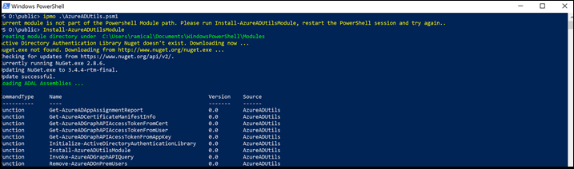
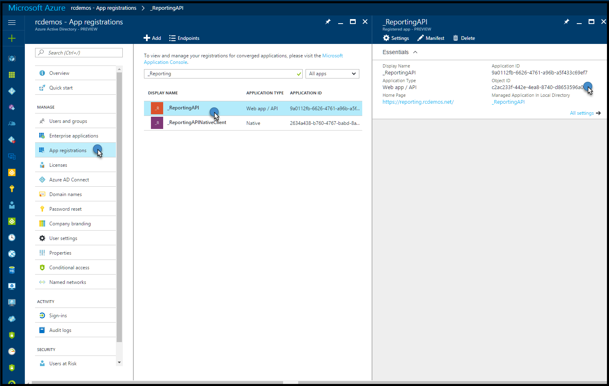
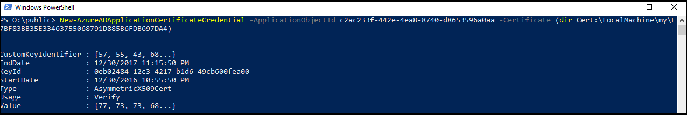
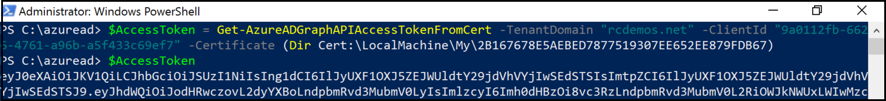
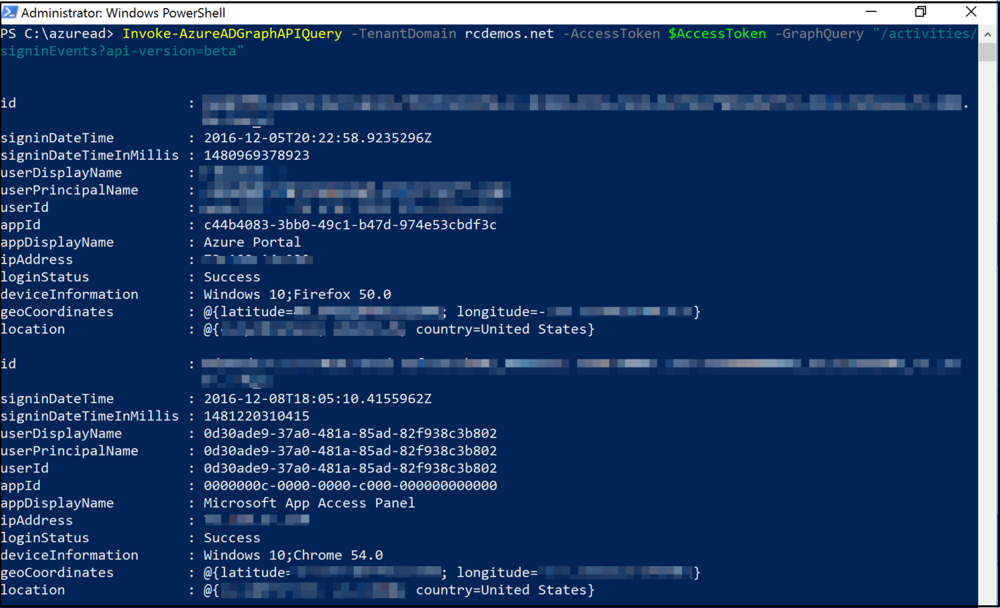

# Get data using the Azure AD Reporting API with certificates
This article discusses how to use the Azure AD Reporting API with certificate credentials to get data from directories without user intervention. 

## Use the Azure AD Reporting API 
Azure AD Reporting API requires that you complete the following steps:
 *	Install prerequisites
 *	Set the certificate in your app
 *	Get an access token
 *	Use the access token to call the Graph API

For information about source code, see [Leverage Report API Module](https://github.com/AzureAD/azure-activedirectory-powershell/tree/gh-pages/Modules/AzureADUtils). 

### Install prerequisites
You will need to have Azure AD PowerShell V2 and AzureADUtils module installed.

1. Download and install Azure AD Powershell V2, following the instructions at [Azure Active Directory PowerShell](https://github.com/Azure/azure-docs-powershell-azuread/blob/master/Azure AD Cmdlets/AzureAD/index.md).
2. Download the Azure AD Utils module from [AzureAD/azure-activedirectory-powershell](https://github.com/AzureAD/azure-activedirectory-powershell/blob/gh-pages/Modules/AzureADUtils/AzureADUtils.psm1). 
  This module provides several utility cmdlets including:
   * The latest version of ADAL using Nuget
   * Access tokens from user, application keys, and certificates using ADAL
   * Graph API handling paged results

**To install the Azure AD Utils module:**

1. Create a directory to save the utilities module (for example, c:\azureAD) and download the module from GitHub.
2. Open a PowerShell session, and go to the directory you just created. 
3. Import the module, and install it in the PowerShell module path using the Install-AzureADUtilsModule cmdlet. 

The session should look similar to this screen:

  

### Set the certificate in your app
1. If you already have an app, get its Object ID from the Azure Portal. 

  

2. Open a PowerShell session and connect to Azure AD using the Connect-AzureAD cmdlet.

  

3. Use the New-AzureADApplicationCertificateCredential cmdlet from AzureADUtils to add a certificate credential to it. 

>[!Note]
>You need to provide the application Object ID that you captured earlier, as well as the certificate object (get this using the Cert: drive).
>

  
  
### Get an access token

To get an access token, use the Get-AzureADGraphAPIAccessTokenFromCert cmdlet from AzureADUtils. 

>[!NOTE]
>You need to use the Application ID instead of the Object ID that you used in the last section.
>

 

### Use the access token to call the Graph API

Now you can create the script. Below is an example using the Invoke-AzureADGraphAPIQuery cmdlet from the AzureADUtils. This cmdlet handles multi-paged results, and then sends those results to the PowerShell pipeline. 

 

You are now ready to export to a CSV and save to a SIEM system. You can also wrap your script in a scheduled task to get Azure AD data from your tenant periodically without having to store application keys in the source code. 

## Next steps
[The fundamentals of Azure identity management](https://docs.microsoft.com/en-us/azure/active-directory/fundamentals-identity) 

