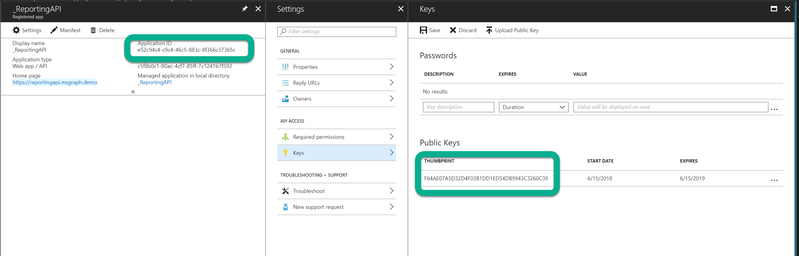
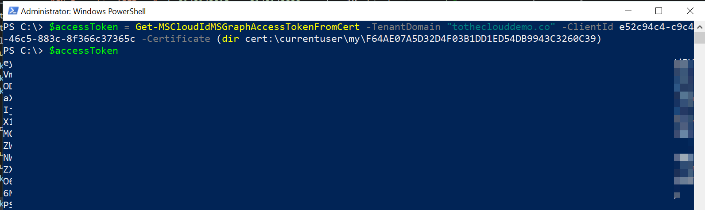
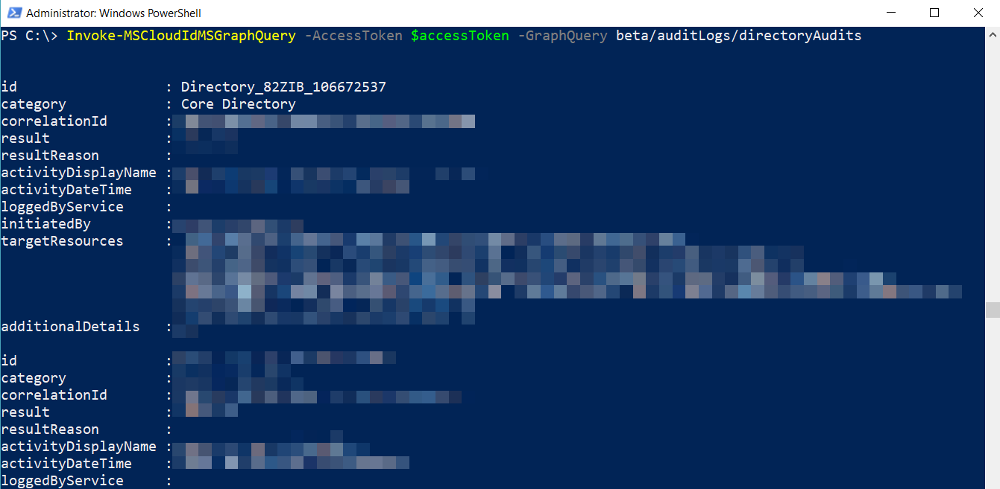
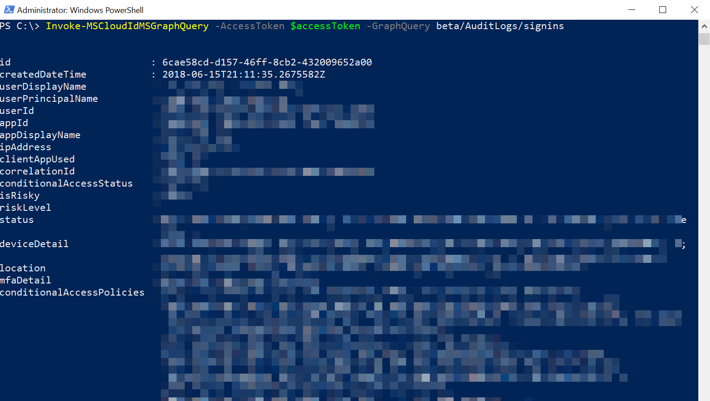

# Get data using the Azure Active Directory reporting API with certificates

The [Azure Active Directory (Azure AD) reporting APIs](https://msdn.microsoft.com/library/azure/ad/graph/howto/azure-ad-reports-and-events-preview) provide you with programmatic access to the data through a set of REST-based APIs. You can call these APIs from a variety of programming languages and tools.

If you want to access the Azure AD Reporting API  without user intervention, you can configure your access to use certificates

This article:

- Provides you with the required steps to access the Azure AD reporting API using certificates.
- Assumes that you have completed the [prerequisites to access the Azure Active Directory reporting API](active-directory-reporting-api-prerequisites-azure-portal.md). 

To access the reporting API with certificates, you need to:

1. [Install the prerequisites](#install-prerequisites)
2. [Register the certificate in your app](#register-the-certificate-in-your-app)
3. [Get an access token for MS Graph API](#get-an-access-token-for-ms-graph-api)
4. [Query the MS Graph API endpoints](#query-the-ms-graph-api-endpoints)

## Install prerequisites

You need to have Azure AD PowerShell V2 and AzureADUtils module installed.

1. Download and install Azure AD Powershell V2, following the instructions at [Azure Active Directory PowerShell](https://github.com/Azure/azure-docs-powershell-azuread/blob/master/Azure AD Cmdlets/AzureAD/index.md)

2. Install the MSCloudIDUtils from the [PowerShellGallery - MSCloudIdUtils](https://www.powershellgallery.com/packages/MSCloudIdUtils/)
  This module provides several utility cmdlets including:
    - The ADAL libraries needed for authentication
    - Access tokens from user, application keys, and certificates using ADAL
    - Graph API handling paged results

**To install the Azure MSCloudIDUtils module:**

1. Once you have installed the PowerShell module from the PowerShell gallery, you can import the module, and if it's the first time using the module run **Install-MSCloudIdUtilsModule** to complete setup.

The session should look similar to this screen:

  

## Register the certificate in your app

**To upload the certificate public key to your app registration:**

1. For the application you have registered to call the reportingAPI, [Register your certificate with Azure AD](https://docs.microsoft.com/en-us/azure/active-directory/develop/active-directory-certificate-credentials#register-your-certificate-with-azure-ad)

2. Make note of the Application ID, and the thumbprint of the certificate you have registered with your application.

  

  
## Get an access token for MS Graph API

To get an access token for the MS Graph API, use the **Get-MSCloudIdMSGraphAccessTokenFromCert** cmdlet from the MSCloudIdUtils PowerShell module. 

>[!NOTE]
>You need to use the Application ID (also known as ClientID), and the certificate thumbprint of the certificate with the private key installed in your computer's certificate store (CurrentUser or LocalMachine certificate store).
>

 

## Use the access token to call the Graph API

Now, you can create the script using the access token retrieved. Below is an example using the **Invoke-MSCloudIdMSGraphQuery** cmdlet from the MSCloudIDUtils to enumerate the signins or diectoryAudits endpoint. This cmdlet handles multi-paged results, and then sends those results to the PowerShell pipeline.
### Query the DirectoryAudits endpoint
 

 ### Query the SignIns endpoint
 

You are now ready to export to a CSV and save to a SIEM system. You can also wrap your script in a scheduled task to get Azure AD data from your tenant periodically without having to store application keys in the source code. 

## Next steps

- [Get a first impression of the reporting APIs](active-directory-reporting-api-getting-started-azure-portal.md#explore)

- [Create your own solution](active-directory-reporting-api-getting-started-azure-portal.md#customize)

