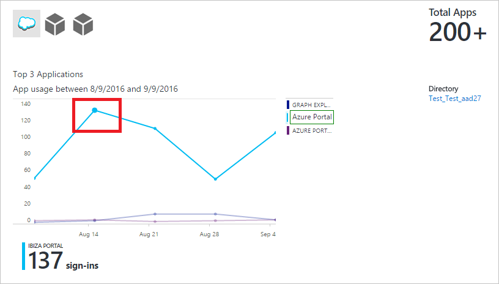
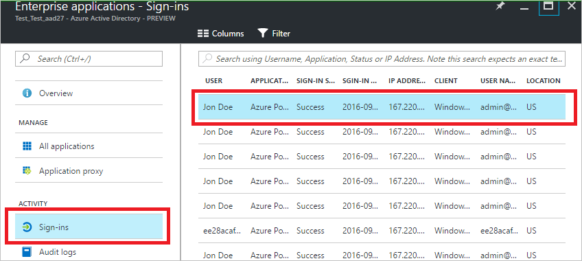
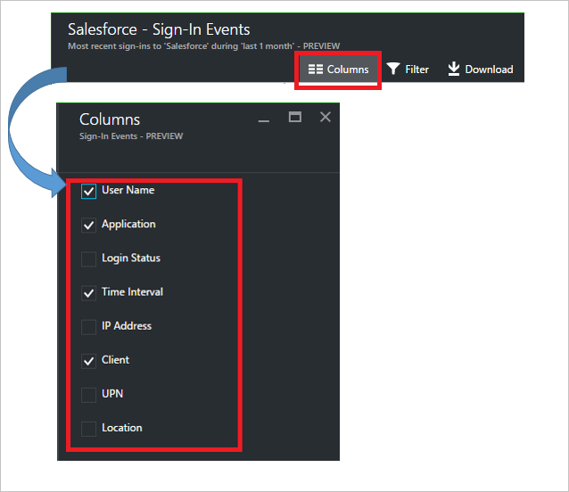
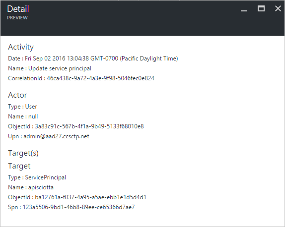
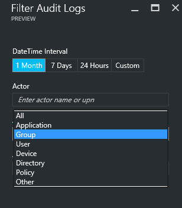
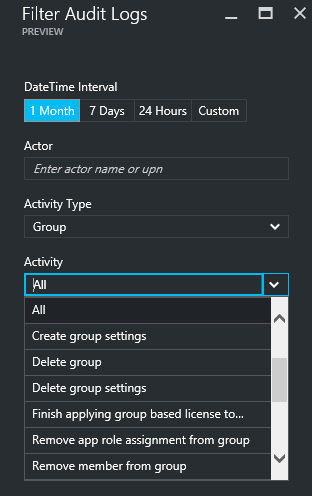

# Azure Active Directory reporting - preview

*This documentation is part of the [Azure Active Directory Reporting Guide](active-directory-reporting-guide.md).*

With reporting in the Azure Active Directory preview, you get all the information you need to determine how your environment is doing. [What's in the preview?](active-directory-preview-explainer.md)

There are two main areas of reporting:

* **Sign-in activities** – Information about the usage of managed applications and user sign-in activities
* **Audit logs** - System activity information about users and group management, your managed applications and directory activities

Depending on the scope of the data you are looking for, you can access these reports either by clicking **Users and groups** or **Enterprise applications** in the services list in the [Azure portal](https://portal.azure.com).

## Sign-in activities
### User sign-in activities
With the information provided by the user sign-in report, you find answers to questions such as:

* What is the sign-in pattern of a user?
* How many users have users signed in over a week?
* What’s the status of these sign-ins?

Your entry point to this data is the user sign-in graph in the **Overview** section under **Users and groups**.

 

The user sign-in graph shows weekly aggregations of sign ins for all users in a given time period. The default for the time period is 30 days.

When you click on a day in the sign-in graph, you get a detailed list of the sign-in activities.

Each row in the sign-in activities list gives you the detailed information about the selected sign-in such as:

* Who has signed in?
* What was the related UPN?
* What application was the target of the sign-in?
* What is the IP address of the sign-in?
* What was the status of the sign-in?

### Usage of managed applications
With an application-centric view of your sign-in data, you can answer questions such as:

* Who is using my applications?
* What are the top 3 applications in your organization?
* I have recently rolled out an application. How is it doing?

Your entry point to this data is the top 3 applications in your organization within the last 30 days report in the **Overview** section under **Enterprise applications**.

 

The app usage graph weekly aggregations of sign ins for your top 3 applications in a given time period. The default for the time period is 30 days.

If you want to, you can set the focus on a specific application.

When you click on a day in the app usage graph, you get a detailed list of the sign-in activities.

The **Sign-ins** option gives you a complete overview of all sign-in events to your applications.

By using the column chooser, you can select the data fields you want to display.

### Filtering sign-ins
You can filter sign-ins to limit the amount of displayed data using the following fields:

* Date and time 
* User's user principal name
* Application name
* Client name
* Sign-in status

Another method to filter the entries of the sign-in activities is to search for specific entries.
The search method enables you to scope your sign-ins around specific **users**, **groups** or **applications**.

## Audit logs
The auditing logs in Azure Active Directory provide records of system activities for compliance.

There are three main categories for auditing related activities in the Azure portal:

* Users and groups   
* Applications
* Directory   

For a complete list of audit report activities, see the [list of audit report events](active-directory-reporting-audit-events.md#list-of-audit-report-events).

Your entry point to all auditing data is **Audit logs** in the **Activity** section of **Azure Active Directory**.

An audit log has a list view that shows the actors (who), the activities (what) and the targets.

By clicking an item in the list view, you can get more details about it.

### Users and groups audit logs
With user and group-based audit reports, you can get answers to questions such as:

* What types of updates have been applied the users?
* How many users were changed?
* How many passwords were changed?
* What has an administrator done in a directory?
* What are the groups that have been added?
* Are there groups with membership changes?
* Have the owners of group been changed?
* What licenses have been assigned to a group or a user?

If you just want to review auditing data that is related to users and groups, you can find a filtered view under **Audit logs** in the **Activity** section of **Users and Groups**.

### Application audit logs
With application-based audit reports, you can get answers to questions such as:

* What are the applications that have been added or updated?
* What are the applications that have been removed?
* Has a service principle for an application changed?
* Have the names of applications been changed?
* Who gave consent to an application?

If you just want to review auditing data that is related to applications, you can find a filtered view under **Audit logs** in the **Activity** section of **Enterprise applications**.

### Filtering audit logs
You can filter sign-ins to limit the amount of displayed data using the following fields:

* Date and time
* Actor's user principal name
* Activity type
* Activity

The content of the **Activity Type** list, is tied to your entry point to this blade.  
If your entry point is Azure Active Directory, this list contains all possible activity types:

* Application 
* Group 
* User
* Device
* Directory
* Policy
* Other

The listed activities are scoped by activity type.
For example, if you have **Group** selected as **Activity Type**, the **Activity** list only contains group related activities.   

Another method to filter the entries of a audit log is to search for specific entries.

## Next steps
See the [Azure Active Directory Reporting Guide](active-directory-reporting-guide.md).

