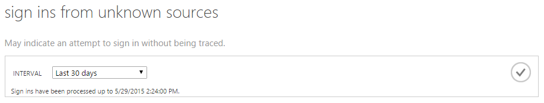
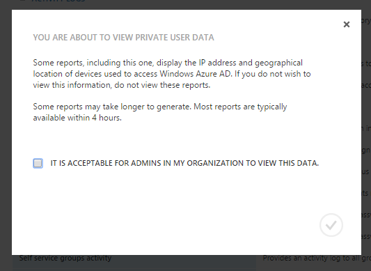
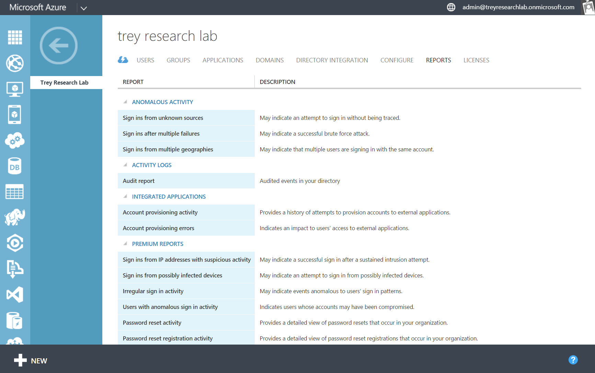
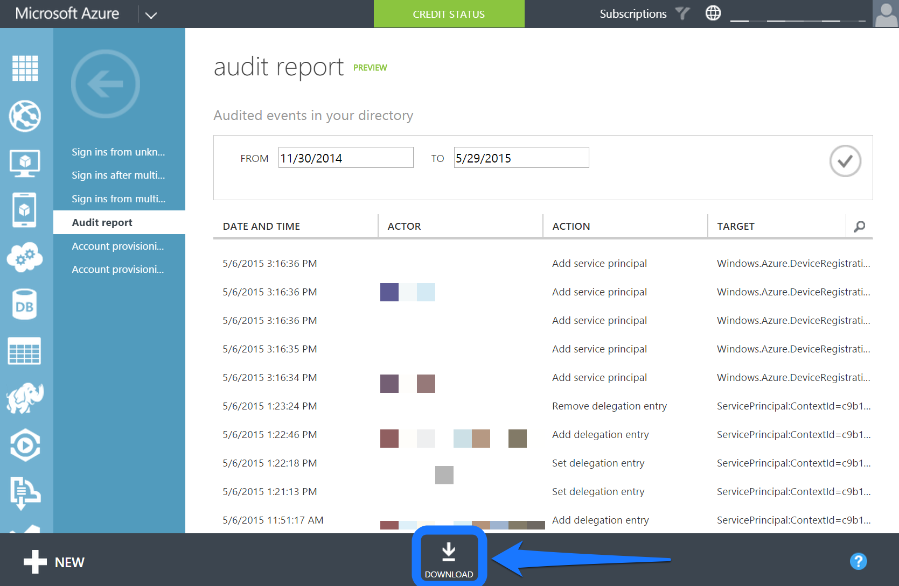
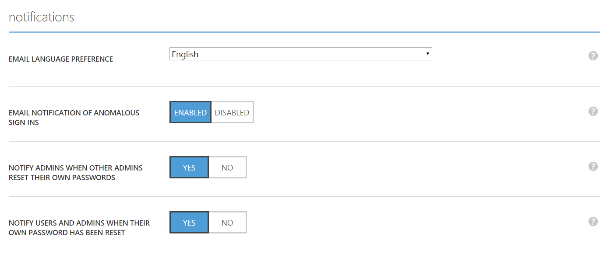

<properties
   pageTitle="Azure AD Reporting: Getting started"
   description="Lists the various available reports in Azure Active Directory reporting"
   services="active-directory"
   documentationCenter=""
   authors="curtand"
   manager="stevenpo"
   editor=""/>

<tags
   ms.service="active-directory"
   ms.devlang="na"
   ms.topic="article"
   ms.tgt_pltfrm="na"
   ms.workload="identity"
   ms.date="09/21/2015"
   ms.author="curtand;kenhoff"/>

# Getting started with Azure AD Reporting

## What it is

Azure Active Directory includes security, activity, and audit reports for your directory. Here's a list of the reports included:

### Security reports

- Sign ins from unknown sources
- Sign ins after multiple failures
- Sign ins from multiple geographies
- Sign ins from IP addresses with suspicious activity
- Irregular sign in activity
- Sign ins from possibly infected devices
- Users with anomalous sign in activity

### Activity reports

- Application usage: summary
- Application usage: detailed
- Application dashboard
- Account provisioning errors
- Individual user devices
- Individual user Activity
- Groups activity report
- Password Reset Registration Activity Report
- Password reset activity

### Audit reports

- Directory audit report

> [AZURE.TIP] For more documentation on Azure AD Reporting, check out [View your access and usage reports](active-directory-view-access-usage-reports.md).

## How it works

### Reporting pipeline

The reporting pipeline consists of three main steps. Every time a user signs in, or an authentication is made, the following happens:

- First, the user is authenticated (successfully or unsuccessfully), and the result is stored in the Azure Active Directory service databases.
- At regular intervals, all recent sign ins are processed. At this point, our security and anomalous activity algorithms are searching all recent sign ins for suspicious activity.
- After processing, the reports are written, cached, and served in the Azure Management Portal.

### Report generation times

Due to the large volume of authentications and sign ins processed by the Azure AD platform, the most recent sign ins processed are, on average, one hour old. In rare cases, it may take up to 8 hours to process the most recent sign ins.

You can find the most recent processed sign in by examining the help text at the top of each report.

> [AZURE.TIP] For more documentation on Azure AD Reporting, check out [View your access and usage reports](active-directory-view-access-usage-reports.md).

## Getting started

### Sign into the Azure Management Portal

First, you'll need to sign into the [Azure Management Portal](https://manage.windowsazure.com)  as a global or compliance administrator. You must also be an Azure subscription service administrator or co-administrator, or be using the "Access to Azure AD" Azure subscription.

### Navigate to Reports

To view Reports, navigate to the Reports tab at the top of your directory.

If this is your first time viewing the reports, you'll need to agree to a dialog box before you can view the reports. This is to ensure that it's acceptable for admins in your organization to view this data, which may be considered private information in some countries.

### Explore each report

Navigate into each report to see the data being collected and the sign ins processed. You can find a [list of all the reports here](active-directory-reporting-what-it-is.md).

### Download the reports as CSV

Each report can be downloaded as a CSV (comma separated value) file. You can use these files in Excel, PowerBI or third-party analysis programs to further analyze your data.

To download any report as a CSV, navigate to the report and click "Download" at the bottom.

> [AZURE.TIP] For more documentation on Azure AD Reporting, check out [View your access and usage reports](active-directory-view-access-usage-reports.md).

## Next steps

### Customize alerts for anomalous sign in activity

Navigate to the "Configure" tab of your directory.

Scroll to the "Notifications" section.

Enable or disable the "Email Notifications of Anomalous sign ins" section.

### Integrate with the Azure AD Reporting API

See [Getting started with the Reporting API](active-directory-reporting-api-getting-started.md).

### Engage Multi-Factor Authentication on users

Select a user in a report.

Click the "Enable MFA" button at the bottom of the screen.

> [AZURE.TIP] For more documentation on Azure AD Reporting, check out [View your access and usage reports](active-directory-view-access-usage-reports.md).

## Learn more

### Audit events

Learn about what events are audited in the directory in [Azure Active Directory Reporting Audit Events](active-directory-reporting-audit-events.md).

### API Integration

See [Getting started with the Reporting API](active-directory-reporting-api-getting-started.md) and the [API reference documentation](https://msdn.microsoft.com/library/azure/mt126081.aspx).

### Get in touch

Email [aadreportinghelp@microsoft.com](mailto:aadreportinghelp@microsoft.com) for feedback, help, or any questions you might have!

> [AZURE.TIP] For more documentation on Azure AD Reporting, check out [View your access and usage reports](active-directory-view-access-usage-reports.md).
