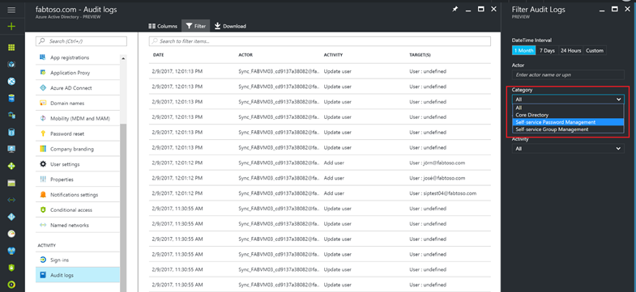
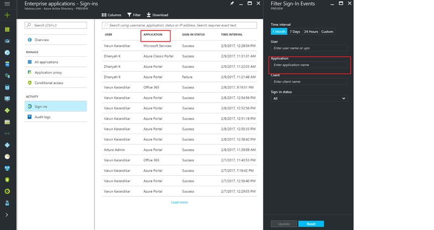

# How to find activity reports in the Azure Portal

With the migration from the Azure classic portal to the Azure portal, we are providing you with a new look to the Azure Active Directory Activity Logs. We have released a [blog post](https://blogs.technet.microsoft.com/enterprisemobility/2016/11/08/azuread-weve-just-turned-on-detailed-auditing-and-sign-in-logs-in-the-new-azure-portal/) a couple of months ago that explains how we provide Activity logs in the context of the resource you are working on. This article describes to you how we have translated the existing reports in the Azure classic portal into the new world of the Azure portal.

## What is new?

The reports in the Azure classic portal are split into various categories:

1.	Security Reports
2.	Activity Reports
3.	Integrated App Reports

### Activity and Integrated App Reports

Moving to context based reporting in Azure portal, we have merged the existing reports into one single view with a single underlying API providing the data to the view. You can find this view under “*Activities*” > Audit Logs in the Azure Portal (left navigation). The following are the reports that have been consolidated into this view.

-	Audit report

- 	Password reset activity

- 	Password reset registration activity

- 	Self service groups activity

- 	Office365 Group Name Changes

- 	Account provisioning activity

- 	Password rollover status
- 	Account provisioning errors

The Application Usage report has been enhanced and included in a view called the “*Activities*” -> Sign-ins (left nav) and includes all the users’ sign-ins, which, in turn can be derived to get the Application usage information. You can find App usage information through “Enterprise Applications” Overview screen as well.

## How can I access a specific report in this single view?

### Audit Logs

One of the key asks of many customers has been the ability to have multiple filter options to access Activity logs within Azure AD. In lieu of this, we have provided advanced filtering mechanism for you to filter the data you want. One of the filters we have provided is called “*Activity Category*”, which lists the different types of Activity Logs that Azure AD provides. By choosing the category you want, you can narrow down the results of the Activity logs to the ones you are interested in seeing. 

For example, if you are interested in just getting **Self-service Password Reset** related activities, you can choose the **Self-service Password Management** category. The categories you can see are in the context of the resource you are working on.  

 
The various categories we have today include:

- Core Directory

- Self-service Password Management

- Self-service Group Management

- Account Provisioning

### Application Usage

You can view the Application usage for all apps or a single app through the Activities -> Sign-ins view. As shown below, this view is present for all applications or a single application. You can filter either on User Name or Application Name if you want narrow down the results.
 

### Security Reports

The security reports have been consolidated to provide a view of all the risk signals that Azure Active Directory Identity Protection can detect and shown accordingly. Here are the list of security signals supported today

(Include the table that provides a list of risk signals along with what free, P1 and P2 customers get)

## Activity Reports in Azure Classic Portal versus Azure Portal

This section lists the existing reports in the Azure classic portal and how you can get this information in the Azure portal.

**Audit Logs**

- In the left navigation pane, click **Activities**, and then click **Audit Logs**
- As **Activity Category**, select **Core Directory** 

**Password reset activity**

- In the left navigation pane, click **Activities**, and then click **Audit Logs**
- As the **Activity Category**, select **Self service Password Management** 

**Password reset registration activity**	

- In the left navigation pane, click **Activities**, and then click **Audit Logs**
- As **Activity Category**, select **Self Service Password Management**.

**Self service groups activity**	

- In the left navigation pane, click **Activities**, and then click **Audit Logs**
- As **Activity Category**, select **Self service Group Management**

**Office365 Group Name Changes**

- In the left navigation pane, click **Activities**, and then click **Audit Logs**
- As **Activity Category**, select **Self service Password Management**
- As **Activity Resource Type**, select **Group** 
- As **Activity Source**, select **O365 groups** 

**Account provisioning activity**	

- In the left navigation pane, click **Activities**, and then click **Audit Logs**
- As as **Activity Category**, select **Account User Provisioning**

**Password rollover status**	

- In the left navigation pane, click **Activities**, and then click **Audit Logs**
- As **Activity Category**, select **Automatic App Password Rollover**

**Account provisioning errors**

- In the left navigation pane, click **Activities**, and then click **Audit Logs**
- As the **Activity Category**, select **Account User Provisioning**

**Application Usage**

- In the left navigation pane,	click **Enterprise Applications**, and then click **Sign-ins**

## Next Steps

