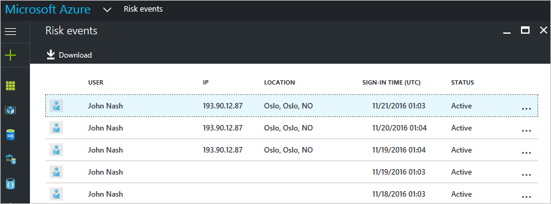
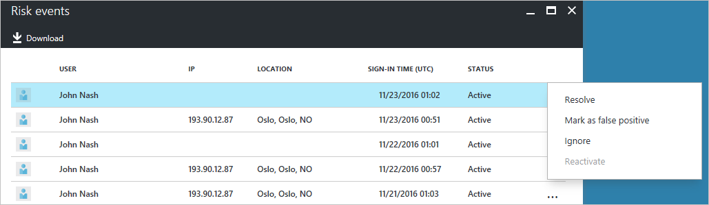

---

title: Risky sign-ins report in the Azure Active Directory portal | Microsoft Docs
description: Learn about the risky sign-ins report in the Azure Active Directory portal
services: active-directory
author: MarkusVi
manager: femila

ms.assetid: 7728fcd7-3dd5-4b99-a0e4-949c69788c0f
ms.service: active-directory
ms.devlang: na
ms.topic: get-started-article
ms.tgt_pltfrm: na
ms.workload: identity
ms.date: 05/04/2017
ms.author: markvi

---
# Risky sign-ins report in the Azure Active Directory portal

With the security reports in Azure Active Directory (Azure AD) you can gain insights into the probability of compromised user accounts in your environment. 

Azure AD detects suspicious actions that are related to your user accounts. For each detected action, a record called *risk event* is created. For more details, see [Azure Active Directory risk events](active-directory-identity-protection-risk-events.md). 

The detected risk events are used to calculate:

- **Risky sign-ins** - A risky sign-in is an indicator for a sign-in attempt that might have been performed by someone who is not the legitimate owner of a user account. For more details, see [Risky sign-ins](active-directory-identityprotection.md#risky-sign-ins). 

- **Users flagged for risk** - A risky user is an indicator for a user account that might have been compromised. For more details, see [Users flagged for risk](active-directory-identityprotection.md#users-flagged-for-risk).  

In [the Azure portal](https://portal.azure.com), you can find the security reports on the **Azure Active Directory** blade in the **Security** section. 

## Azure Active Directory free and basic edition

The Azure Active Directory free and basic editions provide you with a list of risky sign-ins that have been detected for your users. The risk events report provides you with:

- **User** - The name of the user that was used during the sign-in operation
- **IP** - The IP address of the device that was used to connect to Azure Active Directory
- **Location** - The location used to connect to Azure Active Directory
- **Sign-in time** - The time when the sign-in was performed
- **Status** - The status of the sign-in

This report provides you with an option to download the report data.

Based on your investigation of the risky sign-in, you can provide feedback to Azure Active Directory in form of the following actions:

- Resolve
- Mark as false positive
- Ignore
- Reactivate

For more details, see [Closing risk events manually](active-directory-identityprotection.md#closing-risk-events-manually).

## Azure Active Directory premium editions

The risky sign-ins report in the Azure Active Directory premium editions provides you with:

- Aggregated information about the [risk event types](active-directory-identity-protection-risk-events.md) that have been detected

- An option to download the report

When you select a risk event, you get a detailed report view for this risk event that enables you to:

- An option to configure a [user risk remediation policy](active-directory-identityprotection.md#user-risk-security-policy)  

- Review the detection timeline for the risk event  

- Review a list of users for which this risk event has been detected

- [Manually close risk events](active-directory-identityprotection.md#closing-risk-events-manually) or reactivate a manually closed risk event. 

When you select a user, you get a detailed report view for this user that enables you to:

- Open the All sign-ins view

- Reset the user's password

- Dismiss all events

- Investigate reported risk events for the user. 

To investigate a risk event, select one from the list.  
This opens the **Details** blade for this risk event. On the **Details** blade, you have the option to either [manually close a risk event](active-directory-identityprotection.md#closing-risk-events-manually) or reactivate a manually closed risk event. 

## Next steps

- For more information about Azure Active Directory Identity Protection, see [Azure Active Directory Identity Protection](active-directory-identityprotection.md).

