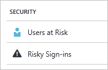

---

title: Users at risk security report in the Azure Active Directory portal | Microsoft Docs
description: Learn about the users at risk security report in the Azure Active Directory portal
services: active-directory
author: MarkusVi
manager: femila

ms.assetid: addd60fe-d5ac-4b8b-983c-0736c80ace02
ms.service: active-directory
ms.devlang: na
ms.topic: get-started-article
ms.tgt_pltfrm: na
ms.workload: identity
ms.date: 05/04/2017
ms.author: markvi

---
# Users at risk security report in the Azure Active Directory portal

With the security reports in the Azure Active Directory (Azure AD) you can gain insights into the probability of compromised user accounts in your environment. 

Azure Active Directory detects suspicious actions that are related to your user accounts. For each detected action, a record called *risk event* is created. For more details, see [Azure Active Directory risk events](active-directory-identity-protection-risk-events.md). 

The detected risk events are used to calculate:

- **Risky sign-ins** - A risky sign-in is an indicator for a sign-in attempt that might have been performed by someone who is not the legitimate owner of a user account. For more details, see [Risky sign-ins](active-directory-identityprotection.md#risky-sign-ins). 

- **Users flagged for risk** - A risky user is an indicator for a user account that might have been compromised. For more details, see [Users flagged for risk](active-directory-identityprotection.md#users-flagged-for-risk).  

In the Azure portal, you can find the security reports on the **Azure Active Directory** blade in the **Security** section.  

## Azure Active Directory free and basic edition

The users at risk report in the Azure Active Directory free and basic editions provides you with a list of user accounts that may have been compromised. 

Selecting a user opens the related user data blade.
For users that are at risk, you can review the user’s sign-in history and reset the password if necessary.

## Azure Active Directory premium editions

The users at risk report in the Azure Active Directory premium editions provides you with:

- A [list of user accounts](active-directory-identityprotection.md#users-flagged-for-risk) that may have been compromised 

- Aggregated information about the [risk event types](active-directory-identity-protection-risk-events.md) that have been detected

- An option to download the report

- An option to configure a [user risk remediation policy](active-directory-identityprotection.md#user-risk-security-policy)  

When you select a user, you get a detailed report view for this user that enables you to:

- Open the All sign-ins view

- Reset the user's password

- Dismiss all events

- Investigate reported risk events for the user. 

To investigate a risk event, select one from the list.  
This opens the **Details** blade for this risk event. On the **Details** blade, you have the option to either [manually close a risk event](active-directory-identityprotection.md#closing-risk-events-manually) or reactivate a manually closed risk event. 

## Next steps

- For more information about Azure Active Directory Identity Protection, see [Azure Active Directory Identity Protection](active-directory-identityprotection.md).

