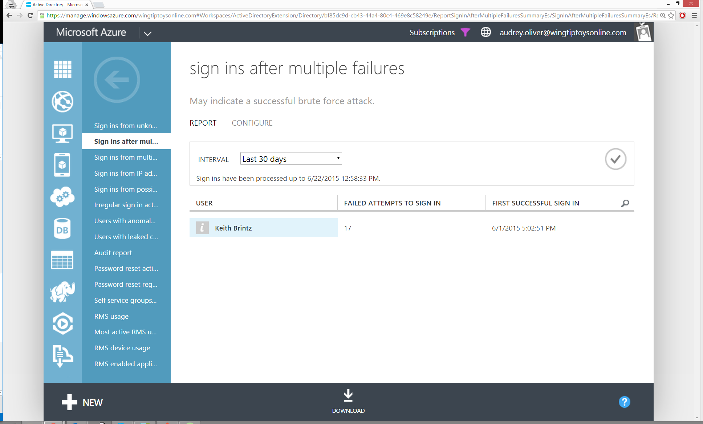

<properties
	pageTitle="Sign ins after multiple failures"
	description="A report that indicates users who have successfully signed in after multiple consecutive failed sign in attempts."
	services="active-directory"
	documentationCenter=""
	authors="SSalahAhmed"
	manager="stevenpo"
	editor=""/>

<tags
	ms.service="active-directory"
	ms.workload="identity"
	ms.tgt_pltfrm="na"
	ms.devlang="na"
	ms.topic="article"
	ms.date="03/04/2016"
	ms.author="saah;kenhoff"/>

# Sign-ins after multiple failures
This report indicates users who have successfully signed in after multiple consecutive failed sign in attempts. Possible causes include:

- User had forgotten their password</li><li>User is the victim of a successful password guessing brute force attack

Results from this report will show you the number of consecutive failed sign-in attempts made prior to the successful sign-in and a timestamp associated with the first successful sign-in.

**Report Settings**: You can configure the minimum number of consecutive failed sign in attempts that must occur before it can be displayed in the report. When you make changes to this setting it is important to note that these changes will not be applied to any existing failed sign ins that currently show up in your existing report. However, they will be applied to all future sign-ins. Changes to this report can only be made by licensed admins.

