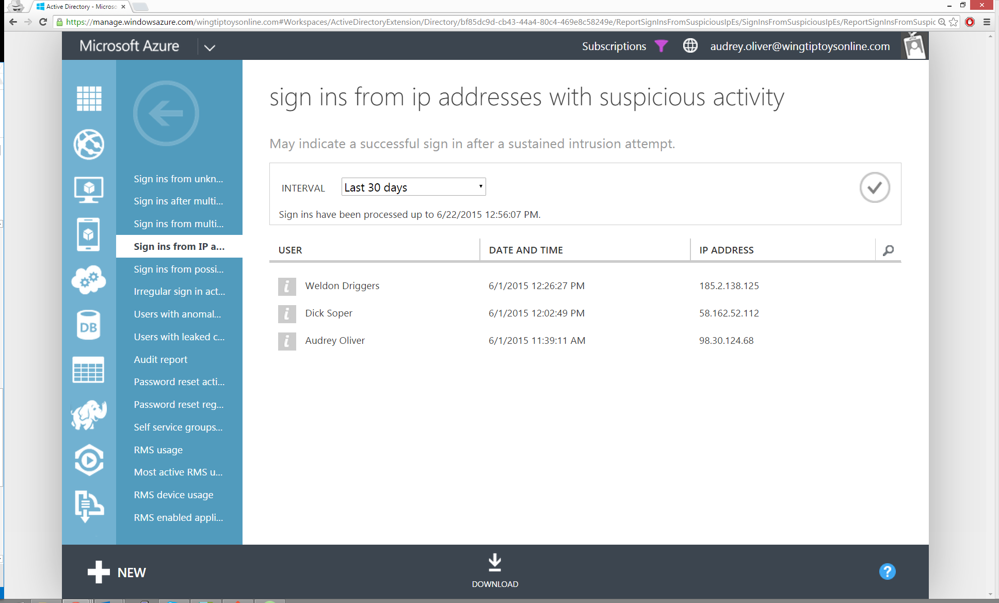

<properties
	pageTitle="Sign ins from IP addresses with suspicious activity"
	description="A report that includes sign in attempts that have been executed from IP addresses where suspicious activity has been noted."
	services="active-directory"
	documentationCenter=""
	authors="SSalahAhmed"
	manager="gchander"
	editor=""/>

<tags
	ms.service="active-directory"
	ms.workload="identity"
	ms.tgt_pltfrm="na"
	ms.devlang="na"
	ms.topic="article"
	ms.date="08/17/2015"
	ms.author="saah; kenhoff"/>

# Sign ins from IP addresses with suspicious activity

This report shows sign ins from IP addresses where suspicious activity has been detected. Suspicious activity in this case is defined to be an unsually high failed sign ins to successful sign ins ratio, which may indicate that an IP is being used for malicious purposes.

