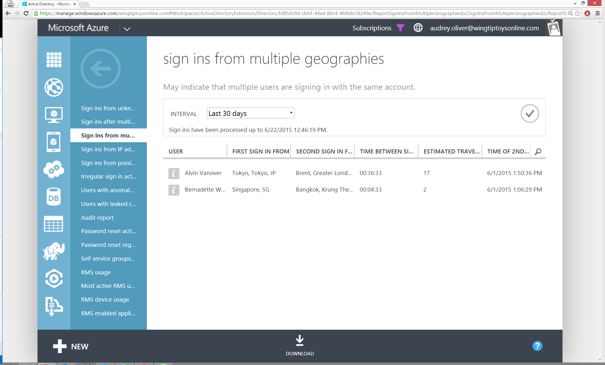

<properties
	pageTitle="Sign ins from multiple geographies"
	description="A report that indicates users where two sign ins appeared to originate from different regions and the time between the sign ins makes it impossible for the user to have travelled between those regions."
	services="active-directory"
	documentationCenter=""
	authors="kenhoff"
	manager="ilanas"
	editor=""/>

<tags
	ms.service="active-directory"
	ms.workload="identity"
	ms.tgt_pltfrm="na"
	ms.devlang="na"
	ms.topic="article"
	ms.date="07/01/2015"
	ms.author="kenhoff"/>

# Sign ins from multiple geographies

| Description        | Report location |
| :-------------     | :-------        |
| 
This report includes successful sign in activities from a user where two sign ins appeared to originate from different regions and the time between the sign ins makes it impossible for the user to have travelled between those regions. Possible causes include:
<ul><li>User is sharing their password</li><li>User is using a remote desktop to launch a web browser for sign in</li><li>A hacker has signed in to the account of a user from a different country.</li></ul>
Results from this report will show you the successful sign in events, together with the time between the sign ins, the regions where the sign ins appeared to originate from and the estimated travel time between those regions.

The travel time shown is only an estimate and may be different from the actual travel time between the locations. Also, no events are generated for sign ins between neighboring regions.
 | Directory > Reports tab |

