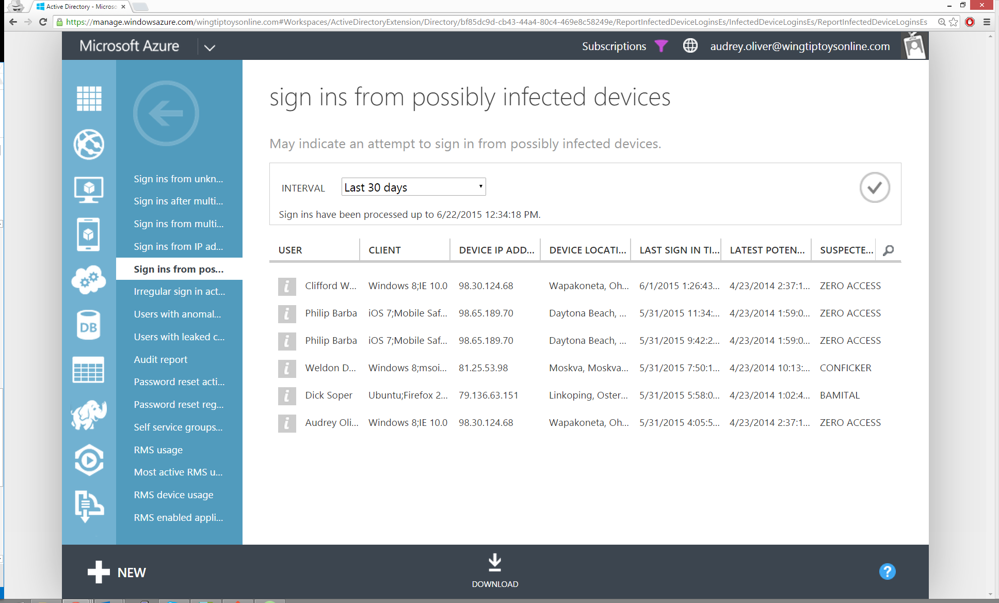

<properties
	pageTitle="Sign ins from possibly infected devices"
	description="A report that includes sign in attempts that have been executed from devices on which some malware (malicious software) may be running."
	services="active-directory"
	documentationCenter=""
	authors="SSalahAhmed"
	manager="gchander"
	editor=""/>

<tags
	ms.service="active-directory"
	ms.workload="identity"
	ms.tgt_pltfrm="na"
	ms.devlang="na"
	ms.topic="article"
	ms.date="03/04/2016"
	ms.author="saah;kenhoff"/>

# Sign ins from possibly infected devices
This report attempts to identify your users' devices that that have become infected and are now part of a botnet. We correlate IP addresses of users' sign-ins against IP addresses that we know to be in contact with botnet servers.

Recommendation: This report flags IP addresses, not user devices. We recommend that you contact the user and scan all the user's devices to be certain. It is also possible that a user's personal device is infected, or that someone other than the user, who was using the same IP address as the user, has an infected device.

For more information about how to address malware infections, see the [Malware Protection Center](http://go.microsoft.com/fwlink/?linkid=335773).

