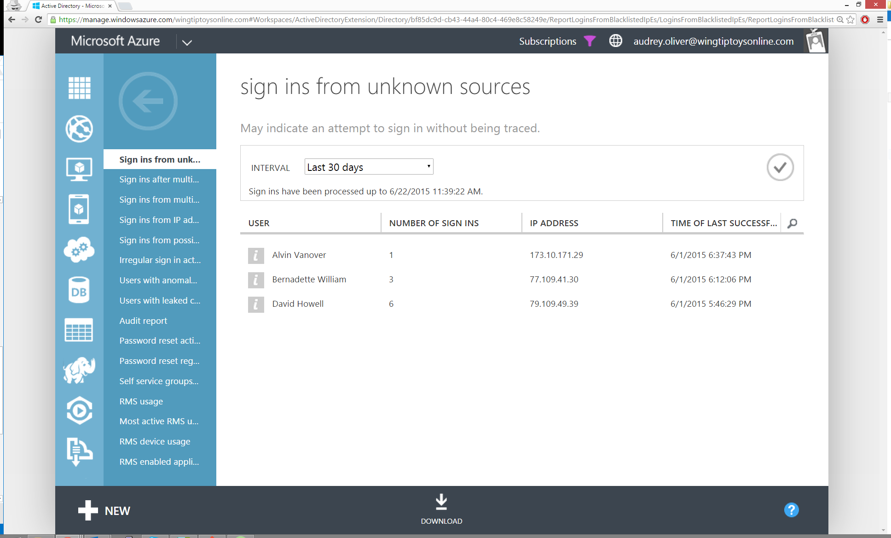

# Sign ins from unknown sources
This report indicates users who have successfully signed in to your directory while assigned a client IP address that has been recognized by Microsoft as an anonymous proxy IP address (for example, a Tor IP address). These proxies are often used by users that want to hide their computer’s IP address, and may be used for malicious intent.

Results from this report will show the number of times a user successfully signed in to your directory from that address and the proxy’s IP address.

