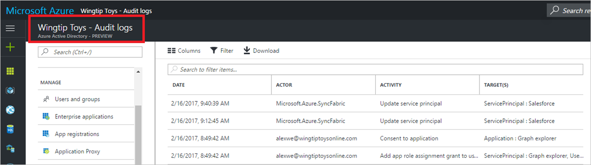

---

title: 'Troubleshooting: Missing data in the Azure Active Directory activity log  | Microsoft Docs'
description: Lists the various available reports for Azure Active Directory
services: active-directory
documentationcenter: ''
author: MarkusVi
manager: femila
editor: ''

ms.assetid: 7cbe4337-bb77-4ee0-b254-3e368be06db7
ms.service: active-directory
ms.devlang: na
ms.topic: get-started-article
ms.tgt_pltfrm: na
ms.workload: identity
ms.date: 05/04/2017
ms.author: markvi

---

# I can’t find some actions that I performed in the Azure Active Directory activity log

## Symptoms

I performed some actions in the Azure portal and expected to see the audit logs for those actions in the `Activity logs > Audit Logs` blade, but I can’t find them.

 
 

## Cause

Actions don’t appear immediately in the Activity Audit log. It can take anywhere from 15 minutes to an hour to see the audit logs in the portal from the time the operation is performed.

## Resolution

Wait for 15 minutes to an hour and see if the actions appear in the log. If you still don’t see them, please raise a support ticket with us and we will look into it.

## Next steps
See the [Azure Active Directory reporting FAQ](active-directory-reporting-faq.md).

