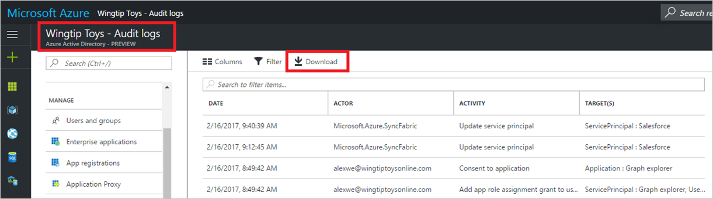

---

title: 'Troubleshooting: Missing data in the downloaded Azure Active Directory activity logs | Microsoft Docs'
description: Provides you with a resolution to missing data in downloaded Azure Active Directory activity logs.
services: active-directory
documentationcenter: ''
author: MarkusVi
manager: femila
editor: ''

ms.assetid: ffce7eb1-99da-4ea7-9c4d-2322b755c8ce
ms.service: active-directory
ms.devlang: na
ms.topic: get-started-article
ms.tgt_pltfrm: na
ms.workload: identity
ms.date: 05/04/2017
ms.author: markvi

---

# I can’t find any data in the Azure Active Directory activity logs I have downloaded

## Symptoms

I downloaded the activity logs (audit or sign-ins) and I don’t see all the records for the time I chose. Why? 

 
 

## Cause

When you download activity logs in the Azure portal, we limit the scale to 120K records, sorted by most recent. 

## Resolution

You can leverage [Azure AD Reporting APIs](active-directory-reporting-api-getting-started.md) to fetch up to a million records at any given point. Our recommended approach is to run a script on a scheduled basis that calls the reporting APIs to fetch records in an incremental fashion over a period of time (e.g., daily or weekly).

## Next steps
See the [Azure Active Directory reporting FAQ](active-directory-reporting-faq.md).

