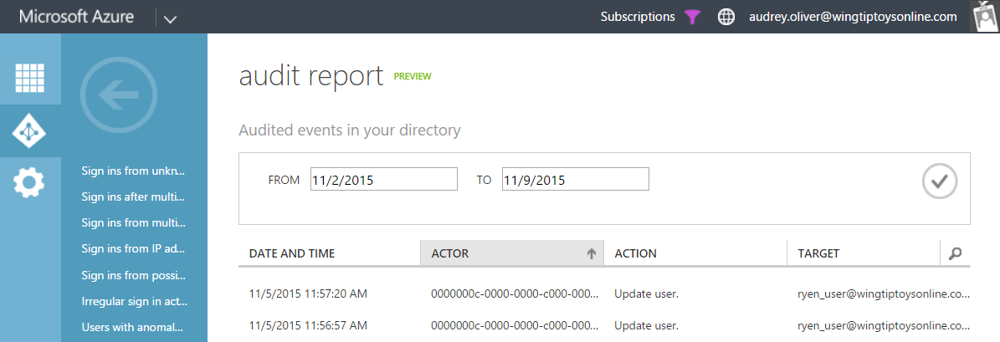
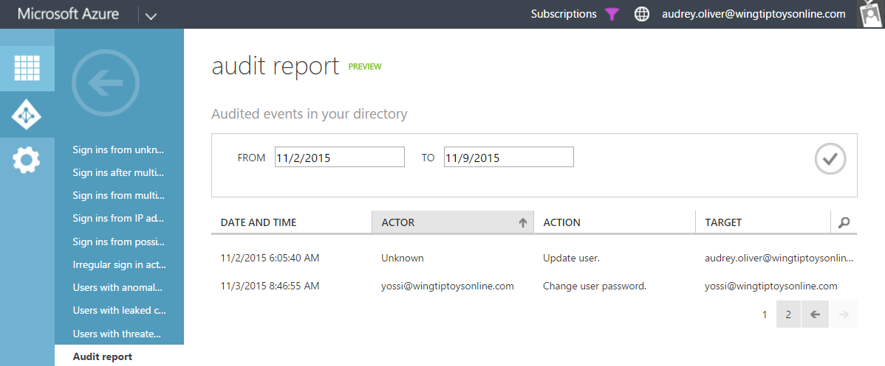

<properties
   pageTitle="Azure Active Directory Reporting 'Unknown Actor' | Microsoft Azure"
   description="Description of the 'Unknown Actor' event in Azure Active Directory Reports"
   services="active-directory"
   documentationCenter=""
   authors="SSalahAhmed"
   manager="mbaldwin"
   editor=""/>

<tags
   ms.service="active-directory"
   ms.devlang="na"
   ms.topic="article"
   ms.tgt_pltfrm="na"
   ms.workload="identity"
   ms.date="03/04/2016"
   ms.author="saah"/>

# Azure Active Directory Reporting 'Unknown Actor' event

*This documentation is part of the [Azure Active Directory Reporting Guide](active-directory-reporting-guide.md).*

On rare occasions, you may see unusual values in the "Actor" or "User" fields in Azure AD Reports. This behavior is expected, and is caused by one of two events:

## A Service Principal is acting on the directory, without a user context

In this case, a Service Principal (Application) is performing directory updates without actually signing in as a user. This causes the Service Principal's ID to show up as the Actor, instead of a UPN. Here's an example:

This is a known bug, and we are working to resolve it.

## A user was deleted from the directory before the event was processed

In this case, a user was deleted from the directory before we processed the event and associated a user name with it. Here's an example:

This is a known bug, and we are working to resolve it.

<!--  -->
