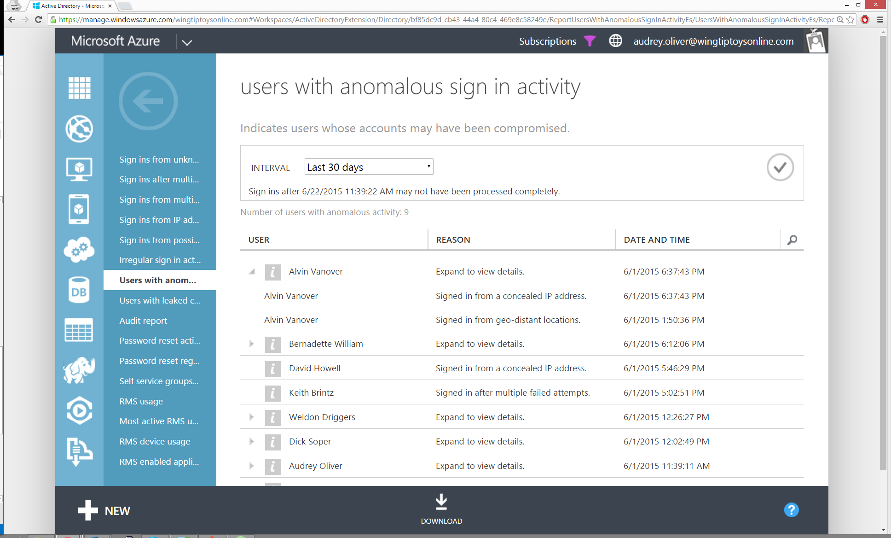

<properties
	pageTitle="Users with anomalous sign in activity"
	description="A report that indicates all user accounts for which anomalous sign in activity has been identified."
	services="active-directory"
	documentationCenter=""
	authors="SSalahAhmed"
	manager="gchander"
	editor=""/>

<tags
	ms.service="active-directory"
	ms.workload="identity"
	ms.tgt_pltfrm="na"
	ms.devlang="na"
	ms.topic="article"
	ms.date="03/04/2016"
	ms.author="saah;kenhoff"/>

# Users with anomalous sign in activity
This is an aggregate report that combines suspicious sign-ins from the following reports:

<ul><li>Sign ins from unknown sources</li>
<li>Sign-ins after multiple failures</li>
<li>Sign-ins from multiple geographies</li>
<li>Sign-ins from IP addresses with suspicious activity</li>
<li>Sign-ins from possibly infected devices</li>
<li>Irregular sign-in activity</li>
</ul>

