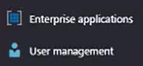
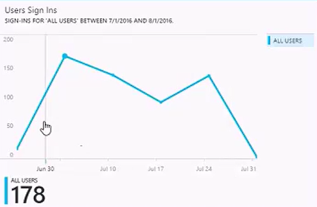
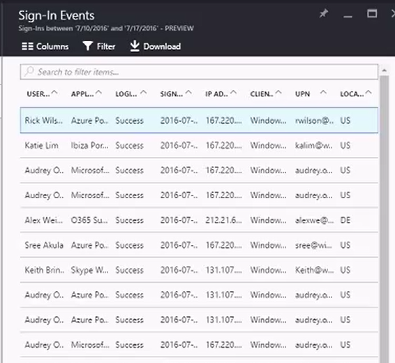

<properties
   pageTitle="Azure Active Directory Reporting: Getting started | Microsoft Azure"
   description="Lists the various available reports in Azure Active Directory reporting"
   services="active-directory"
   documentationCenter=""
   authors="markusvi"
   manager="femila"
   editor=""/>

<tags
   ms.service="active-directory"
   ms.devlang="na"
   ms.topic="get-started-article"
   ms.tgt_pltfrm="na"
   ms.workload="identity"
   ms.date="08/08/2016"
   ms.author="markvi"/>

# Azure Active Directory reporting

With Azure Active Directory Reporting, you get all the information you need to determine how your environment is doing.

There are two main areas of reporting:

- **User sign-ins** – Information about the usage of managed applications and user sign-in activities 

- **System events** - Audit information about user management and your managed applications

Depending on the scope (users or applications) of the data you are looking for, you can access these reports either by clicking **User management** or **Enterprise applications** in the left navigation bar of the Azure management portal. 

 
 

## User sign ins

With the information provided by the user sign-in report, for your users, you find answers to questions such as:

- What is the sign-in pattern of a user?
- How many users have users signed-in over a week?
- What’s the status of these sign-ins?

Your entry point to this data is the user sign-in graph in the **Overview** section of **User management**. The user sign-in graph shows weekly aggregations of sign ins for all users in a given time period. The default for the time period is 30 days. 
 

 

When you click on a day in the sign-in graph, you get a detailed list of the sign-in events.

 

Each row in the sign-in events list gives you the detailed information about the selected sign-in such as:

- Who has signed-in?

- What was the related UPN?

- What application was the target of the sign-in?

- What is the IP address of the sign-in?

- What was the status of the sign-in?

While the overview section provides you with an aggregated view of all user sign-ins, you can also scope the data around a specific user, groups or applications.

With an application centric view of your sign-in data, you can answer questions such as:

- Who is using my applications?

- What are the top 3 applications in your organization?

- I have recently rolled-out an application. How is it doing?

Your entry point to the application centric view of this data is the user sign-in graph in the Overview section under Enterprise applications. The application graph shows the top 3 applications in your organization within the last 30 days. 

\<Screenshot\>

Like in the case of user sign-in data, you can scope the application data around specific applications.

## Auditing

The auditing reports in Azure Active Directory provide records of system events for compliance.

There are two main audit views in the Azure portal:

- User and group related events - 

- Application events – 

You can filter an audit report by a date or a target resource type such as a specific application, a user or group and you can group them by activity.

\<screenshot\>

With user and group-based audit reports, you can get answers to questions such as:

- What has happened to a given user within the last 30 days?

- How many users were changed within the last 30 days?

- What has an administrator done in a directory within the last 30 days?

- What are the groups that have changed within the last 30 days?

- What are the groups that have been added within the last 30 days?

With application-based audit reports, you can get answers to questions such as:

- What are the applications that have been added during the last 30 days?

- Has a service principle for an application changed within the last 30 days?

For a complete list of audit report events, see the [list of audit report events](active-directory-reporting-audit-events.md#list-of-audit-report-events).

