<properties 
    pageTitle="Tutorial: Azure Active Directory integration with 15Five | Microsoft Azure" 
    description="Learn how to use 15Five with Azure Active Directory to enable single sign-on, automated provisioning, and more!" 
    services="active-directory" 
    authors="jeevansd"  
    documentationCenter="na" 
    manager="femila"/>
<tags 
    ms.service="active-directory" 
    ms.devlang="na" 
    ms.topic="article" 
    ms.tgt_pltfrm="na" 
    ms.workload="identity" 
    ms.date="07/11/2016" 
    ms.author="jeedes" />

#Tutorial: Azure Active Directory integration with 15Five

The objective of this tutorial is to show the integration of Azure and 15Five. The scenario outlined in this tutorial assumes that you already have the following items:

-   A valid Azure subscription
-   A 15Five single sign-on enabled subscription

After completing this tutorial, the Azure AD users you have assigned to 15Five will be able to single sign into the application at your 15Five company site (service provider initiated sign on), or using the [Introduction to the Access Panel](active-directory-saas-access-panel-introduction.md).

The scenario outlined in this tutorial consists of the following building blocks:

1.  Enabling the application integration for 15Five
2.  Configuring single sign-on
3.  Configuring user provisioning
4.  Assigning users

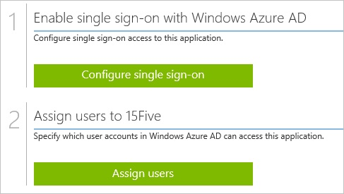
##Enabling the application integration for 15Five

The objective of this section is to outline how to enable the application integration for 15Five.

###To enable the application integration for 15Five, perform the following steps:

1.  In the Azure classic portal, on the left navigation pane, click **Active Directory**.

    

2.  From the **Directory** list, select the directory for which you want to enable directory integration.

3.  To open the applications view, in the directory view, click **Applications** in the top menu.

    

4.  Click **Add** at the bottom of the page.

    

5.  On the **What do you want to do** dialog, click **Add an application from the gallery**.

    

6.  In the **search box**, type **15Five**.

    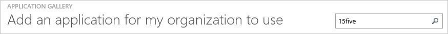

7.  In the results pane, select **15Five**, and then click **Complete** to add the application.

    
##Configuring single sign-on

The objective of this section is to outline how to enable users to authenticate to 15Five with their account in Azure AD using federation based on the SAML protocol.

###To configure single sign-on, perform the following steps:

1.  In the Azure classic portal, on the **15Five** application integration page, click **Configure single sign-on** to open the **Configure Single Sign On ** dialog.

    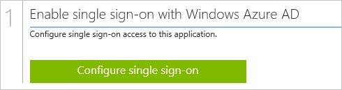

2.  On the **How would you like users to sign on to 15Five** page, select **Microsoft Azure AD Single Sign-On**, and then click **Next**.

    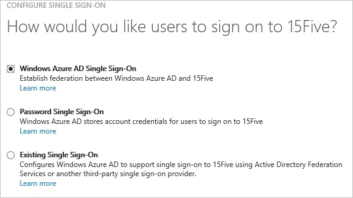

3.  On the **Configure App URL** page, in the **15Five Sign In URL** textbox, type your URL using the following pattern "*https://company.15Five.com*", and then click **Next**.

    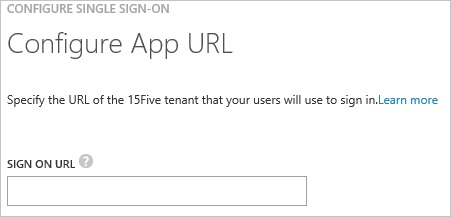

4.  On the **Configure single sign-on at 15Five** page, click **Download metadata**, and then forward the metadata file to the 15Five support team.

    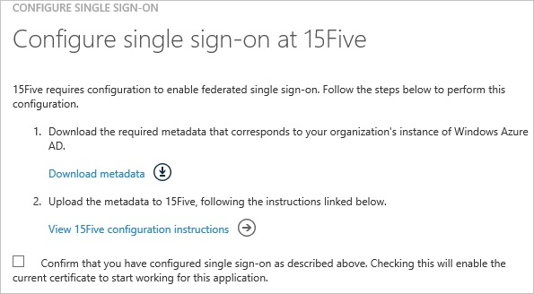

    >[AZURE.NOTE] Single sign-on needs to be enabled by the 15Five support team.

5.  On the Azure classic portal, select the single sign-on configuration confirmation, and then click **Complete** to close the **Configure Single Sign On** dialog.

    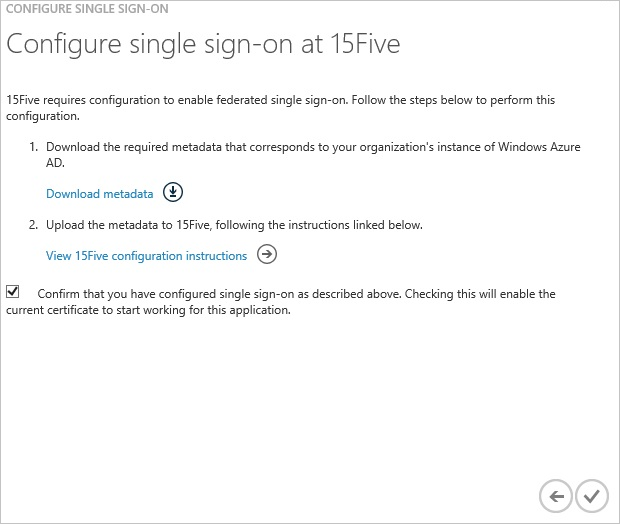
##Configuring user provisioning

In order to enable Azure AD users to log into 15Five, they must be provisioned into 15Five.  
In the case of 15Five, provisioning is a manual task.

###To configure user provisioning, perform the following steps:

1.  Log in to your **15Five** company site as administrator.

2.  Go to **Manage Company**.

    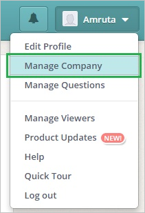

3.  Go to **People \> Add People**.

    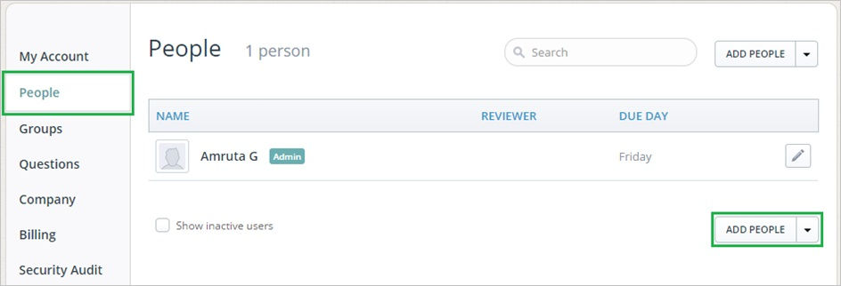

4.  In the Add New Person section, perform the following steps:

    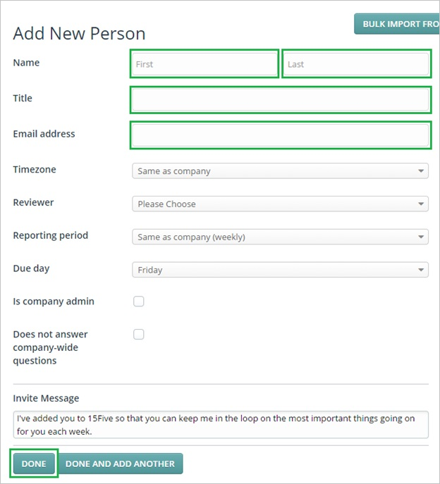

    1.  Type the **First Name**, **Last Name**, **Title**, **Email address** of a valid Azure Active Directory account you want to provision into the related textboxes.
    2.  Click **Done**.

    >[AZURE.NOTE] The Azure AD account holder will receive an email including a link to confirm the account before it becomes active.

>[AZURE.NOTE] You can use any other 15Five user account creation tools or APIs provided by 15Five to provision AAD user accounts.

##Assigning users

To test your configuration, you need to grant the Azure AD users you want to allow using your application access to it by assigning them.

###To assign users to 15Five, perform the following steps:

1.  In the Azure classic portal, create a test account.

2.  On the **15Five **application integration page, click **Assign users**.

    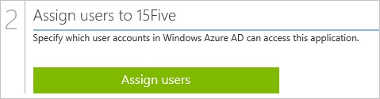

3.  Select your test user, click **Assign**, and then click **Yes** to confirm your assignment.

    

If you want to test your single sign-on settings, open the Access Panel. For more details about the Access Panel, see [Introduction to the Access Panel](active-directory-saas-access-panel-introduction.md).
