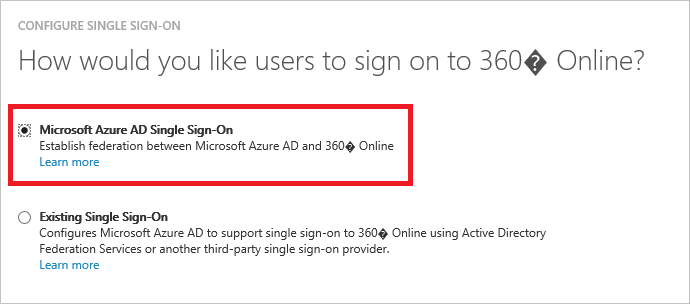
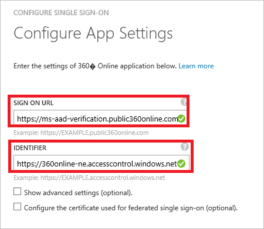
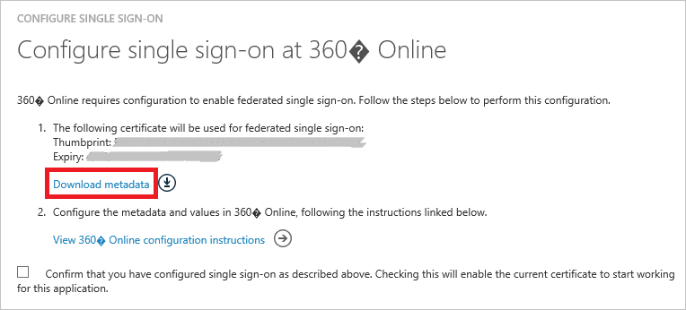
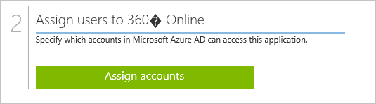

<properties
	pageTitle="Tutorial: Azure Active Directory integration with Weekdone | Microsoft Azure"
	description="Learn how to configure single sign-on between Azure Active Directory and 360° Online."
	services="active-directory"
	documentationCenter=""
	authors="jeevansd"
	manager="stevenpo"
	editor=""/>

<tags
	ms.service="active-directory"
	ms.workload="identity"
	ms.tgt_pltfrm="na"
	ms.devlang="na"
	ms.topic="article"
	ms.date="04/18/2016"
	ms.author="jeedes"/>

# Tutorial: Azure Active Directory integration with 360° Online

The objective of this tutorial is to show the integration of Azure and 360° Online. 
 The scenario outlined in this tutorial assumes that you already have the following items:

- A valid Azure subscription
- A 360° Online tenant

After completing this tutorial, the Azure AD users you have assigned to 360° Online will be able to single sign into the application at your 360° Online company site (service provider initiated sign on), or using the [Introduction to the Access Panel](https://azure.microsoft.com/en-us/documentation/articles/active-directory-saas-access-panel-introduction/). 

The scenario outlined in this tutorial consists of the following building blocks: 

1. Enabling the application integration for 360° Online  

2. Configuring single sign-on  

3. Configuring user provisioning  

4. Assigning users   
![Active Directory][12] 

## Enabling the application integration for 360° Online

The objective of this section is to outline how to enable the application integration for 360° Online. 

**To enable the application integration for 360° Online, perform the following steps:**

1. In the **Azure Management Portal**, on the left navigation pane, click **Active Directory**.   
![Active Directory][1] 

2. From the **Directory** list, select the directory for which you want to enable directory integration.

3. To open the applications view, in the directory view, click **Applications** in the top menu.  
![Applications][2] 
4. Click **Add** at the bottom of the page.  
![Applications][3] 
5. On the **What do you want to do** dialog, click **Add an application from the gallery**.  
![Applications][4] 
6. In the search box, type **360° Online**.  
 
7. In the results pane, select **360° Online**, and then click **Complete** to add the application.
  

##  Configuring single sign-on
The objective of this section is to outline how to enable users to authenticate to 360° Online with their account in Azure AD using federation based on the WS-Federated protocol. 

**To configure Azure AD single sign-on with 360° Online, perform the following steps:**

1.In the Azure AD portal, on the **360° Online** application integration page, click **Configure single sign-on** to open the **Configure Single Sign-On**  dialog.
   ![Configure Single Sign-On][13]  

2.On the **How would you like users to sign on to 360° Online** page, select **Azure AD Single Sign-On**, and then click **Next**.
     

3.On the **Configure App URL** dialog page, perform the following steps and then click **Next**.
    

a. In the Sign On URL textbox, type the URL used by your users to sign-on to your 360° Online application (e.g.: https://companyname.public360online.com). 

b. In the IDENTIFIER textbox, type the URL in the following pattern: **"https://360online-ne.accesscontrol.windows.net"** 

c. Click **Next** 

4.On the **Configure App URL** dialog page, perform the following steps and then click **Next**.
    

a. Click **Download metadata**, and then save it on your computer.

b. Click **Next**.

5.To get SSO configured for your application, contact your 360° Online support team via support.community@software-innovation.com. Attach the downloaded metadata file to your mail and send the mail to 360° Online team to set up SSO on their side.

6.In the Azure AD portal, select the single sign-on configuration confirmation, and then click **Next**.
  ![Azure AD Single Sign-On][10] 

7.On the **Single sign-on confirmation** page, click **Complete**.  
    
![Azure AD Single Sign-On][11]

### Configuring user provisioning

In order to enable Azure AD users to log into 360° Online, they must be provisioned into 360° Online. 

In the case of 360° Online, provisioning is a manual task. You need to contact the 360° Online support team via support.community@software-innovation.com to provision your Azure AD users on app side. 

### Assigning users

To test your configuration, you need to grant the Azure AD users you want to allow using your application access to it by assigning them.  

**To assign users to 360° Online, perform the following steps:**

1. In the Azure AD portal, create a test account. 

2. On the **360° Online** application integration page, click **Assign users**.
  

3. Select your test user, click **Assign**, and then click **Yes** to confirm your assignment.
  

If you want to test your single sign-on settings, open the Access Panel. For more details about the Access Panel, see Introduction to the Access Panel.

### Testing Single Sign-On

The objective of this section is to test your Azure AD single sign-on configuration using the Access Panel. 

When you click the 360° Online tile in the Access Panel, open the Access Panel. For more details about the Access Panel, see [Introduction to the Access Panel](https://azure.microsoft.com/en-us/documentation/articles/active-directory-saas-access-panel-introduction/). 

<!--Image references-->

[1]: ./media/active-directory-saas-360online-tutorial/tutorial_general_01.png
[2]: ./media/active-directory-saas-360online-tutorial/tutorial_general_02.png
[3]: ./media/active-directory-saas-360online-tutorial/tutorial_general_03.png
[4]: ./media/active-directory-saas-360online-tutorial/tutorial_general_04.png

[10]: ./media/active-directory-saas-360online-tutorial/tutorial_general_06.png
[11]: ./media/active-directory-saas-360online-tutorial/tutorial_general_07.png
[12]: ./media/active-directory-saas-360online-tutorial/tutorial_general_08.png
[13]: ./media/active-directory-saas-360online-tutorial/tutorial_general_09.png
[20]: ./media/active-directory-saas-360online-tutorial/tutorial_general_100.png

