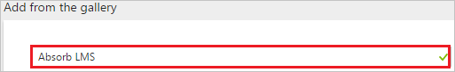
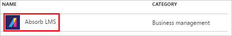
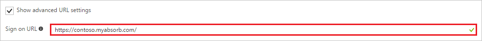
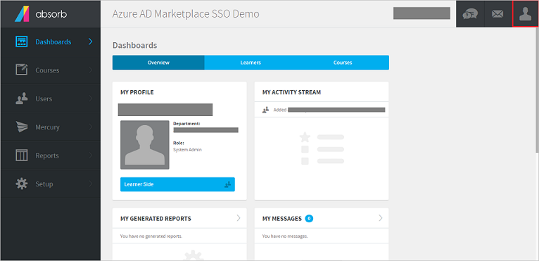
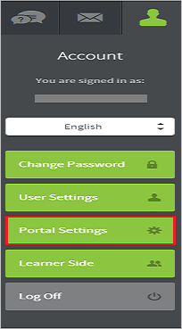
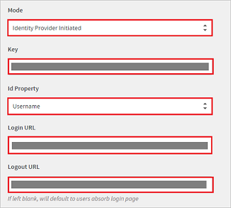
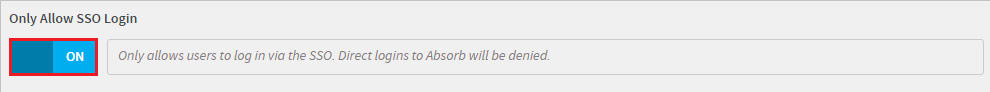
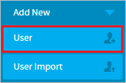
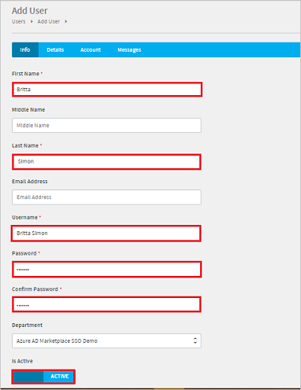

# Tutorial: Azure Active Directory integration with Absorb LMS

In this tutorial, you learn how to integrate Absorb LMS with Azure Active Directory (Azure AD).

Integrating Absorb LMS with Azure AD provides you with the following benefits:

- You can control in Azure AD who has access to Absorb LMS
- You can enable your users to automatically get signed-on to Absorb LMS (Single Sign-On) with their Azure AD accounts
- You can manage your accounts in one central location - the Azure portal

If you want to know more details about SaaS app integration with Azure AD, see. [What is application access and single sign-on with Azure Active Directory](active-directory-appssoaccess-whatis.md).

## Prerequisites

To configure Azure AD integration with Absorb LMS, you need the following items:

- An Azure AD subscription
- An Absorb LMS single-sign on enabled subscription

> [!NOTE]
> To test the steps in this tutorial, we do not recommend using a production environment.

To test the steps in this tutorial, you should follow these recommendations:

- Do not use your production environment, unless it is necessary.
- If you don't have an Azure AD trial environment, you can get a one-month trial [here](https://azure.microsoft.com/pricing/free-trial/).

## Scenario description
In this tutorial, you test Azure AD single sign-on in a test environment. 
The scenario outlined in this tutorial consists of two main building blocks:

1. Adding Absorb LMS from the gallery
2. Configuring and testing Azure AD single sign-on

## Adding Absorb LMS from the gallery
To configure the integration of Absorb LMS in to Azure AD, you need to add Absorb LMS from the gallery to your list of managed SaaS apps.

**To add Absorb LMS from the gallery, perform the following steps:**

1. In the **[Azure portal](https://portal.azure.com)**, on the left navigation panel, click **Azure Active Directory** icon. 

	![Active Directory][1]

2. Navigate to **Enterprise applications**. Then go to **All applications**.

	![Applications][2]
	
3. To add new application, click **New application** button on the top of dialog.

	![Applications][3]

4. In the search box, type **Absorb LMS**.

	

5. In the results panel, select **Absorb LMS**, and then click **Add** button to add the application.

	

##  Configuring and testing Azure AD single sign-on
In this section, you configure and test Azure AD single sign-on with Absorb LMS based on a test user called "Britta Simon."

For single sign-on to work, Azure AD needs to know what the counterpart user in Absorb LMS is to a user in Azure AD. In other words, a link relationship between an Azure AD user and the related user in Absorb LMS needs to be established.

This link relationship is established by assigning the value of the **user name** in Azure AD as the value of the **Username** in Absorb LMS.

To configure and test Azure AD single sign-on with Absorb LMS, you need to complete the following building blocks:

1. **[Configuring Azure AD Single Sign-On](#configuring-azure-ad-single-sign-on)** - to enable your users to use this feature.
2. **[Creating an Azure AD test user](#creating-an-azure-ad-test-user)** - to test Azure AD single sign-on with Britta Simon.
3. **[Creating an Absorb LMS test user](#creating-an-absorb-lms-test-user)** - to have a counterpart of Britta Simon in Absorb LMS that is linked to the Azure AD representation of user.
4. **[Assigning the Azure AD test user](#assigning-the-azure-ad-test-user)** - to enable Britta Simon to use Azure AD single sign-on.
5. **[Testing Single Sign-On](#testing-single-sign-on)** - to verify whether the configuration works.

### Configuring Azure AD single sign-on

In this section, you enable Azure AD single sign-on in the Azure portal and configure single sign-on in your Absorb LMS application.

**To configure Azure AD single sign-on with Absorb LMS, perform the following steps:**

1. In the Azure portal, on the **Absorb LMS** application integration page, click **Single sign-on**.

	![Configure Single Sign-On][4]

2. On the **Single sign-on** dialog, select **Mode** as	**SAML-based Sign-on** to enable single sign-on.
 
	

3. On the **Absorb LMS Domain and URLs** section, If you wish to configure the application in **IDP** initiated mode:

	

    a. In the **Identifier** textbox, type a URL using the following pattern: `https://<subdomain>.myabsorb.com/Account/SAML`

	b. In the **Reply URL** textbox, type a URL using the following pattern: `https://<subdomain>.myabsorb.com/Account/SAML`

4. Check **Show advanced URL settings**. If you wish to configure the application in **SP** initiated mode:

	

    In the **Sign-on URL** textbox, type a URL using the following pattern: `https://<subdomain>.myabsorb.com/`
	 
	> [!NOTE] 
	> These values are not the real. Update these values with the actual Identifier and Reply URL and Sign-On URL. Here we suggest you to use the unique value of string in the Identifier, Reply URL, and Sign-On URL. Contact [Absorb LMS Client support team](https://www.absorblms.com/support) to get these values. 

5. On the **SAML Signing Certificate** section, click **Metadata XML** and then save the metadata file on your computer.

	 

6. Click **Save** button.

	
	
7. On the **Absorb LMS Configuration** section, click **Configure Absorb LMS** to open **Configure sign-on** window. Copy the **Sign-Out URL and SAML Single Sign-On Service URL** from the **Quick Reference section.**

	 

8. In a different web browser window, log in to your Absorb LMS company site as an administrator.

9. Click the **Account Icon** on the admin interface. 

	

10. Click **Portal Settings**.

	
	
11.	Click the **Users** tab.

	

12. Perform the following steps to access the Single Sign-On configuration fields:

	

	a. Select the appropriate **Mode**.

	> [!NOTE]
	> Mode: Both IdP & SP initiated are supported.

	b. Open the Certificate that you have downloaded from the Azure portal in notepad, remove the **---BEGIN CERTIFICATE---** and **---END CERTIFICATE---** tag and then paste the remaining content in the **Key** textbox.
	
	c. In the **Id Property**, select the appropriate attribute which you have configured as the user identifier in the Azure AD (For example, If the userprinciplename is selected in Azure AD, then Username would be selected here.)

	d. In the **Login URL**, paste the **“SAML Single Sign-On Service URL”** value you have copied from the **Configure sign-on** window of the Azure portal.

	e. In the **Logout URL**, paste the **“Sign-Out URL”** value you have copied from the **Configure sign-on** window of the Azure portal.

13. Enable **‘Only Allow SSO Login’**.

	

14. Click **"Save."**

> [!TIP]
> You can now read a concise version of these instructions inside the [Azure portal](https://portal.azure.com), while you are setting up the app!  After adding this app from the **Active Directory > Enterprise Applications** section, simply click the **Single Sign-On** tab and access the embedded documentation through the **Configuration** section at the bottom. You can read more about the embedded documentation feature here: [Azure AD embedded documentation]( https://go.microsoft.com/fwlink/?linkid=845985)

### Creating an Azure AD test user
The objective of this section is to create a test user in the Azure portal called Britta Simon.

![Create Azure AD User][100]

**To create a test user in Azure AD, perform the following steps:**

1. In the **Azure portal**, on the left navigation pane, click **Azure Active Directory** icon.

	 

2. To display the list of users, go to **Users and groups** and click **All users**.
	
	 

3. At the top of the dialog click **Add** to open the **User** dialog.
 
	 

4. On the **User** dialog page, perform the following steps:
 
	 

    a. In the **Name** textbox, type **BrittaSimon**.

    b. In the **User name** textbox, type the **email address** of BrittaSimon.

	c. Select **Show Password** and write down the value of the **Password**.

    d. Click **Create**.

### Creating an Absorb LMS test user

To enable Azure AD users to log in to Absorb LMS, they must be provisioned in to Absorb LMS.  
For Absorb LMS, provisioning is a manual task.

**To provision a user account, perform the following steps:**

1. Log in to your Absorb LMS company site as an administrator.

2. Click **Users** tab.

    

3. Click **Users** under the **Users** tab.

    

4.  Select **User** from **Add New** drop-down.

    

5. On the **Add User** page, perform the following steps:

	

	a. In the **First Name** textbox, type the first name like Britta.

	b. In the **Last Name** textbox, type the last name like Simon.
	
	c. In the **Username** textbox, type the user name like Britta Simon.

	d. In the **Password** textbox, type the password of Britta Simon.

	e. In the **Confirm Password** dropdown, select the confirm password of Britta Simon.
	
	f. Make it as **ACTIVE**.	

6. Click **"Save."**
 
### Assigning the Azure AD test user

In this section, you enable Britta Simon to use Azure single sign-on by granting access to Absorb LMS.

![Assign User][200] 

**To assign Britta Simon to Absorb LMS, perform the following steps:**

1. In the Azure portal, open the applications view, and then navigate to the directory view and go to **Enterprise applications** then click **All applications**.

	![Assign User][201] 

2. In the applications list, select **Absorb LMS**.

	 

3. In the menu on the left, click **Users and groups**.

	![Assign User][202] 

4. Click **Add** button. Then select **Users and groups** on **Add Assignment** dialog.

	![Assign User][203]

5. On **Users and groups** dialog, select **Britta Simon** in the Users list.

6. Click **Select** button on **Users and groups** dialog.

7. Click **Assign** button on **Add Assignment** dialog.
	
### Testing single sign-on

In this section, you test your Azure AD single sign-on configuration using the Access Panel.

Click the Absorb LMS tile in the Access Panel, you will get automatically signed-on to your Absorb LMS application. For more information about the Access Panel, see [Introduction to the Access Panel](https://msdn.microsoft.com/library/dn308586).

## Additional resources

* [List of Tutorials on How to Integrate SaaS Apps with Azure Active Directory](active-directory-saas-tutorial-list.md)
* [What is application access and single sign-on with Azure Active Directory?](active-directory-appssoaccess-whatis.md)

<!--Image references-->

[1]: ./media/active-directory-saas-absorblms-tutorial/tutorial_general_01.png
[2]: ./media/active-directory-saas-absorblms-tutorial/tutorial_general_02.png
[3]: ./media/active-directory-saas-absorblms-tutorial/tutorial_general_03.png
[4]: ./media/active-directory-saas-absorblms-tutorial/tutorial_general_04.png

[100]: ./media/active-directory-saas-absorblms-tutorial/tutorial_general_100.png

[200]: ./media/active-directory-saas-absorblms-tutorial/tutorial_general_200.png
[201]: ./media/active-directory-saas-absorblms-tutorial/tutorial_general_201.png
[202]: ./media/active-directory-saas-absorblms-tutorial/tutorial_general_202.png
[203]: ./media/active-directory-saas-absorblms-tutorial/tutorial_general_203.png

