<properties 
    pageTitle="Tutorial: Azure Active Directory integration with Adaptive Suite | Microsoft Azure"
    description="Learn how to use Adaptive Suite with Azure Active Directory to enable single sign-on, automated provisioning, and more!" 
    services="active-directory" 
    authors="jeevansd"  
    documentationCenter="na" 
    manager="femila"/>
<tags 
    ms.service="active-directory" 
    ms.devlang="na" 
    ms.topic="article" 
    ms.tgt_pltfrm="na" 
    ms.workload="identity" 
    ms.date="07/11/2016" 
    ms.author="jeedes" />

#Tutorial: Azure Active Directory integration with Adaptive Suite

The objective of this tutorial is to show the integration of Azure and Adaptive Suite.  
The scenario outlined in this tutorial assumes that you already have the following items:

-   A valid Azure subscription
-   An Adaptive Suite tenant

After completing this tutorial, the Azure AD users you have assigned to Adaptive Suite will be able to single sign into the application at your Adaptive Suite company site (service provider initiated sign on), or using the [Introduction to the Access Panel](active-directory-saas-access-panel-introduction.md).

The scenario outlined in this tutorial consists of the following building blocks:

1.  Enabling the application integration for Adaptive Suite
2.  Configuring single sign-on
3.  Configuring user provisioning
4.  Assigning users

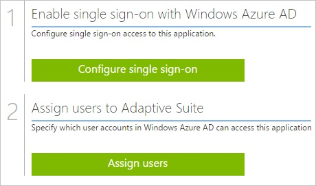
##Enabling the application integration for Adaptive Suite

The objective of this section is to outline how to enable the application integration for Adaptive Suite.

###To enable the application integration for Adaptive Suite, perform the following steps:

1.  In the Azure classic portal, on the left navigation pane, click **Active Directory**.

    

2.  From the **Directory** list, select the directory for which you want to enable directory integration.

3.  To open the applications view, in the directory view, click **Applications** in the top menu.

    

4.  Click **Add** at the bottom of the page.

    

5.  On the **What do you want to do** dialog, click **Add an application from the gallery**.

    

6.  In the **search box**, type **Adaptive Suite**.

    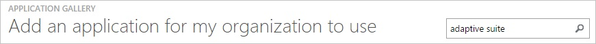

7.  In the results pane, select **Adaptive Suite**, and then click **Complete** to add the application.

    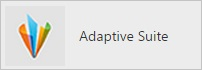
##Configuring single sign-on

The objective of this section is to outline how to enable users to authenticate to Adaptive Suite with their account in Azure AD using federation based on the SAML protocol.  
Configuring single sign-on for Adaptive Suite requires you to retrieve a thumbprint value from a certificate.  
If you are not familiar with this procedure, see [How to retrieve a certificate's thumbprint value](http://youtu.be/YKQF266SAxI).

###To configure single sign-on, perform the following steps:

1.  In the Azure classic portal, on the **Adaptive Suite** application integration page, click **Configure single sign-on** to open the **Configure Single Sign On ** dialog.

    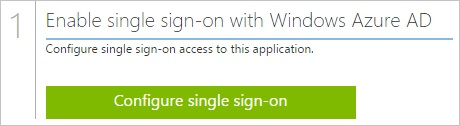

2.  On the **How would you like users to sign on to Adaptive Suite** page, select **Microsoft Azure AD Single Sign-On**, and then click **Next**.

    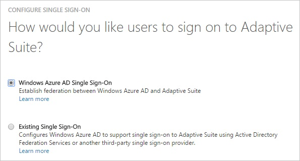

3.  On the **Configure App Settings** page, in the **Reply URL** textbox, type your URL using the following pattern "*https://login.adaptiveinsights.com:443/samlsso/RlJFRVRSSUFMMTI3MTE=*", and then click **Next**.

    >[AZURE.NOTE] You can get this value from the Adaptive Suite’s **SAML SSO Settings** page.

    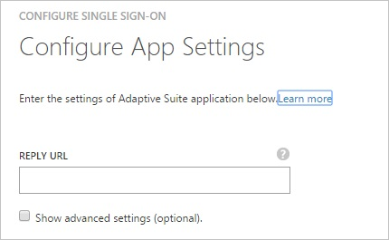

4.  On the **Configure single sign-on at Adaptive Suite** page, to download your certificate, click **Download certificate**, and then save the certificate file locally on your computer.

    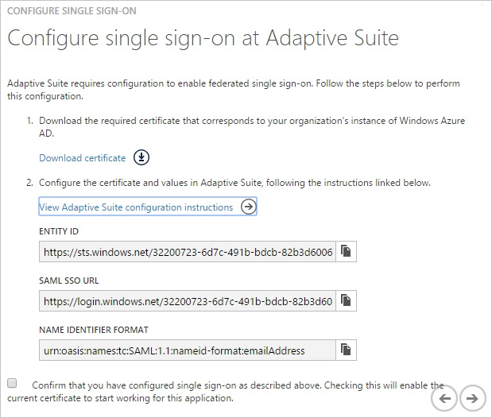

5.  In a different web browser window, log into your Adaptive Suite company site as an administrator.

6.  Go to **Admin**.

    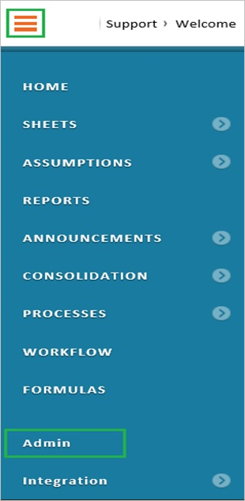

7.  In the **Users and Roles** section, click **Manage SAML SSO Settings**.

    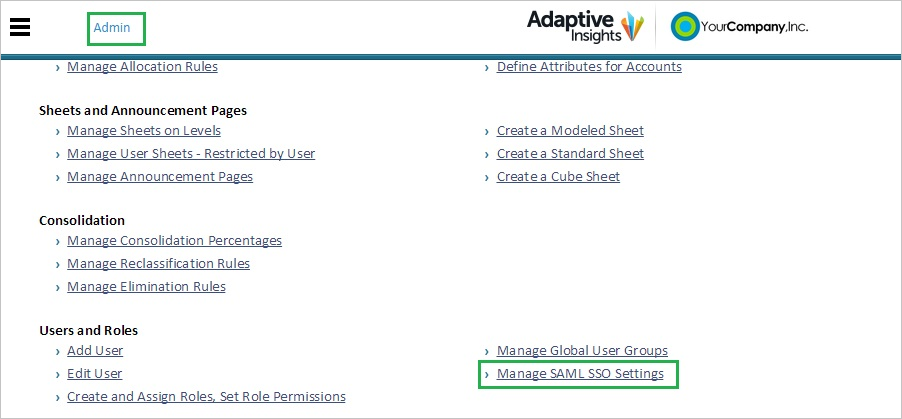

8.  On the **SAML SSO Settings** page, perform the following steps:

    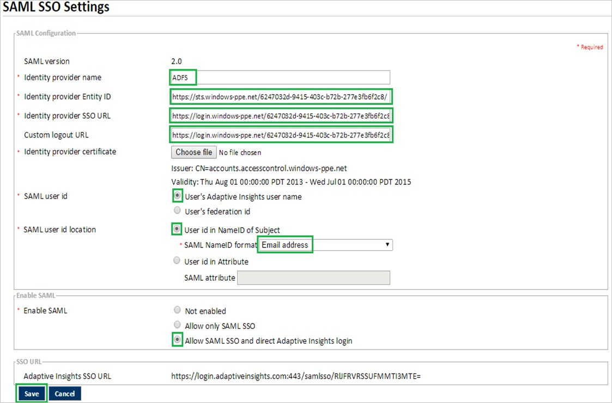

    1.  In the **Identity provider name** textbox, type a name for your configuration.
    2.  In the Azure classic portal, on the **Configure single sign-on at Adaptive Suite** dialog page, copy the **Entity ID** value, and then paste it into the **Identity provider Entity ID** textbox.
    3.  In the Azure classic portal, on the **Configure single sign-on at Adaptive Suite** dialog page, copy the **SAML SSO URL** value, and then paste it into the **Identity provider SSO URL** textbox.
    4.  In the Azure classic portal, on the **Configure single sign-on at Adaptive Suite** dialog page, copy the **SAML SSO URL** value, and then paste it into the **Custom logout URL** textbox.
    5.  To upload your downloaded certificate, click **Choose file**.
    6.  As **SAML user id**, select **User’s Adaptive Insights user name**.
    7.  As **SAML user id location**, select **User id in NameID of Subject**.
    8.  As **SAML NameID format**, select **Email address**.
    9.  As **Enable SAML**, select **Allow SAML SSO and direct Adaptive Insights login**.
    10. Click **Save**.

9.  On the Azure classic portal, select the single sign-on configuration confirmation, and then click **Complete** to close the **Configure Single Sign On** dialog.

    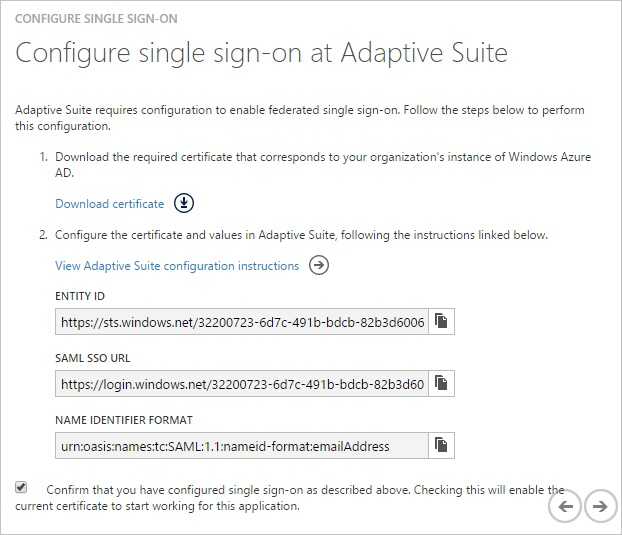
##Configuring user provisioning

In order to enable Azure AD users to log into Adaptive Suite, they must be provisioned into Adaptive Suite.  
In the case of Adaptive Suite, provisioning is a manual task.

###To configure user provisioning, perform the following steps:

1.  Log in to your **Adaptive Suite** company site as an administrator.

2.  Go to **Admin**.

    

3.  In the **Users and Roles** section, click **Add User**.

    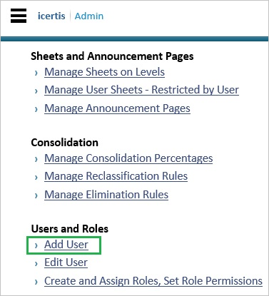

4.  In the **New User** section, perform the following steps:

    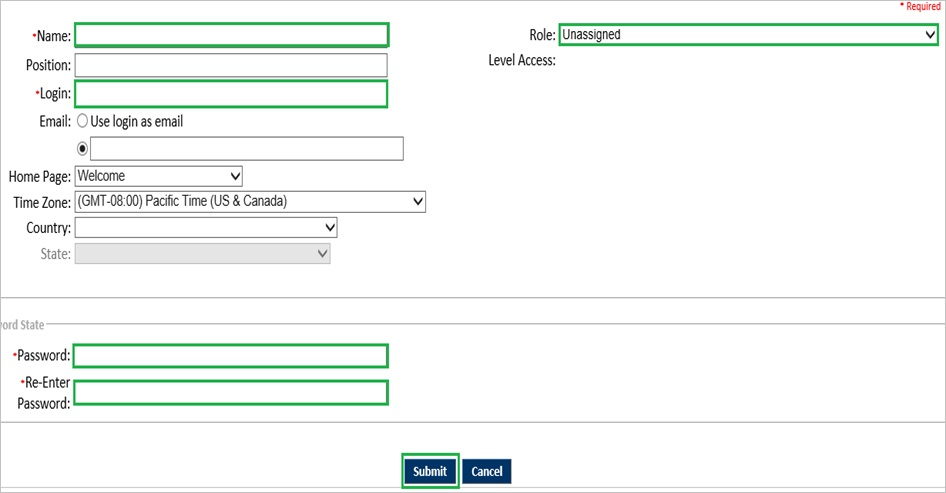

    1.  Type the **Name**, **Login**, **Email**, **Password** of a valid Azure Active Directory user you want to provision into the related textboxes.
    2.  Select a **Role**.
    3.  Click **Submit**.

>[AZURE.NOTE] You can use any other Adaptive Suite user account creation tools or APIs provided by Adaptive Suite to provision AAD user accounts.

##Assigning users

To test your configuration, you need to grant the Azure AD users you want to allow using your application access to it by assigning them.

###To assign users to Adaptive Suite, perform the following steps:

1.  In the Azure classic portal, create a test account.

2.  On the **Adaptive Suite **application integration page, click **Assign users**.

    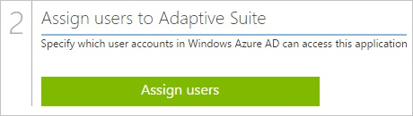

3.  Select your test user, click **Assign**, and then click **Yes** to confirm your assignment.

    

If you want to test your single sign-on settings, open the Access Panel. For more details about the Access Panel, see [Introduction to the Access Panel](active-directory-saas-access-panel-introduction.md).
