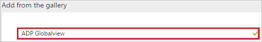
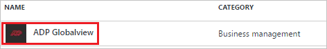
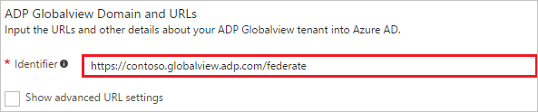
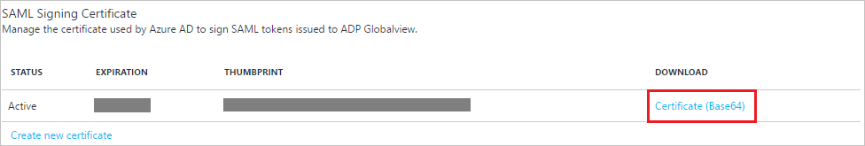
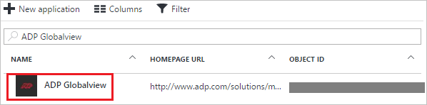

# Tutorial: Azure Active Directory integration with ADP Globalview

In this tutorial, you learn how to integrate ADP Globalview with Azure Active Directory (Azure AD).

Integrating ADP Globalview with Azure AD provides you with the following benefits:

- You can control in Azure AD who has access to ADP Globalview
- You can enable your users to automatically get signed-on to ADP Globalview (Single Sign-On) with their Azure AD accounts
- You can manage your accounts in one central location - the Azure portal

If you want to know more details about SaaS app integration with Azure AD, see [what is application access and single sign-on with Azure Active Directory](active-directory-appssoaccess-whatis.md).

## Prerequisites

To configure Azure AD integration with ADP Globalview, you need the following items:

- An Azure AD subscription
- An ADP Globalview single sign-on enabled subscription

> [!NOTE]
> To test the steps in this tutorial, we do not recommend using a production environment.

To test the steps in this tutorial, you should follow these recommendations:

- Do not use your production environment, unless it is necessary.
- If you don't have an Azure AD trial environment, you can get a one-month trial [here](https://azure.microsoft.com/pricing/free-trial/).

## Scenario description
In this tutorial, you test Azure AD single sign-on in a test environment. 
The scenario outlined in this tutorial consists of two main building blocks:

1. Adding ADP Globalview from the gallery
2. Configuring and testing Azure AD single sign-on

## Adding ADP Globalview from the gallery
To configure the integration of ADP Globalview into Azure AD, you need to add ADP Globalview from the gallery to your list of managed SaaS apps.

**To add ADP Globalview from the gallery, perform the following steps:**

1. In the **[Azure portal](https://portal.azure.com)**, on the left navigation panel, click **Azure Active Directory** icon. 

	![Active Directory][1]

2. Navigate to **Enterprise applications**. Then go to **All applications**.

	![Applications][2]
	
3. To add new application, click **New application** button on the top of dialog.

	![Applications][3]

4. In the search box, type **ADP Globalview**.

	

5. In the results panel, select **ADP Globalview**, and then click **Add** button to add the application.

	

##  Configuring and testing Azure AD single sign-on
In this section, you configure and test Azure AD single sign-on with ADP Globalview based on a test user called "Britta Simon."

For single sign-on to work, Azure AD needs to know what the counterpart user in ADP Globalview is to a user in Azure AD. In other words, a link relationship between an Azure AD user and the related user in ADP Globalview needs to be established.

This link relationship is established by assigning the value of the **user name** in Azure AD as the value of the **Username** in ADP Globalview.

To configure and test Azure AD single sign-on with ADP Globalview, you need to complete the following building blocks:

1. **[Configuring Azure AD Single Sign-On](#configuring-azure-ad-single-sign-on)** - to enable your users to use this feature.
2. **[Creating an Azure AD test user](#creating-an-azure-ad-test-user)** - to test Azure AD single sign-on with Britta Simon.
3. **[Creating an ADP Globalview test user](#creating-an-adp-globalview-test-user)** - to have a counterpart of Britta Simon in ADP Globalview that is linked to the Azure AD representation of user.
4. **[Assigning the Azure AD test user](#assigning-the-azure-ad-test-user)** - to enable Britta Simon to use Azure AD single sign-on.
5. **[Testing Single Sign-On](#testing-single-sign-on)** - to verify whether the configuration works.

### Configuring Azure AD single sign-on

In this section, you enable Azure AD single sign-on in the Azure portal and configure single sign-on in your ADP Globalview application.

**To configure Azure AD single sign-on with ADP Globalview, perform the following steps:**

1. In the Azure portal, on the **ADP Globalview** application integration page, click **Single sign-on**.

	![Configure Single Sign-On][4]

2. On the **Single sign-on** dialog, select **Mode** as	**SAML-based Sign-on** to enable single sign-on.
 
	

3. On the **ADP Globalview Domain and URLs** section, perform the following steps:

	

     In the **Identifier** textbox, type a URL using the following pattern: `https://<subdomain>.globalview.adp.com/federate` or `https://<subdomain>.globalview.adp.com/federate2`

	> [!NOTE] 
	> The value is not real. Update the value with the actual Identifier. Contact [ADP Globalview support](https://www.adp.com/contact-us/overview.aspx) to get the value.
 
4. On the **SAML Signing Certificate** section, click **Certificate (Base64)** and then save the certificate file on your computer.

	 

5. The ADP GlobalView application expects the SAML assertions in a specific format, which requires you to add custom attribute mappings to your SAML token attributes configuration. 

6. The following screenshot shows an example for it. The claim names always be **"PersonImmutableID"** and the value of which we have mapped to ExtensionAttribute2, which contains the EmployeeID of the user. Here the user mapping from Azure AD to ADP GlobalView is done on the EmployeeID but you can map it to a different value also based on your application settings. You can work with the ADP GlobalView team first to use the correct identifier of a user and map that value with the **"PersonImmutableID"** claim. You can also map the Email and UserID claim as shown in the picture.

	

7. In the **User Attributes** section on the **Single sign-on** dialog, configure SAML token attribute as shown in the image and perform the following steps:
	
	| Attribute Name | Attribute Value |
	| ------------------- | -------------------- |    
	| personalimmutableid | user.extensionattribute2 |
	| email 			  | user.mail |
	| userid              | user.userprincipalname|
	
	a. Click **Add attribute** to open the **Add Attribute** dialog.

	

	

	b. In the **Name** textbox, type the attribute name shown for that row.

	c. From the **Value** list, type the attribute value shown for that row.
	
	d. Click **Ok**.

	> [!NOTE] 
	> Before you can configure the SAML assertion, you need to contact your [ADP Globalview support](https://www.adp.com/contact-us/overview.aspx) and request the value of the unique identifier attribute for your tenant. You need this value to configure the custom claim for your application. 

8. On the **ADP Globalview Configuration** section, click **Configure ADP Globalview** to open **Configure sign-on** window. Copy the **Sign-Out URL, SAML Entity ID, and SAML Single Sign-On Service URL** from the **Quick Reference section.**

	 

9. Click **Save** button.

	

10. To configure single sign-on on **ADP Globalview** side, you need to send the downloaded **Certificate (Base64)**, **Sign-Out URL, SAML Entity ID, and SAML Single Sign-On Service URL** to [ADP Globalview support](https://www.adp.com/contact-us/overview.aspx).

> [!TIP]
> You can now read a concise version of these instructions inside the [Azure portal](https://portal.azure.com), while you are setting up the app!  After adding this app from the **Active Directory > Enterprise Applications** section, simply click the **Single Sign-On** tab and access the embedded documentation through the **Configuration** section at the bottom. You can read more about the embedded documentation feature here: [Azure AD embedded documentation]( https://go.microsoft.com/fwlink/?linkid=845985)

### Creating an Azure AD test user
The objective of this section is to create a test user in the Azure portal called Britta Simon.

![Create Azure AD User][100]

**To create a test user in Azure AD, perform the following steps:**

1. In the **Azure portal**, on the left navigation pane, click **Azure Active Directory** icon.

	 

2.  To display the list of users, go to **Users and groups** and click **All users**.
	
	 

3. To open the **User** dialog, click **Add** on the top of the dialog.
 
	 

4. On the **User** dialog page, perform the following steps:
 
	 

    a. In the **Name** textbox, type **BrittaSimon**.

    b. In the **User name** textbox, type the **email address** of BrittaSimon.

	c. Select **Show Password** and write down the value of the **Password**.

    d. Click **Create**.
 
### Creating an ADP Globalview test user

The objective of this section is to create a user called Britta Simon in ADP GlobalView. Work with [ADP Globalview support](https://www.adp.com/contact-us/overview.aspx) to add the users in the ADP GlobalView account. 

### Assigning the Azure AD test user

In this section, you enable Britta Simon to use Azure single sign-on by granting access to ADP Globalview.

![Assign User][200] 

**To assign Britta Simon to ADP Globalview, perform the following steps:**

1. In the Azure portal, open the applications view, and then navigate to the directory view and go to **Enterprise applications** then click **All applications**.

	![Assign User][201] 

2. In the applications list, select **ADP Globalview**.

	 

3. In the menu on the left, click **Users and groups**.

	![Assign User][202] 

4. Click **Add** button. Then select **Users and groups** on **Add Assignment** dialog.

	![Assign User][203]

5. On **Users and groups** dialog, select **Britta Simon** in the Users list.

6. Click **Select** button on **Users and groups** dialog.

7. Click **Assign** button on **Add Assignment** dialog.
	
### Testing single sign-on

The objective of this section is to test your Azure AD SSO configuration using the Access Panel.  

When you click the ADP GlobalView tile in the Access Panel, you should get automatically signed-on to your ADP GlobalView application.

## Additional resources

* [List of Tutorials on How to Integrate SaaS Apps with Azure Active Directory](active-directory-saas-tutorial-list.md)
* [What is application access and single sign-on with Azure Active Directory?](active-directory-appssoaccess-whatis.md)

<!--Image references-->

[1]: ./media/active-directory-saas-adglobalview-tutorial/tutorial_general_01.png
[2]: ./media/active-directory-saas-adglobalview-tutorial/tutorial_general_02.png
[3]: ./media/active-directory-saas-adglobalview-tutorial/tutorial_general_03.png
[4]: ./media/active-directory-saas-adglobalview-tutorial/tutorial_general_04.png

[100]: ./media/active-directory-saas-adglobalview-tutorial/tutorial_general_100.png

[200]: ./media/active-directory-saas-adglobalview-tutorial/tutorial_general_200.png
[201]: ./media/active-directory-saas-adglobalview-tutorial/tutorial_general_201.png
[202]: ./media/active-directory-saas-adglobalview-tutorial/tutorial_general_202.png
[203]: ./media/active-directory-saas-adglobalview-tutorial/tutorial_general_203.png

