# Tutorial: Azure Active Directory integration with Adobe Creative Cloud

In this tutorial, you learn how to integrate Adobe Creative Cloud with Azure Active Directory (Azure AD).

Integrating Adobe Creative Cloud with Azure AD provides you with the following benefits:

- You can control in Azure AD who has access to Adobe Creative Cloud
- You can enable your users to automatically get signed-on to Adobe Creative Cloud (Single Sign-On) with their Azure AD accounts
- You can manage your accounts in one central location - the Azure Management portal

If you want to know more details about SaaS app integration with Azure AD, see [What is application access and single sign-on with Azure Active Directory](active-directory-appssoaccess-whatis.md).

## Prerequisites

To configure Azure AD integration with Adobe Creative Cloud, you need the following items:

- An Azure AD subscription
- A Adobe Creative Cloud single-sign on enabled subscription

> [!NOTE]
> To test the steps in this tutorial, we do not recommend using a production environment.

To test the steps in this tutorial, you should follow these recommendations:

- You should not use your production environment, unless this is necessary.
- If you don't have an Azure AD trial environment, you can get an one-month trial [here](https://azure.microsoft.com/pricing/free-trial/).

## Scenario description
In this tutorial, you test Azure AD single sign-on in a test environment. 
The scenario outlined in this tutorial consists of two main building blocks:

1. Adding Adobe Creative Cloud from the gallery
2. Configuring and testing Azure AD single sign-on

## Adding Adobe Creative Cloud from the gallery
To configure the integration of Adobe Creative Cloud into Azure AD, you need to add Adobe Creative Cloud from the gallery to your list of managed SaaS apps.

**To add Adobe Creative Cloud from the gallery, perform the following steps:**

1. In the **[Azure Management Portal](https://portal.azure.com)**, on the left navigation panel, click **Azure Active Directory** icon. 

	![Active Directory][1]

2. Navigate to **Enterprise applications**. Then go to **All applications**.

	![Applications][2]
	
3. Click **Add** button on the top of the dialog.

	![Applications][3]

4. In the search box, type **Adobe Creative Cloud**.

	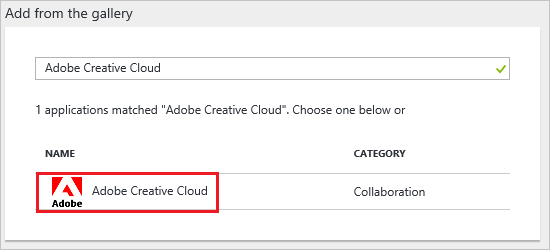

5. In the results panel, select **Adobe Creative Cloud**, and then click **Add** button to add the application.

	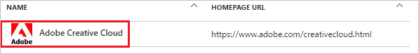

##  Configuring and testing Azure AD single sign-on
In this section, you configure and test Azure AD single sign-on with Adobe Creative Cloud based on a test user called "Britta Simon".

For single sign-on to work, Azure AD needs to know what the counterpart user in Adobe Creative Cloud is to a user in Azure AD. In other words, a link relationship between an Azure AD user and the related user in Adobe Creative Cloud needs to be established.

This link relationship is established by assigning the value of the **user name** in Azure AD as the value of the **Username** in Adobe Creative Cloud.

To configure and test Azure AD single sign-on with Adobe Creative Cloud, you need to complete the following building blocks:

1. **[Configuring Azure AD Single Sign-On](#configuring-azure-ad-single-sign-on)** - to enable your users to use this feature.
2. **[Creating an Azure AD test user](#creating-an-azure-ad-test-user)** - to test Azure AD single sign-on with Britta Simon.
3. **[Creating an Adobe Creative Cloud test user](#creating-an-adobe-creative-cloud-test-user)** - to have a counterpart of Britta Simon in Adobe Creative Cloud that is linked to the Azure AD representation of her.
4. **[Assigning the Azure AD test user](#assigning-the-azure-ad-test-user)** - to enable Britta Simon to use Azure AD single sign-on.
5. **[Testing Single Sign-On](#testing-single-sign-on)** - to verify whether the configuration works.

### Configuring Azure AD single sign-on

In this section, you enable Azure AD single sign-on in the Azure Management portal and configure single sign-on in your Adobe Creative Cloud application.

**To configure Azure AD single sign-on with Adobe Creative Cloud, perform the following steps:**

1. In the Azure Management portal, on the **Adobe Creative Cloud** application integration page, click **Single sign-on**.

	![Configure Single Sign-On][4]

2. On the **Single sign-on** dialog, as **Mode** select **SAML-based Sign-on** to enable single sign on.
 
	

3. On the **Adobe Creative Cloud Domain and URLs** section, perform the following steps if you wish to configure the application in **IDP** initiated mode:

	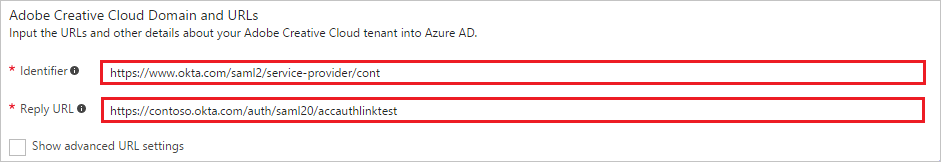

    a. In the **Identifier** textbox, type the value as: `https://www.okta.com/saml2/service-provider/<token>`

	b. In the **Reply URL** textbox, type a URL using the following pattern: `https://<company name>.okta.com/auth/saml20/accauthlinktest`

	> [!NOTE] 
	> Please note that these are not the real values. You have to update these values with the actual Identifier and Reply URL. Here we suggest you to use the unique value of string in the Identifier. If you need to create an user manually, you need to contact the Adobe Creative Cloud support team.

4. On the **Adobe Creative Cloud Domain and URLs** section, perform the following steps if you wish to configure the application in **SP** initiated mode:

	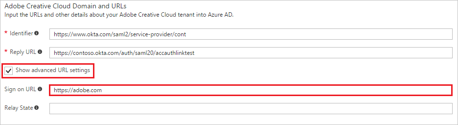

    a. Click on the **Show advanced URL settings** option

    b. In the **Sign-on URL** textbox, type the value as: `https://adobe.com`

5. On the **SAML Signing Certificate** section, click **Certificate (Base64)** and then save the certificate file on your computer.

	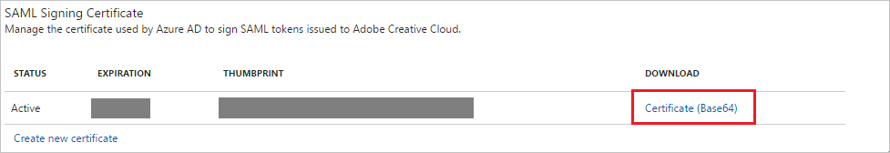 

6. On the **Adobe Creative Cloud Configuration** section, click **Configure Adobe Creative Cloud** to open **Configure sign-on** window. Please copy the **SAML Entity Id** and **SAML SSO Service URL** from Quick Reference section.

	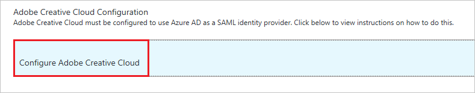 

7. In a different web browser window, sign-on to your Adobe Creative Cloud tenant as an administrator.

8.  Go to **Identity** on the left navigation pane and click your domain. Then perform the following steps on **Single Sign On Configuration Required** section.

	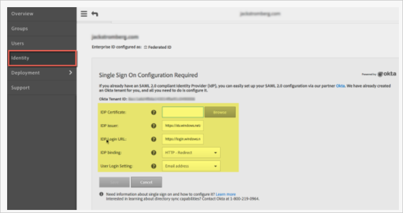

9. Click **Browse** to upload the downloaded certificate from Azure AD to **IDP Certificate**.

10. In the **IDP issuer** textbox, put the value of **SAML Entity Id** which you copied from **Configure sign-on** section in Azure portal.

11. In the **IDP Login URL** textbox, put the value of **SAML SSO Service URL** which you copied from **Configure sign-on** section in Azure portal.

12. Select **HTTP - Redirect** as **IDP Binding**.

13. Select **Email Address** as **User Login Setting**.
 
14. Click **Save** button.

15. The dashboard will now present the XML **"Download Metadata"** file. It contains Adobe’s EntityDescriptor URL and AssertionConsumerService URL. Please open the file and configure them in the Azure AD application.

	

	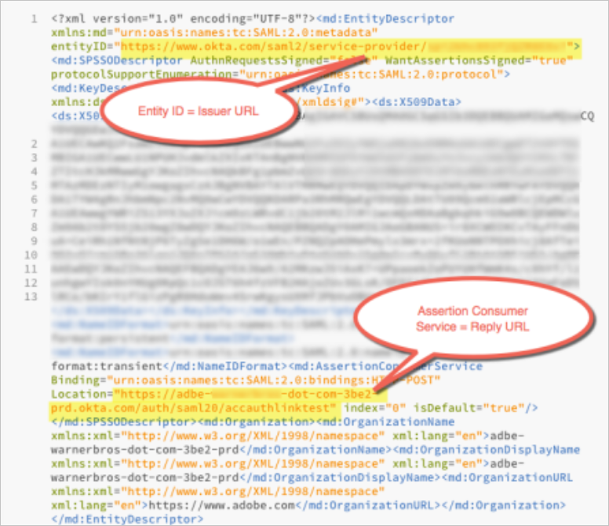

	a. Use the EntityDescriptor value Adobe provided you for **Identifier** on the **Configure App Settings** dialog.

	b. Use the AssertionConsumerService value Adobe provided you for **Reply URL** on the **Configure App Settings** dialog.
 
### Creating an Azure AD test user
The objective of this section is to create a test user in the Azure Management portal called Britta Simon.

![Create Azure AD User][100]

**To create a test user in Azure AD, perform the following steps:**

1. In the **Azure Management portal**, on the left navigation pane, click **Azure Active Directory** icon.

	 

2. Go to **Users and groups** and click **All users** to display the list of users.
	
	 

3. At the top of the dialog click **Add** to open the **User** dialog.
 
	 

4. On the **User** dialog page, perform the following steps:
 
	 

    a. In the **Name** textbox, type **BrittaSimon**.

    b. In the **User name** textbox, type the **email address** of BrittaSimon.

	c. Select **Show Password** and write down the value of the **Password**.

    d. Click **Create**. 

### Creating an Adobe Creative Cloud test user

In order to enable Azure AD users to log into Adobe Creative Cloud, they must be provisioned into Adobe Creative Cloud.  
In the case of Adobe Creative Cloud, provisioning is a manual task.

**To provision a user accounts, perform the following steps:**

1. Log in to your Adobe Creative Cloud company site as an administrator.

2. Click **People**.

    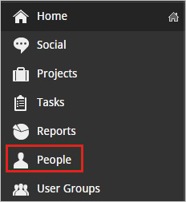

3. Click **Invite User**.

	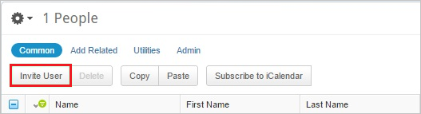

4. On the **Invite People** dialog page, perform the following steps:

	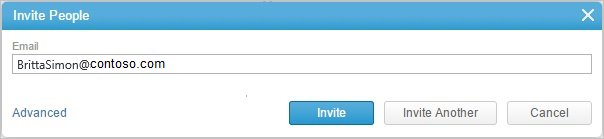

	a. In the **Email** textbox, type the email address of Britta Simon account.
	
    b. Click **Invite**.

	> [!NOTE]
    > The Azure Active Directory account holder will receive an email and follow a link to confirm their account before it becomes active.

### Assigning the Azure AD test user

In this section, you enable Britta Simon to use Azure single sign-on by granting her access to Adobe Creative Cloud.

![Assign User][200] 

**To assign Britta Simon to Adobe Creative Cloud, perform the following steps:**

1. In the Azure Management portal, open the applications view, and then navigate to the directory view and go to **Enterprise applications** then click **All applications**.

	![Assign User][201] 

2. In the applications list, select **Adobe Creative Cloud**.

	 

3. In the menu on the left, click **Users and groups**.

	![Assign User][202] 

4. Click **Add** button. Then select **Users and groups** on **Add Assignment** dialog.

	![Assign User][203]

5. On **Users and groups** dialog, select **Britta Simon** in the Users list.

6. Click **Select** button on **Users and groups** dialog.

7. Click **Assign** button on **Add Assignment** dialog.
	
### Testing single sign-on

In this section, you test your Azure AD single sign-on configuration using the Access Panel.

When you click the Adobe Creative Cloud tile in the Access Panel, you should get automatically signed-on to your Adobe Creative Cloud application.

## Additional resources

* [List of Tutorials on How to Integrate SaaS Apps with Azure Active Directory](active-directory-saas-tutorial-list.md)
* [What is application access and single sign-on with Azure Active Directory?](active-directory-appssoaccess-whatis.md)

<!--Image references-->

[1]: ./media/active-directory-saas-adobe-creative-cloud-tutorial/tutorial_general_01.png
[2]: ./media/active-directory-saas-adobe-creative-cloud-tutorial/tutorial_general_02.png
[3]: ./media/active-directory-saas-adobe-creative-cloud-tutorial/tutorial_general_03.png
[4]: ./media/active-directory-saas-adobe-creative-cloud-tutorial/tutorial_general_04.png

[100]: ./media/active-directory-saas-adobe-creative-cloud-tutorial/tutorial_general_100.png

[200]: ./media/active-directory-saas-adobe-creative-cloud-tutorial/tutorial_general_200.png
[201]: ./media/active-directory-saas-adobe-creative-cloud-tutorial/tutorial_general_201.png
[202]: ./media/active-directory-saas-adobe-creative-cloud-tutorial/tutorial_general_202.png
[203]: ./media/active-directory-saas-adobe-creative-cloud-tutorial/tutorial_general_203.png