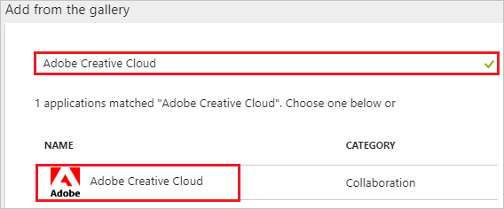
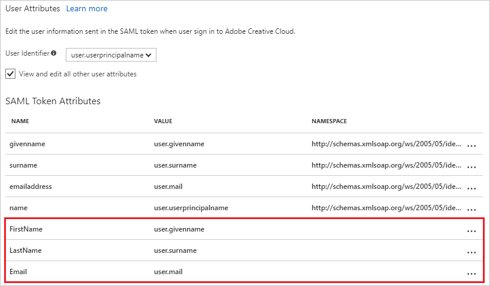

# Tutorial: Azure Active Directory integration with Adobe Creative Cloud

In this tutorial, you learn how to integrate Adobe Creative Cloud with Azure Active Directory (Azure AD).

Integrating Adobe Creative Cloud with Azure AD provides you with the following benefits:

- You can control in Azure AD who has access to Adobe Creative Cloud.
- You can enable your users to automatically get signed-on to Adobe Creative Cloud (Single Sign-On) with their Azure AD accounts.
- You can manage your accounts in one central location - the Azure portal.

If you want to know more details about SaaS app integration with Azure AD, see [what is application access and single sign-on with Azure Active Directory](active-directory-appssoaccess-whatis.md).

## Prerequisites

To configure Azure AD integration with Adobe Creative Cloud, you need the following items:

- An Azure AD subscription
- An Adobe Creative Cloud single-sign on enabled subscription

> [!NOTE]
> To test the steps in this tutorial, we do not recommend using a production environment.

To test the steps in this tutorial, you should follow these recommendations:

- Do not use your production environment, unless it is necessary.
- If you don't have an Azure AD trial environment, you can [get a one-month trial](https://azure.microsoft.com/pricing/free-trial/).

## Scenario description
In this tutorial, you test Azure AD single sign-on in a test environment. 
The scenario outlined in this tutorial consists of two main building blocks:

1. Adding Adobe Creative Cloud from the gallery
2. Configuring and testing Azure AD single sign-on

## Adding Adobe Creative Cloud from the gallery
To configure the integration of Adobe Creative Cloud into Azure AD, you need to add Adobe Creative Cloud from the gallery to your list of managed SaaS apps.

**To add Adobe Creative Cloud from the gallery, perform the following steps:**

1. In the **[Azure portal](https://portal.azure.com)**, on the left navigation panel, click **Azure Active Directory** icon. 

	![The Azure Active Directory button][1]

2. Navigate to **Enterprise applications**. Then go to **All applications**.

	![The Enterprise applications blade][2]
	
3. To add new application, click **New application** button on the top of dialog.

	![The New application button][3]

4. In the search box, type **Adobe Creative Cloud**, select **Adobe Creative Cloud** from result panel then click **Add** button to add the application.

	

## Configure and test Azure AD single sign-on

In this section, you configure and test Azure AD single sign-on with Adobe Creative Cloud based on a test user called "Britta Simon".

For single sign-on to work, Azure AD needs to know what the counterpart user in Adobe Creative Cloud is to a user in Azure AD. In other words, a link relationship between an Azure AD user and the related user in Adobe Creative Cloud needs to be established.

In Adobe Creative Cloud, assign the value of the **user name** in Azure AD as the value of the **Username** to establish the link relationship.

To configure and test Azure AD single sign-on with Adobe Creative Cloud, you need to complete the following building blocks:

1. **[Configure Azure AD Single Sign-On](#configure-azure-ad-single-sign-on)** - to enable your users to use this feature.
2. **[Create an Azure AD test user](#create-an-azure-ad-test-user)** - to test Azure AD single sign-on with Britta Simon.
3. **[Create an Adobe Creative Cloud test user](#create-an-adobe-creative-cloud-test-user)** - to have a counterpart of Britta Simon in Adobe Creative Cloud that is linked to the Azure AD representation of user.
4. **[Assign the Azure AD test user](#assign-the-azure-ad-test-user)** - to enable Britta Simon to use Azure AD single sign-on.
5. **[Test single sign-on](#test-single-sign-on)** - to verify whether the configuration works.

### Configure Azure AD single sign-on

In this section, you enable Azure AD single sign-on in the Azure portal and configure single sign-on in your Adobe Creative Cloud application.

**To configure Azure AD single sign-on with Adobe Creative Cloud, perform the following steps:**

1. In the Azure portal, on the **Adobe Creative Cloud** application integration page, click **Single sign-on**.

	![Configure single sign-on link][4]

2. On the **Single sign-on** dialog, select **Mode** as	**SAML-based Sign-on** to enable single sign-on.
 
	

3. On the **Adobe Creative Cloud Domain and URLs** section, perform the following steps if you wish to configure the application in IDP initiated mode:

	

    a. In the **Identifier** textbox,  type the value as: `https://www.okta.com/saml2/service-provider/<token>`

	b. In the **Reply URL** textbox, type a URL using the following pattern: `https://<company name>.okta.com/auth/saml20/accauthlinktest`

	> [!NOTE] 
	> These values are not real. Update these values with the actual Identifier and Reply URL. Contact [Adobe Creative Cloud Client support team](https://helpx.adobe.com/in/contact/support.html) to get these values. 

4. Check **Show advanced URL settings** and perform the following step if you wish to configure the application in **SP** initiated mode:

	

    In the **Sign-on URL** textbox, type the value as: `https://adobe.com`

5. On the **SAML Signing Certificate** section, click **Certificate(Base64)** and then save the certificate file on your computer.

	
	 
6. Adobe Creative Cloud application expects the SAML assertions in a specific format. Configure the following claims for this application. You can manage the values of these attributes from the **"Attribute"** tab of the application. The following screenshot shows an example for this.

	

7. In the **User Attributes** section on the **Single sign-on** dialog, configure SAML token attribute as shown in the image above and perform the following steps:

	| Attribute Name | Attribute Value |
	| ---------------| ----------------|
	| FirstName |user.givenname |
	| LastName |user.surname |
	| Email |user.mail |

	a. Click **Add attribute** to open the **Add Attribute** dialog.
	
	
	
	
	
	b. In the **Name** textbox, type the attribute name shown for that row.
	
	c. From the **Value** list, type the attribute value shown for that row.
	
	d. Click **Ok**.
	
8. Click **Save** button.

	
	
9. On the **Adobe Creative Cloud Configuration** section, click **Configure Adobe Creative Cloud** to open **Configure sign-on** window. Copy the **SAML Entity ID and SAML Single Sign-On Service URL** from the **Quick Reference section**.

	
	
10. In a different web browser window, sign-on to your Adobe Creative Cloud tenant as an administrator.

11. Go to **Identity** on the left navigation pane and click your domain. Then perform the following steps on **Single Sign On Configuration Required** section.

	
	
	a. Click **Browse** to upload the downloaded certificate from Azure AD to **IDP Certificate**.
	
	b. In the **IDP issuer** textbox, put the value of **SAML Entity Id** which you copied from **Configure sign-on** section in Azure portal.
	
	c. In the **IDP Login URL** textbox, put the value of **SAML SSO Service URL** which you copied from **Configure sign-on** section in Azure portal.
	
	d. Select **HTTP - Redirect** as **IDP Binding**.
	
	e. Select **Email Address** as **User Login Setting**.
	
	f. Click **Save** button.

12. The dashboard will now present the XML **"Download Metadata"** file. It contains Adobe’s EntityDescriptor URL and AssertionConsumerService URL. Please open the file and configure them in the Azure AD application.

	

	

	a. Use the EntityDescriptor value Adobe provided you for **Identifier** on the **Configure App Settings** dialog.

	b. Use the AssertionConsumerService value Adobe provided you for **Reply URL** on the **Configure App Settings** dialog.

> [!TIP]
> You can now read a concise version of these instructions inside the [Azure portal](https://portal.azure.com), while you are setting up the app!  After adding this app from the **Active Directory > Enterprise Applications** section, simply click the **Single Sign-On** tab and access the embedded documentation through the **Configuration** section at the bottom. You can read more about the embedded documentation feature here: [Azure AD embedded documentation]( https://go.microsoft.com/fwlink/?linkid=845985)

### Create an Azure AD test user

The objective of this section is to create a test user in the Azure portal called Britta Simon.

   ![Create an Azure AD test user][100]

**To create a test user in Azure AD, perform the following steps:**

1. In the Azure portal, in the left pane, click the **Azure Active Directory** button.

    

2. To display the list of users, go to **Users and groups**, and then click **All users**.

    

3. To open the **User** dialog box, click **Add** at the top of the **All Users** dialog box.

    

4. In the **User** dialog box, perform the following steps:

    

    a. In the **Name** box, type **BrittaSimon**.

    b. In the **User name** box, type the email address of user Britta Simon.

    c. Select the **Show Password** check box, and then write down the value that's displayed in the **Password** box.

    d. Click **Create**.
 
### Create an Adobe Creative Cloud test user

In order to enable Azure AD users to log into Adobe Creative Cloud, they must be provisioned into Adobe Creative Cloud.  
In the case of Adobe Creative Cloud, provisioning is a manual task.

### To provision a user accounts, perform the following steps:

1. Log in to your Adobe Creative Cloud company site as an administrator.

2. Click **People**.

    

3. Click **Invite User**.

	

4. On the **Invite People** dialog page, perform the following steps:

	

	a. In the **Email** textbox, type the email address of Britta Simon account.
	
    b. Click **Invite**.

	> [!NOTE]
    > The Azure Active Directory account holder will receive an email and follow a link to confirm their account before it becomes active.

### Assign the Azure AD test user

In this section, you enable Britta Simon to use Azure single sign-on by granting access to Adobe Creative Cloud.

![Assign the user role][200] 

**To assign Britta Simon to Adobe Creative Cloud, perform the following steps:**

1. In the Azure portal, open the applications view, and then navigate to the directory view and go to **Enterprise applications** then click **All applications**.

	![Assign User][201] 

2. In the applications list, select **Adobe Creative Cloud**.

	  

3. In the menu on the left, click **Users and groups**.

	![The "Users and groups" link][202]

4. Click **Add** button. Then select **Users and groups** on **Add Assignment** dialog.

	![The Add Assignment pane][203]

5. On **Users and groups** dialog, select **Britta Simon** in the Users list.

6. Click **Select** button on **Users and groups** dialog.

7. Click **Assign** button on **Add Assignment** dialog.
	
### Test single sign-on

In this section, you test your Azure AD single sign-on configuration using the Access Panel.

When you click the Adobe Creative Cloud tile in the Access Panel, you should get automatically signed-on to your Adobe Creative Cloud application.
For more information about the Access Panel, see [Introduction to the Access Panel](active-directory-saas-access-panel-introduction.md). 

## Additional resources

* [List of Tutorials on How to Integrate SaaS Apps with Azure Active Directory](active-directory-saas-tutorial-list.md)
* [What is application access and single sign-on with Azure Active Directory?](active-directory-appssoaccess-whatis.md)

<!--Image references-->

[1]: ./media/active-directory-saas-adobe-creative-cloud-tutorial/tutorial_general_01.png
[2]: ./media/active-directory-saas-adobe-creative-cloud-tutorial/tutorial_general_02.png
[3]: ./media/active-directory-saas-adobe-creative-cloud-tutorial/tutorial_general_03.png
[4]: ./media/active-directory-saas-adobe-creative-cloud-tutorial/tutorial_general_04.png

[100]: ./media/active-directory-saas-adobe-creative-cloud-tutorial/tutorial_general_100.png

[200]: ./media/active-directory-saas-adobe-creative-cloud-tutorial/tutorial_general_200.png
[201]: ./media/active-directory-saas-adobe-creative-cloud-tutorial/tutorial_general_201.png
[202]: ./media/active-directory-saas-adobe-creative-cloud-tutorial/tutorial_general_202.png
[203]: ./media/active-directory-saas-adobe-creative-cloud-tutorial/tutorial_general_203.png

