<properties 
    pageTitle="Tutorial: Azure Active Directory integration with Adobe EchoSign | Microsoft Azure" 
    description="Learn how to use Adobe EchoSign with Azure Active Directory to enable single sign-on, automated provisioning, and more!" 
    services="active-directory" 
    authors="jeevansd"  
    documentationCenter="na" 
    manager="femila"/>
<tags 
    ms.service="active-directory" 
    ms.devlang="na" 
    ms.topic="article" 
    ms.tgt_pltfrm="na" 
    ms.workload="identity" 
    ms.date="07/11/2016" 
    ms.author="jeedes" />

#Tutorial: Azure Active Directory integration with Adobe EchoSign

The objective of this tutorial is to show the integration of Azure and Adobe EchoSign.  
The scenario outlined in this tutorial assumes that you already have the following items:

-   A valid Azure subscription
-   An Adobe EchoSign single sign on enabled subscription

After completing this tutorial, the Azure AD users you have assigned to Adobe EchoSign will be able to single sign into the application at your Adobe EchoSign company site (service provider initiated sign on), or using the [Introduction to the Access Panel](active-directory-saas-access-panel-introduction.md).

The scenario outlined in this tutorial consists of the following building blocks:

1.  Enabling the application integration for Adobe EchoSign
2.  Configuring single sign-on
3.  Configuring user provisioning
4.  Assigning users

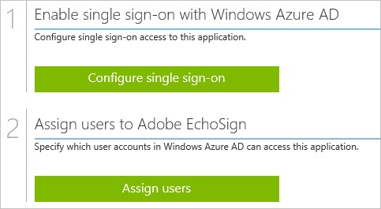
##Enabling the application integration for Adobe EchoSign

The objective of this section is to outline how to enable the application integration for Adobe EchoSign.

###To enable the application integration for Adobe EchoSign, perform the following steps:

1.  In the Azure classic portal, on the left navigation pane, click **Active Directory**.

    

2.  From the **Directory** list, select the directory for which you want to enable directory integration.

3.  To open the applications view, in the directory view, click **Applications** in the top menu.

    

4.  Click **Add** at the bottom of the page.

    

5.  On the **What do you want to do** dialog, click **Add an application from the gallery**.

    

6.  In the **search box**, type **Adobe EchoSign**.

    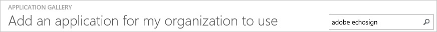

7.  In the results pane, select **Adobe EchoSign**, and then click **Complete** to add the application.

    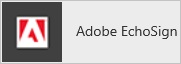
##Configuring single sign-on

The objective of this section is to outline how to enable users to authenticate to Adobe EchoSign with their account in Azure AD using federation based on the SAML protocol.  
As part of this procedure, you are required to create a base-64 encoded certificate file.  
If you are not familiar with this procedure, see [How to convert a binary certificate into a text file](http://youtu.be/PlgrzUZ-Y1o).

###To configure single sign-on, perform the following steps:

1.  In the Azure classic portal, on the **Adobe EchoSign** application integration page, click **Configure single sign-on** to open the **Configure Single Sign On ** dialog.

    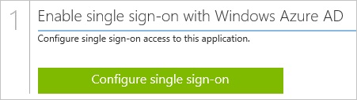

2.  On the **How would you like users to sign on to Adobe EchoSign** page, select **Microsoft Azure AD Single Sign-On**, and then click **Next**.

    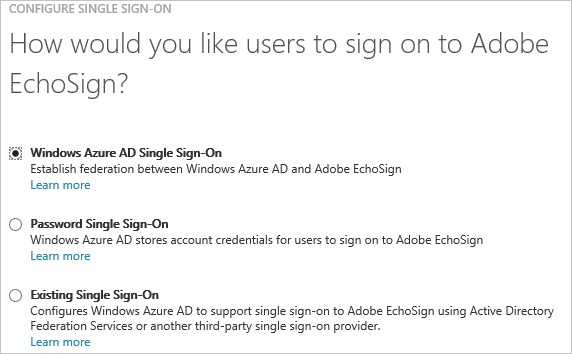

3.  On the **Configure App URL** page, in the **Adobe EchoSign Sign On URL** textbox, type your URL using the following pattern "*https://company.echosign.com/*", and then click **Next**.

    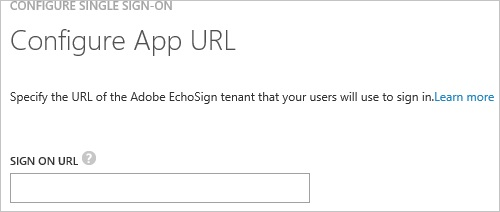

4.  On the **Configure single sign-on at Adobe EchoSign** page, click **Download certificate**, and then save the certificate file on your computer.

    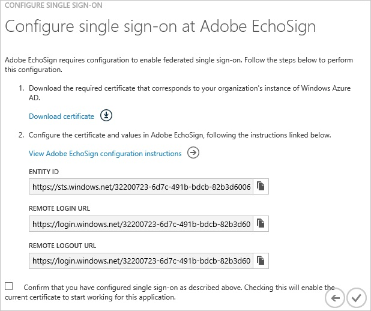

5.  In a different web browser window, log into your Adobe EchoSign company site as an administrator.

6.  In the menu on the top, click **Account**, and then, in the navigation pane on the left die, click **SAML Settings** under **Account Settings**.

    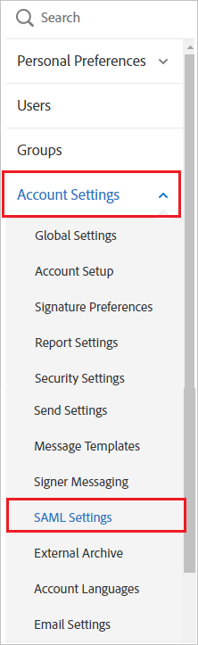

7.  In the SAML Settings section, perform the following steps:

    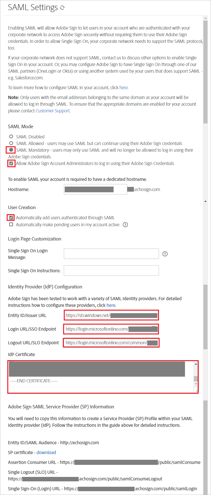

    1.  As **SAML Mode**, select **SAML Mandatory**.
    2.  Select **Allow EchoSign Account Administrators to log in using their EchoSign Credentials**.
    3.  As **User Creation**, select **Automatically add users authenticated through SAML**.

8.  Move on, performing the following steps:

    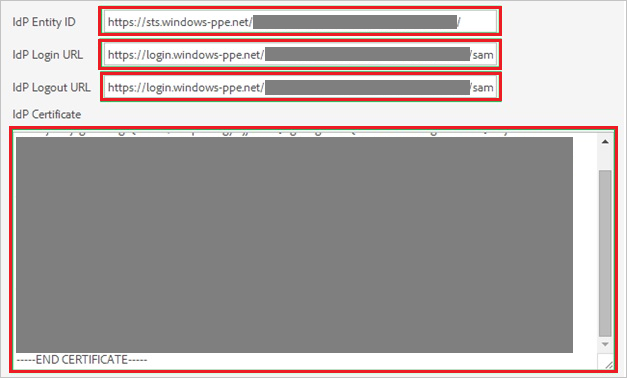

    1.  In the Azure classic portal, on the **Configure single sign-on at Adobe EchoSign** dialog page, copy the **Entity ID** value, and then paste it into the **IdP Entity ID** textbox.
    2.  In the Azure classic portal, on the **Configure single sign-on at Adobe EchoSign** dialog page, copy the **Remote Login URL** value, and then paste it into the **IdP Login URL** textbox.
    3.  In the Azure classic portal, on the **Configure single sign-on at Adobe EchoSign** dialog page, copy the **Remote Logout URL** value, and then paste it into the **IdP Logout URL** textbox.
    4.  Create a **base-64 encoded** file from your downloaded certificate.  

		>[AZURE.TIP] For more details, see [How to convert a binary certificate into a text file](http://youtu.be/PlgrzUZ-Y1o)
    5.  Open your base-64 encoded certificate in notepad, copy the content of it into your clipboard, and then paste it to the **IdP Certificate** textbox
    6.  Click **Save Changes**.

9.  On the Azure classic portal, select the single sign-on configuration confirmation, and then click **Complete** to close the **Configure Single Sign On** dialog.

    
##Configuring user provisioning

In order to enable Azure AD users to log into Adobe EchoSign, they must be provisioned into Adobe EchoSign.  
In the case of Adobe EchoSign, provisioning is a manual task.

###To provision a user accounts, perform the following steps:

1.  Log in to your **Adobe EchoSign** company site as administrator.

2.  In the menu on the top, click **Account**, and then, in the navigation pane on the left die, click **Users & Groups**, and then, click **Create a new user**.

    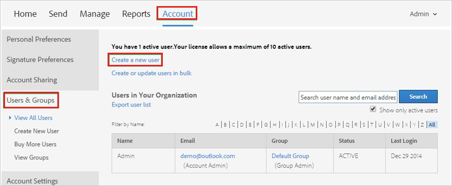

3.  In the **Create New User** section, perform the following steps:

    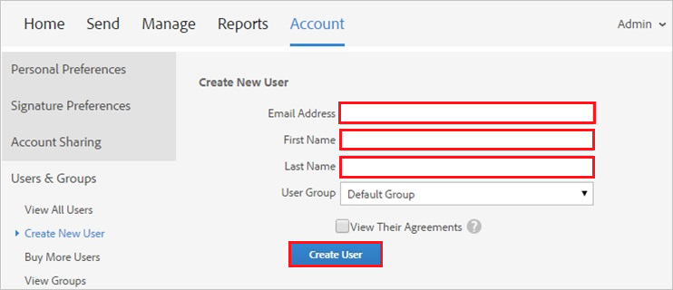

    1.  Type the **Email Address**, **First Name** and **Last Name** of a valid AAD account you want to provision into the related textboxes.
    2.  Click **Create User**.

		>[AZURE.NOTE] The Azure Active Directory account holder will receive an email that includes a link to confirm the account before it becomes active.

>[AZURE.NOTE] You can use any other Adobe EchoSign user account creation tools or APIs provided by Adobe EchoSign to provision AAD user accounts.

##Assigning users

To test your configuration, you need to grant the Azure AD users you want to allow using your application access to it by assigning them.

###To assign users to Adobe EchoSign, perform the following steps:

1.  In the Azure classic portal, create a test account.

2.  On the **Adobe EchoSign **application integration page, click **Assign users**.

    

3.  Select your test user, click **Assign**, and then click **Yes** to confirm your assignment.

    

If you want to test your single sign-on settings, open the Access Panel. For more details about the Access Panel, see [Introduction to the Access Panel](active-directory-saas-access-panel-introduction.md).
