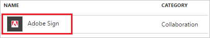
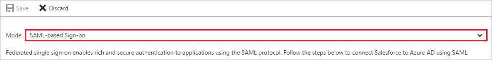
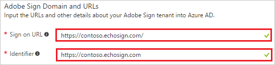
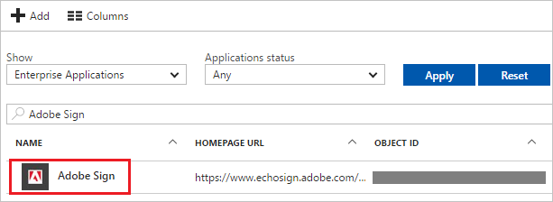

# Tutorial: Azure Active Directory integration with Adobe Sign

In this tutorial, you learn how to integrate Adobe Sign with Azure Active Directory (Azure AD).

Integrating Adobe Sign with Azure AD provides you with the following benefits:

- You can control in Azure AD who has access to Adobe Sign.
- You can enable your users to automatically get signed-on to Adobe Sign (Single Sign-On) with their Azure AD accounts.
- You can manage your accounts in one central location--the Azure portal.

For more details about SaaS app integration with Azure AD, see [What is application access and single sign-on with Azure Active Directory?](manage-apps/what-is-single-sign-on.md).

## Prerequisites

To configure Azure AD integration with Adobe Sign, you need:

- An Azure AD subscription
- An Adobe Sign single sign-on enabled subscription

To test the steps in this tutorial, follow these recommendations:

- Do not use your production environment, unless it is necessary.
- If you don't have an Azure AD trial environment, you can get a one-month trial [here](https://azure.microsoft.com/pricing/free-trial/).

## Scenario description
In this tutorial, you test Azure AD single sign-on in a test environment. 
The scenario outlined in this tutorial consists of two main building blocks:

1. Adding Adobe Sign from the gallery.
2. Configuring and testing Azure AD single sign-on.

## Add Adobe Sign from the gallery
To configure the integration of Adobe Sign into Azure AD, you need to add Adobe Sign from the gallery to your list of managed SaaS apps.

1. In the **[Azure portal](https://portal.azure.com)**, on the left navigation panel, select the **Azure Active Directory** icon. 

	![Screenshot of the Azure Active Directory icon][1]

2. Browse to **Enterprise applications** > **All applications**.

	![Screenshot of Azure Active Directory menus, with Enterprise applications and All applications highlighted][2]
	
3. To add a new application, select **New application** at the top of the dialog box.

	![Screenshot of New application option at the top of the dialog box][3]

4. In the search box, type **Adobe Sign**.

	

5. In the results panel, select **Adobe Sign**, and then select **Add**.

	

##  Configure and test Azure AD single sign-on
In this section, you configure and test Azure AD single sign-on with Adobe Sign, based on a test user called "Britta Simon."

For single sign-on to work, Azure AD needs to recognize a linked relationship between an Azure AD user and the related user in Adobe Sign.

To establish the linked relationship, in Adobe Sign, assign the value of the **user name** in Azure AD as the value of the **Username**.

To configure and test Azure AD single sign-on with Adobe Sign, complete the following building blocks:

1. **[Configure Azure AD Single Sign-On](#configuring-azure-ad-single-sign-on)** to enable your users to use this feature.
2. **[Create an Azure AD test user](#creating-an-azure-ad-test-user)** to test Azure AD single sign-on with Britta Simon.
3. **[Create an Adobe Sign test user](#creating-an-adobe-sign-test-user)** to have a counterpart of Britta Simon in Adobe Sign who is linked to the Azure AD representation of user.
4. **[Assign the Azure AD test user](#assigning-the-azure-ad-test-user)** to enable Britta Simon to use Azure AD single sign-on.
5. **[Test Single Sign-On](#testing-single-sign-on)** to verify whether the configuration works.

### Configure Azure AD single sign-on

In this section, you enable Azure AD single sign-on in the Azure portal, and configure single sign-on in your Adobe Sign application.

1. In the Azure portal, on the **Adobe Sign** application integration page, select **Single sign-on**.

	![Screenshot of Adobe Sign application integration page, with Single sign-on highlighted][4]

2. On the **Single sign-on** dialog box, for **Mode**, select **SAML-based Sign-on** to enable single sign-on.

	

3. In the **Adobe Sign Domain and URLs** section, perform the following steps:

	

    a. In the **Sign-on URL** text box, type a URL that uses the following pattern: `https://<companyname>.echosign.com/`

	b. In the **Identifier** text box, type a URL that uses the following pattern: `https://<companyname>.echosign.com`

	> [!NOTE] 
	> These values are not real. Update these values with the actual Sign-On URL and Identifier. Contact [Adobe Sign Client support team](https://helpx.adobe.com/in/contact/support.html) to get these values.

4. In the **SAML Signing Certificate** section, select **Certificate(Base64)**, and then save the certificate file on your computer.

	 

5. Select **Save**.

	

6. In the **Adobe Sign Configuration** section, select **Configure Adobe Sign** to open the **Configure sign-on** window. Copy the **Sign-Out URL**, **SAML Entity ID**, and **SAML Single Sign-On Service URL** from the **Quick Reference** section.

	

7. Before configuration you need to contact [Adobe Sign Client support team](https://helpx.adobe.com/in/contact/support.html) to whitelist your domain in the Adobe Sign. Follow the below steps to add the domain:

	a. [Adobe Sign Client support team](https://helpx.adobe.com/in/contact/support.html) will send you a randomly generated token. For your domain, token will be like: **adobe-sign-verification= xxxxxxxxxxxxxxxxxxxxxxxxxxxxxxx**

	b. You will need to publish the verification token in a DNS text record and notify [Adobe Sign Client support team](https://helpx.adobe.com/in/contact/support.html).
	
	> [!NOTE]
	> You can expect that this may take a few days or perhaps longer. Note that DNS propagation delays mean that a value published in DNS may not be visible for an hour or more. We expect your IT administrator should be knowledgeable about how to publish this token in a DNS text record.
	
	c. Once you notify [Adobe Sign Client support team](https://helpx.adobe.com/in/contact/support.html) through the support ticket, after the token is published, they will validate the domain and add it to your account.
	
	d. General steps you can take to publish the token on a DNS record-

	* Log in to your domain account
	* Find the page for updating the DNS record. This page may be called DNS Management, Name Server Management, or Advanced Settings.
	* Find the TXT records for your domain.
	* Add a TXT record with the full token value supplied by Adobe
	* Save your changes.

8. In a different web browser window, log in to your Adobe Sign company site as an administrator.

9. In the SAML menu, click **Account Settings**, and then, click **SAML Settings**.
   
	

10. In the **SAML Settings** section, perform the following steps:
  
	
   
    a. As **SAML Mode**, select **SAML Mandatory**.
   
    b. Select **Allow Adobe sign Account Administrators to log in using their  Adobe Sign Credentials**.
   
    c. As **User Creation**, select **Automatically add users authenticated through SAML**.

	d. Paste **SAML Entity ID**, which you have copied from Azure portal into the **Entity ID/Issuer URL** textbox.
   	
	e. Paste **SAML Single Sign-On Service URL**, which you have copied from Azure portal into the **Login URL/SSO Endpoint** textbox.
   
    f. Paste **Sign-Out URL**, which you have copied from Azure portal into the **Logout URL/SLO Endpoint** textbox.

	g. Open your downloaded **Certificate(Base64)** file in notepad, copy the content of it into your clipboard, and then paste it to the **IdP Certificate** textbox

	h. Click **Save Changes**.

### Creating an Azure AD test user
The objective of this section is to create a test user in the Azure portal called Britta Simon.

![Create Azure AD User][100]

**To create a test user in Azure AD, perform the following steps:**

1. In the **Azure portal**, on the left navigation pane, click **Azure Active Directory** icon.

	 

2. To display the list of users, go to **Users and groups** and click **All users**.
	
	 

3. To open the **User** dialog, click **Add** on the top of the dialog.
 
	 

4. On the **User** dialog page, perform the following steps:
 
	 

    a. In the **Name** textbox, type **BrittaSimon**.

    b. In the **User name** textbox, type the **email address** of BrittaSimon.

	c. Select **Show Password** and write down the value of the **Password**.

    d. Click **Create**.
 
### Creating an Adobe Sign test user

To enable Azure AD users to log in to Adobe Sign, they must be provisioned into Adobe Sign. In the case of Adobe Sign, provisioning is a manual task.

>[!NOTE]
>You can use any other Adobe Sign user account creation tools or APIs provided by Adobe Sign to provision AAD user accounts. 

**To provision a user account, perform the following steps:**

1. Log in to your **Adobe Sign** company site as administrator.

2. In the menu on the top, click **Account**, and then, in the navigation pane on the left side, click **Users & Groups**, and then, click **Create a new user**.
   
	
   
3. In the **Create New User** section, perform the following steps:
   
	
   
    a. Type the **Email Address**, **First Name**, and **Last Name** of a valid AAD account you want to provision into the related textboxes.
   
    b. Click **Create User**.

>[!NOTE]
>The Azure Active Directory account holder receives an email that includes a link to confirm the account before it becomes active. 

### Assigning the Azure AD test user

In this section, you enable Britta Simon to use Azure single sign-on by granting access to Adobe Sign.

![Assign User][200] 

**To assign Britta Simon to Adobe Sign, perform the following steps:**

1. In the Azure portal, open the applications view, and then navigate to the directory view and go to **Enterprise applications** then click **All applications**.

	![Assign User][201] 

2. In the applications list, select **Adobe Sign**.

	 

3. In the menu on the left, click **Users and groups**.

	![Assign User][202] 

4. Click **Add** button. Then select **Users and groups** on **Add Assignment** dialog.

	![Assign User][203]

5. On **Users and groups** dialog, select **Britta Simon** in the Users list.

6. Click **Select** button on **Users and groups** dialog.

7. Click **Assign** button on **Add Assignment** dialog.
	
### Testing single sign-on

When you click the Adobe Sign tile in the Access Panel, you should get automatically signed-on to your Adobe Sign application.
 For more information about the Access Panel, see [Introduction to the Access Panel](active-directory-saas-access-panel-introduction.md).

## Additional resources

* [List of Tutorials on How to Integrate SaaS Apps with Azure Active Directory](active-directory-saas-tutorial-list.md)
* [What is application access and single sign-on with Azure Active Directory?](manage-apps/what-is-single-sign-on.md)

<!--Image references-->

[1]: ./media/active-directory-saas-adobe-echosign-tutorial/tutorial_general_01.png
[2]: ./media/active-directory-saas-adobe-echosign-tutorial/tutorial_general_02.png
[3]: ./media/active-directory-saas-adobe-echosign-tutorial/tutorial_general_03.png
[4]: ./media/active-directory-saas-adobe-echosign-tutorial/tutorial_general_04.png

[100]: ./media/active-directory-saas-adobe-echosign-tutorial/tutorial_general_100.png

[200]: ./media/active-directory-saas-adobe-echosign-tutorial/tutorial_general_200.png
[201]: ./media/active-directory-saas-adobe-echosign-tutorial/tutorial_general_201.png
[202]: ./media/active-directory-saas-adobe-echosign-tutorial/tutorial_general_202.png
[203]: ./media/active-directory-saas-adobe-echosign-tutorial/tutorial_general_203.png
