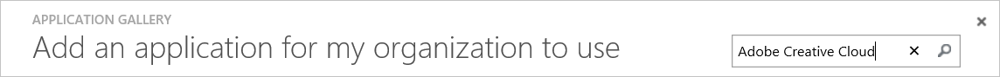
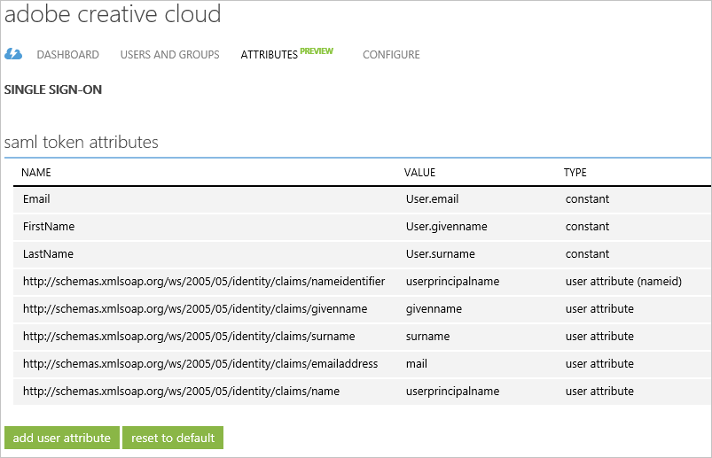

<properties
	pageTitle="Tutorial: Azure Active Directory integration with Adobe Creative Cloud | Microsoft Azure"
	description="Learn how to configure single sign-on between Azure Active Directory and Adobe Creative Cloud."
	services="active-directory"
	documentationCenter=""
	authors="jeevansd"
	manager="femila"
	editor=""/>

<tags
	ms.service="active-directory"
	ms.workload="identity"
	ms.tgt_pltfrm="na"
	ms.devlang="na"
	ms.topic="article"
	ms.date="10/13/2016"
	ms.author="jeedes"/>

# Tutorial: Azure Active Directory integration with Adobe Creative Cloud

The objective of this tutorial is to show you how to integrate Adobe Creative Cloud with Azure Active Directory (Azure AD).

Integrating Adobe Creative Cloud with Azure AD provides you with the following benefits:

- You can control in Azure AD who has access to Adobe Creative Cloud
- You can enable your users to automatically get signed-on to Adobe Creative Cloud (Single Sign-On) with their Azure AD accounts
- You can manage your accounts in one central location - the Azure classic portal

If you want to know more details about SaaS app integration with Azure AD, see [What is application access and single sign-on with Azure Active Directory](active-directory-appssoaccess-whatis.md).

## Prerequisites

To configure Azure AD integration with Adobe Creative Cloud, you need the following items:

- An Azure AD subscription
- A Adobe Creative Cloud single-sign on enabled subscription

> [AZURE.NOTE] To test the steps in this tutorial, we do not recommend using a production environment.

To test the steps in this tutorial, you should follow these recommendations:

- You should not use your production environment, unless this is necessary.
- If you don't have an Azure AD trial environment, you can get a one-month trial [here](https://azure.microsoft.com/pricing/free-trial/).

## Scenario description
The objective of this tutorial is to enable you to test Azure AD single sign-on in a test environment.

The scenario outlined in this tutorial consists of two main building blocks:

1. Adding Adobe Creative Cloud from the gallery
2. Configuring and testing Azure AD single sign-on

## Adding Adobe Creative Cloud from the gallery
To configure the integration of Adobe Creative Cloud into Azure AD, you need to add Adobe Creative Cloud from the gallery to your list of managed SaaS apps.

**To add Adobe Creative Cloud from the gallery, perform the following steps:**

1. In the **Azure classic Portal**, on the left navigation pane, click **Active Directory**. 

	![Active Directory][1]

2. From the **Directory** list, select the directory for which you want to enable directory integration.

3. To open the applications view, in the directory view, click **Applications** in the top menu.
	
	![Applications][2]

4. Click **Add** at the bottom of the page.
	
	![Applications][3]

5. On the **What do you want to do** dialog, click **Add an application from the gallery**.

	![Applications][4]

6. In the search box, type **Adobe Creative Cloud**.

	

7. In the results pane, select **Adobe Creative Cloud**, and then click **Complete** to add the application.

	

##  Configuring and testing Azure AD single sign-on
The objective of this section is to show you how to configure and test Azure AD single sign-on with Adobe Creative Cloud based on a test user called "Britta Simon".

For single sign-on to work, Azure AD needs to know what the counterpart user in Adobe Creative Cloud to an user in Azure AD is. In other words, a link relationship between an Azure AD user and the related user in Adobe Creative Cloud needs to be established.

This link relationship is established by assigning the value of the **user name** in Azure AD as the value of the **Username** in Adobe Creative Cloud.

To configure and test Azure AD single sign-on with Adobe Creative Cloud, you need to complete the following building blocks:

1. **[Configuring Azure AD Single Sign-On](#configuring-azure-ad-single-single-sign-on)** - to enable your users to use this feature.
2. **[Creating an Azure AD test user](#creating-an-azure-ad-test-user)** - to test Azure AD single sign-on with Britta Simon.
3. **[Creating a Adobe Creative Cloud test user](#creating-a-adobe-creative-connect-test-user)** - to have a counterpart of Britta Simon in Adobe Creative Cloud that is linked to the Azure AD representation of her.
4. **[Assigning the Azure AD test user](#assigning-the-azure-ad-test-user)** - to enable Britta Simon to use Azure AD single sign-on.
5. **[Testing Single Sign-On](#testing-single-sign-on)** - to verify whether the configuration works.

### Configuring Azure AD single sign-on

The objective of this section is to enable Azure AD single sign-on in the Azure classic portal and to configure single sign-on in your Adobe Creative Cloud application.

Adobe Creative Cloud application expects the SAML assertions in a specific format. Please configure the following claims for this application. You can manage the values of these attributes from the "**Atrribute**" tab of the application. The following screenshot shows an example for this. 

**To configure Azure AD single sign-on with Adobe Creative Cloud, perform the following steps:**

1. In the Azure classic portal, on the **Adobe Creative Cloud** application integration page, in the menu on the top, click **Attributes**.

    

2. On the **SAML token attributes** dialog, for each row shown in the table below, perform the following steps:
    

	| Attribute Name | Attribute Value |
	| --- | --- |    
    | FirstName | user.givenname |
	| LastName | user.surname |
	| Email | user.email |

	a. Click **add user attribute** to open the **Add User Attribure** dialog.

	
	
	b. In the **Attribute Name** textbox, type the attribute name shown for that row.
	
	c. From the **Attribute Value** list, type the attribute value shown for that row.
	
	d. Click **Complete**

3. In the menu on the top, click **Quick Start**.

	 

4. On the **How would you like users to sign on to Adobe Creative Cloud** page, select **Azure AD Single Sign-On**, and then click **Next**.
    
	

5. On the **Configure App Settings** dialog page, If you wish to configure the application in **IDP initiated mode**, perform the following steps and click **Next**:

    

	a. In the **Identifier** textbox, type a URL using the following pattern: `https://www.okta.com/saml2/service-provider/<token>`

    b. In the **Reply URL** textbox, type a URL using the following pattern: `https://<company name>.okta.com/auth/saml20/accauthlinktest`

	c. Click **Next**

	> [AZURE.NOTE] If you don't know about these URLs, type sample URLs with example pattern and then you will get the actual URLs after you complete step 16.
	
6. If you wish to configure the application in **SP initiated mode** on the **Configure App Settings** dialog page, then click on the **“Show advanced settings (optional)”** and then enter the **Sign On URL** and click **Next**.

	

	a. In the **Sign On URL** textbox, type: `https://adobe.com`

	b. Click **Next**

7. On the **Configure single sign-on at Adobe Creative Cloud** page, perform the following steps and click **Next**:
  
	

    a. Click **Download certificate**, and then save the file on your computer.

    b. Click **Next**.

8. In a different web browser window, sign-on to your Adobe Creative Cloud tenant as an administrator.

9. Go to **Identity** on the left navigation pane and click your domain. Then perform the following steps on **Single Sign On Configuration Required** section.

	

10. Click **Browser** to upload the downloaded certificate from Azure AD to **IDP Certificate**.

11. In the **IDP issuer** textbox, put the value of **Issuer URL** from Azure AD application configuration wizard.

12. In the **IDP Login URL** textbox, put the value of **SSO Service URL** from Azure AD application configuration wizard.

13. Select **HTTP - Redirect** as **IDP Binding**.

14. Select **Email Address** as **User Login Setting**.
 
15. Click **Save** button.

16. The dashboard will now present the XML **"Download Metadata"** file. It contains Adobe’s EntityDescriptor URL and AssertionConsumerService URL. Please open the file and configure them in the Azure AD application.

	

	

	a. Use the EntityDescriptor value Adobe provided you for **Identifier** on the **Configure App Settings** dialog.

	b. Use the AssertionConsumerService value Adobe provided you for **Reply URL** on the **Configure App Settings** dialog.

17. Go to **Identity** and click your domain.

18. Click **Edit Configuration**.

19. Click **Browser** to upload the latest certificate from Azure AD to **IDP Certificate**.

	

	> [AZURE.NOTE] If you need help configuring SAML with Adobe Creative Cloud then please refer this article [Configure SAML](https://helpx.adobe.com/creative-cloud/Configure_Microsoft_Azure_for_use_with_Adobe_SSO.html).

20. In the Azure AD portal, select the single sign-on configuration confirmation, and then click **Next**.
    
	![Azure AD Single Sign-On][10]

21. On the **Single sign-on confirmation** page, click **Complete**.  
    
	![Azure AD Single Sign-On][11]

### Creating an Azure AD test user
The objective of this section is to create a test user in the classic portal called Britta Simon.

![Create Azure AD User][20]

**To create a test user in Azure AD, perform the following steps:**

1. In the **Azure classic Portal**, on the left navigation pane, click **Active Directory**.

    

2. From the **Directory** list, select the directory for which you want to enable directory integration.

3. To display the list of users, in the menu on the top, click **Users**.
    
	

4. To open the **Add User** dialog, in the toolbar on the bottom, click **Add User**.

    

5. On the **Tell us about this user** dialog page, perform the following steps:

    

    a. As Type Of User, select New user in your organization.

    b. In the User Name **textbox**, type **BrittaSimon**.

    c. Click **Next**.

6.  On the **User Profile** dialog page, perform the following steps:
    
	

    a. In the **First Name** textbox, type **Britta**.  

    b. In the **Last Name** textbox, type, **Simon**.

    c. In the **Display Name** textbox, type **Britta Simon**.

    d. In the **Role** list, select **User**.

    e. Click **Next**.

7. On the **Get temporary password** dialog page, click **create**.
    
	

8. On the **Get temporary password** dialog page, perform the following steps:
    
	

    a. Write down the value of the **New Password**.

    b. Click **Complete**.   

### Creating a Adobe Creative Cloud test user

The objective of this section is to create a user called Britta Simon in Adobe Creative Cloud. Adobe Creative Cloud supports just-in-time provisioning, which is by default enabled.

There is no action item for you in this section. A new user will be created during an attempt to access Adobe Creative Cloud if it doesn't exist yet.

> [AZURE.NOTE] If you need to create an user manually, you need to contact the Adobe Creative Cloud support team.

### Assigning the Azure AD test user

The objective of this section is to enabling Britta Simon to use Azure single sign-on by granting her access to Adobe Creative Cloud.
	
![Assign User][200]

**To assign Britta Simon to Adobe Creative Cloud, perform the following steps:**

1. On the classic portal, to open the applications view, in the directory view, click **Applications** in the top menu.
    
	![Assign User][201]

2. In the applications list, select **Adobe Creative Cloud**.
    
	

3. In the menu on the top, click **Users**.
    
	![Assign User][203]

4. In the Users list, select **Britta Simon**.

5. In the toolbar on the bottom, click **Assign**.
    
	![Assign User][205]

### Testing single sign-on

The objective of this section is to test your Azure AD single sign-on configuration using the Access Panel.
 
When you click the Adobe Creative Cloud tile in the Access Panel, you should get automatically signed-on to your Adobe Creative Cloud application.

## Additional resources

* [List of Tutorials on How to Integrate SaaS Apps with Azure Active Directory](active-directory-saas-tutorial-list.md)
* [What is application access and single sign-on with Azure Active Directory?](active-directory-appssoaccess-whatis.md)

<!--Image references-->

[1]: ./media/active-directory-saas-adobecreativecloud-tutorial/tutorial_general_01.png
[2]: ./media/active-directory-saas-adobecreativecloud-tutorial/tutorial_general_02.png
[3]: ./media/active-directory-saas-adobecreativecloud-tutorial/tutorial_general_03.png
[4]: ./media/active-directory-saas-adobecreativecloud-tutorial/tutorial_general_04.png

[6]: ./media/active-directory-saas-adobecreativecloud-tutorial/tutorial_general_05.png
[10]: ./media/active-directory-saas-adobecreativecloud-tutorial/tutorial_general_06.png
[11]: ./media/active-directory-saas-adobecreativecloud-tutorial/tutorial_general_07.png
[20]: ./media/active-directory-saas-adobecreativecloud-tutorial/tutorial_general_100.png

[200]: ./media/active-directory-saas-adobecreativecloud-tutorial/tutorial_general_200.png
[201]: ./media/active-directory-saas-adobecreativecloud-tutorial/tutorial_general_201.png
[203]: ./media/active-directory-saas-adobecreativecloud-tutorial/tutorial_general_203.png
[204]: ./media/active-directory-saas-adobecreativecloud-tutorial/tutorial_general_204.png
[205]: ./media/active-directory-saas-adobecreativecloud-tutorial/tutorial_general_205.png
