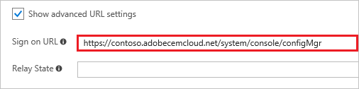
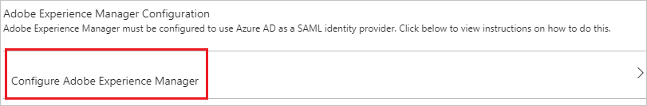
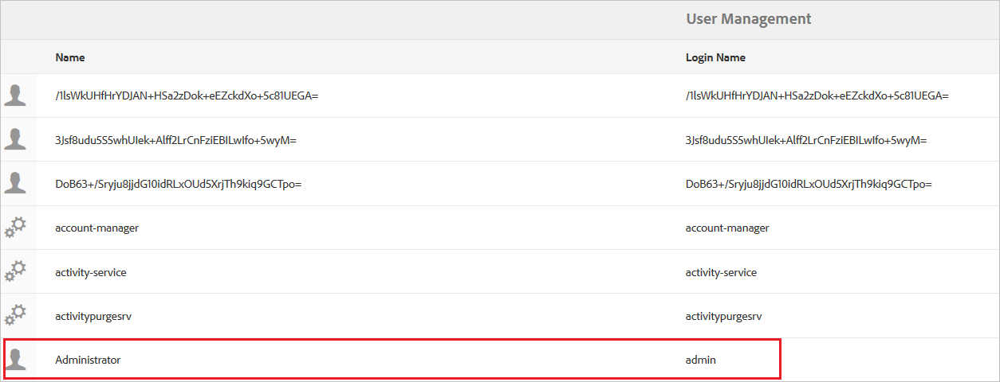
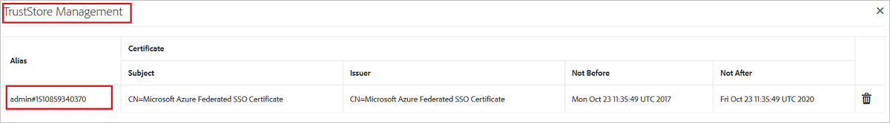
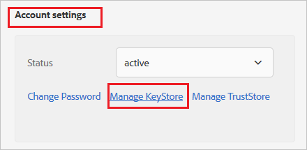
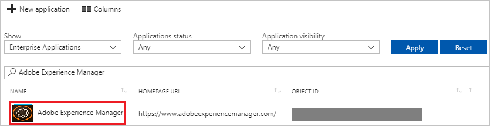

# Tutorial: Azure Active Directory integration with Adobe Experience Manager

In this tutorial, you learn how to integrate Adobe Experience Manager with Azure Active Directory (Azure AD).

Integrating Adobe Experience Manager with Azure AD provides you with the following benefits:

- You can control in Azure AD who has access to Adobe Experience Manager.
- You can enable your users to automatically get signed-on to Adobe Experience Manager (Single Sign-On) with their Azure AD accounts.
- You can manage your accounts in one central location - the Azure portal.

If you want to know more details about SaaS app integration with Azure AD, see [what is application access and single sign-on with Azure Active Directory](active-directory-appssoaccess-whatis.md).

## Prerequisites

To configure Azure AD integration with Adobe Experience Manager, you need the following items:

- An Azure AD subscription
- An Adobe Experience Manager single sign-on enabled subscription

> [!NOTE]
> To test the steps in this tutorial, we do not recommend using a production environment.

To test the steps in this tutorial, you should follow these recommendations:

- Do not use your production environment, unless it is necessary.
- If you don't have an Azure AD trial environment, you can [get a one-month trial](https://azure.microsoft.com/pricing/free-trial/).

## Scenario description
In this tutorial, you test Azure AD single sign-on in a test environment. 
The scenario outlined in this tutorial consists of two main building blocks:

1. Adding Adobe Experience Manager from the gallery
2. Configuring and testing Azure AD single sign-on

## Adding Adobe Experience Manager from the gallery
To configure the integration of Adobe Experience Manager into Azure AD, you need to add Adobe Experience Manager from the gallery to your list of managed SaaS apps.

**To add Adobe Experience Manager from the gallery, perform the following steps:**

1. In the **[Azure portal](https://portal.azure.com)**, on the left navigation panel, click **Azure Active Directory** icon. 

	![The Azure Active Directory button][1]

2. Navigate to **Enterprise applications**. Then go to **All applications**.

	![The Enterprise applications blade][2]
	
3. To add new application, click **New application** button on the top of dialog.

	![The New application button][3]

4. In the search box, type **Adobe Experience Manager**, select **Adobe Experience Manager** from result panel then click **Add** button to add the application.

	

## Configure and test Azure AD single sign-on

In this section, you configure and test Azure AD single sign-on with Adobe Experience Manager based on a test user called "Britta Simon".

For single sign-on to work, Azure AD needs to know what the counterpart user in Adobe Experience Manager is to a user in Azure AD. In other words, a link relationship between an Azure AD user and the related user in Adobe Experience Manager needs to be established.

In Adobe Experience Manager, assign the value of the **user name** in Azure AD as the value of the **Username** to establish the link relationship.

To configure and test Azure AD single sign-on with Adobe Experience Manager, you need to complete the following building blocks:

1. **[Configure Azure AD Single Sign-On](#configure-azure-ad-single-sign-on)** - to enable your users to use this feature.
2. **[Create an Azure AD test user](#create-an-azure-ad-test-user)** - to test Azure AD single sign-on with Britta Simon.
3. **[Create an Adobe Experience Manager test user](#create-an-adobe-experience-manager-test-user)** - to have a counterpart of Britta Simon in Adobe Experience Manager that is linked to the Azure AD representation of user.
4. **[Assign the Azure AD test user](#assign-the-azure-ad-test-user)** - to enable Britta Simon to use Azure AD single sign-on.
5. **[Test single sign-on](#test-single-sign-on)** - to verify whether the configuration works.

### Configure Azure AD single sign-on

In this section, you enable Azure AD single sign-on in the Azure portal and configure single sign-on in your Adobe Experience Manager application.

**To configure Azure AD single sign-on with Adobe Experience Manager, perform the following steps:**

1. In the Azure portal, on the **Adobe Experience Manager** application integration page, click **Single sign-on**.

	![Configure single sign-on link][4]

2. On the **Single sign-on** dialog, select **Mode** as	**SAML-based Sign-on** to enable single sign-on.
 
	

3. On the **Adobe Experience Manager Domain and URLs** section, perform the following steps if you want to configure the app in **IdP** mode:

	

    a. In the **Identifier** textbox, type a unique value which you define on your AEM server as well. 

	b. In the **Reply URL** textbox, type a URL using the following pattern: `https://<AEM Server Url>/saml_login`

	> [!NOTE] 
	> These values are not real. Update these values with the actual Identifier and Reply URL. Contact [Adobe Experience Manager support team](https://helpx.adobe.com/support/experience-manager.html) to get these values.
 
4. Check Show advanced URL settings and perform the following step if you wish to configure the application in **SP** initiated mode:

	

	In the **Sign On URL** textbox, type your Adobe Expereince Manager server URL. 

5. On the **SAML Signing Certificate** section, click **Certificate (Base64)** and then save the certificate file on your computer.

	 

6. On the Adobe Experience Manager Configuration section, click Configure Adobe Experience Manager to open Configure sign-on window. Copy the **SAML Sign-On Service URL**, **SAML Entity ID** and **Sign-Out ID** from the Quick Reference section.

	 

7. Click **Save** button.

	

8. Open **Adobe Experience Manager** admin portal in another browser window.

9. Select **Settings** -> **Security** -> **Users**.

	

10. Select **Administrator** or any other relevant user.

	

11. Select **Account Settings** -> **Manage TrustStore**.

	

12. Click **Select Certificate File** from **Add Certificate from CER file** button. Browse and select the certificate file which you have downloaded from Azure portal.

	

13. The certificate will be added to the TrustStore. Note the alias of the certificate.

	

14. On **Users** page, select **authentication-service**.

	

15. Select **Account settings** -> **Manage KeyStore**. Create KeyStore by supplying a password.

	

16. Go back to the admin screen and select **Settings** -> **Operations** -> **Web Console**.

	

17. This will open the Configuration page.

	

18. Find **Adobe Granite SAML 2.0 Authentication Handler** and click on **Add** icon .

	

19. Perform following actions on this page.

	

	a. In the **Path** textbox, enter **/**.

	b. In **IDP URL** textbox, enter the value of **SAML Sign-On Service URL** which you have copied from Azure Portal.

	c. In **IDP Certificate Alias** textbox, enter the value of **Certificate Alias** which you have added in TrustStore.

	d. In **Security Provided Entity ID** textbox, enter the value of unique **SAML Entity ID** which you have configued in Azure Portal.

	e. In **Assertion Consumer Service URL** textbox, enter the value of **Reply URL** which you have configured in Azure Portal.

	f. In **Password of Key Store** textbox, enter the **Password** which you have set in KeyStore.

	g. In **User Attribute ID** textbox, enter **Name ID** or other User ID which is relevant in your case.

	h. Select **Autocreate CRX Users.**

	i. In **Logout URL** textbox, enter the value of unique **Sign-Out URL** which you have configued in Azure Portal.

	j. Click **Save**

> [!TIP]
> You can now read a concise version of these instructions inside the [Azure portal](https://portal.azure.com), while you are setting up the app!  After adding this app from the **Active Directory > Enterprise Applications** section, simply click the **Single Sign-On** tab and access the embedded documentation through the **Configuration** section at the bottom. You can read more about the embedded documentation feature here: [Azure AD embedded documentation]( https://go.microsoft.com/fwlink/?linkid=845985)

### Create an Azure AD test user

The objective of this section is to create a test user in the Azure portal called Britta Simon.

   ![Create an Azure AD test user][100]

**To create a test user in Azure AD, perform the following steps:**

1. In the Azure portal, in the left pane, click the **Azure Active Directory** button.

    

2. To display the list of users, go to **Users and groups**, and then click **All users**.

    

3. To open the **User** dialog box, click **Add** at the top of the **All Users** dialog box.

    

4. In the **User** dialog box, perform the following steps:

    

    a. In the **Name** box, type **BrittaSimon**.

    b. In the **User name** box, type the email address of user Britta Simon.

    c. Select the **Show Password** check box, and then write down the value that's displayed in the **Password** box.

    d. Click **Create**.
  
### Create an Adobe Experience Manager test user

In this section, you create a user called Britta Simon in Adobe Experience Manager. If you have selected **Autocreate CRX Users** option then users will be created automatically after successful authentication. 

If you want to create users manually, please work with [Adobe Experience Manager support team](https://helpx.adobe.com/support/experience-manager.html) to add the users in the Adobe Experience Manager platform. 

### Assign the Azure AD test user

In this section, you enable Britta Simon to use Azure single sign-on by granting access to Adobe Experience Manager.

![Assign the user role][200] 

**To assign Britta Simon to Adobe Experience Manager, perform the following steps:**

1. In the Azure portal, open the applications view, and then navigate to the directory view and go to **Enterprise applications** then click **All applications**.

	![Assign User][201] 

2. In the applications list, select **Adobe Experience Manager**.

	  

3. In the menu on the left, click **Users and groups**.

	![The "Users and groups" link][202]

4. Click **Add** button. Then select **Users and groups** on **Add Assignment** dialog.

	![The Add Assignment pane][203]

5. On **Users and groups** dialog, select **Britta Simon** in the Users list.

6. Click **Select** button on **Users and groups** dialog.

7. Click **Assign** button on **Add Assignment** dialog.
	
### Test single sign-on

In this section, you test your Azure AD single sign-on configuration using the Access Panel.

When you click the Adobe Experience Manager tile in the Access Panel, you should get automatically signed-on to your Adobe Experience Manager application.
For more information about the Access Panel, see [Introduction to the Access Panel](active-directory-saas-access-panel-introduction.md). 

## Additional resources

* [List of Tutorials on How to Integrate SaaS Apps with Azure Active Directory](active-directory-saas-tutorial-list.md)
* [What is application access and single sign-on with Azure Active Directory?](active-directory-appssoaccess-whatis.md)

<!--Image references-->

[1]: ./media/active-directory-saas-adobeexperiencemanager-tutorial/tutorial_general_01.png
[2]: ./media/active-directory-saas-adobeexperiencemanager-tutorial/tutorial_general_02.png
[3]: ./media/active-directory-saas-adobeexperiencemanager-tutorial/tutorial_general_03.png
[4]: ./media/active-directory-saas-adobeexperiencemanager-tutorial/tutorial_general_04.png

[100]: ./media/active-directory-saas-adobeexperiencemanager-tutorial/tutorial_general_100.png

[200]: ./media/active-directory-saas-adobeexperiencemanager-tutorial/tutorial_general_200.png
[201]: ./media/active-directory-saas-adobeexperiencemanager-tutorial/tutorial_general_201.png
[202]: ./media/active-directory-saas-adobeexperiencemanager-tutorial/tutorial_general_202.png
[203]: ./media/active-directory-saas-adobeexperiencemanager-tutorial/tutorial_general_203.png

