<properties 
    pageTitle="Tutorial: Azure Active Directory integration with AirWatch | Microsoft Azure" 
    description="Learn how to use AirWatch with Azure Active Directory to enable single sign-on, automated provisioning, and more!" 
    services="active-directory" 
    authors="jeevansd"  
    documentationCenter="na" 
    manager="femila"/>
<tags 
    ms.service="active-directory" 
    ms.devlang="na" 
    ms.topic="article" 
    ms.tgt_pltfrm="na" 
    ms.workload="identity" 
    ms.date="07/11/2016" 
    ms.author="jeedes" />

#Tutorial: Azure Active Directory integration with AirWatch

The objective of this tutorial is to show the integration of Azure and AirWatch.  
The scenario outlined in this tutorial assumes that you already have the following items:

-   A valid Azure subscription
-   An AirWatch single sign-on enabled subscription

After completing this tutorial, the Azure AD users you have assigned to AirWatch will be able to single sign into the application at your AirWatch company site (service provider initiated sign on), or using the [Introduction to the Access Panel](active-directory-saas-access-panel-introduction.md).

The scenario outlined in this tutorial consists of the following building blocks:

1.  Enabling the application integration for AirWatch
2.  Configuring single sign-on
3.  Configuring user provisioning
4.  Assigning users

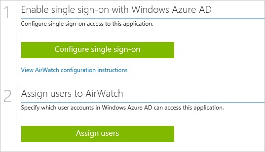
##Enabling the application integration for AirWatch

The objective of this section is to outline how to enable the application integration for AirWatch.

###To enable the application integration for AirWatch, perform the following steps:

1.  In the Azure classic portal, on the left navigation pane, click **Active Directory**.

    

2.  From the **Directory** list, select the directory for which you want to enable directory integration.

3.  To open the applications view, in the directory view, click **Applications** in the top menu.

    

4.  Click **Add** at the bottom of the page.

    

5.  On the **What do you want to do** dialog, click **Add an application from the gallery**.

    

6.  In the **search box**, type **AirWatch**.

    

7.  In the results pane, select **AirWatch**, and then click **Complete** to add the application.

    
##Configuring single sign-on

The objective of this section is to outline how to enable users to authenticate to AirWatch with their account in Azure AD using federation based on the SAML protocol.  
As part of this procedure, you are required to create a base-64 encoded certificate file.  
If you are not familiar with this procedure, see [How to convert a binary certificate into a text file](http://youtu.be/PlgrzUZ-Y1o).

###To configure single sign-on, perform the following steps:

1.  In the Azure classic portal, on the **AirWatch** application integration page, click **Configure single sign-on** to open the **Configure Single Sign On ** dialog.

    

2.  On the **How would you like users to sign on to AirWatch** page, select **Microsoft Azure AD Single Sign-On**, and then click **Next**.

    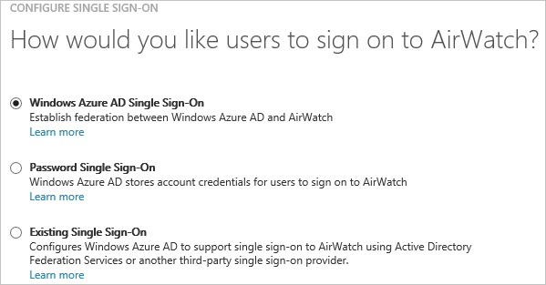

3.  On the **Configure App URL** page, in the **AirWatch Sign On URL** textbox, type your URL used by your users to sign in to your AirWatch application (e.g.: "*https:// companycode.awmdm.com/AirWatch/Login?gid=companycode*"), and then click **Next**.

    

4.  On the **Configure single sign-on at AirWatch** page, click **Download certificate**, and then save the certificate file on your computer.

    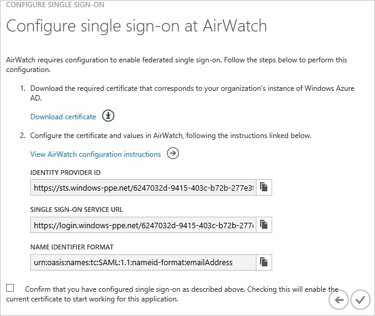

5.  In a different web browser window, log into your AirWatch company site as an administrator.

6.  In the left navigation pane, click **Accounts**, and then click **Administrators**.

    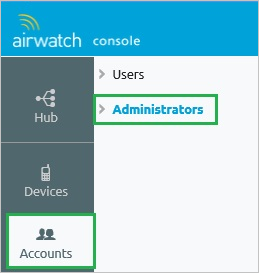

7.  Expand the **Settings** menu, and then click **Directory Services**.

    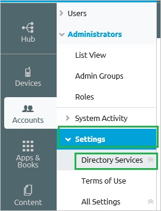

8.  Click the **User** tab, in the **Base DN** textfield, type your domain name, and then click **Save**.

    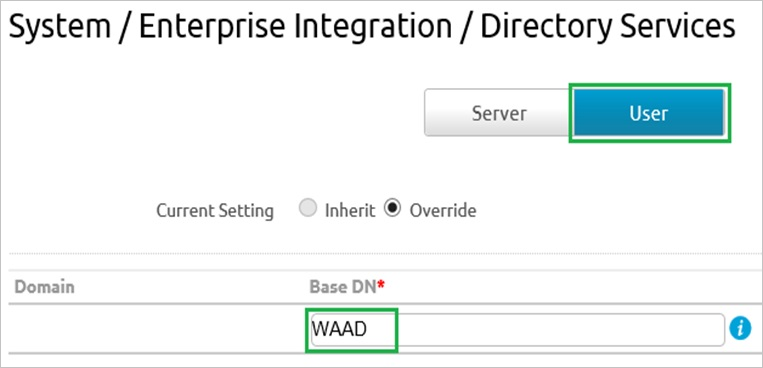

9.  Click the **Server** tab.

    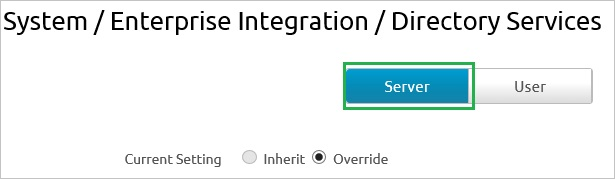

10. Perform the following steps:

    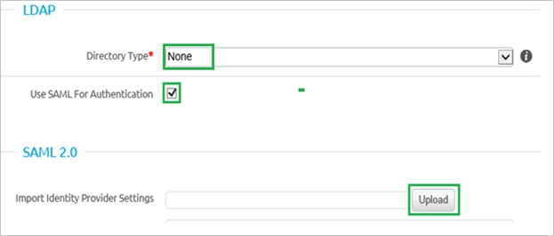

    1.  As **Directory Type**, select **None**.
    2.  Select **Use SAML For Authentication**.
    3.  To upload the downloaded certificate, click **Upload**.

11. In the **Request** section, perform the following steps:

    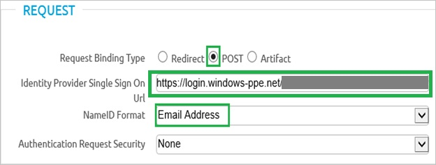

    1.  As **Request Binding Type**, select **POST**.
    2.  In the Azure classic portal, on the **Configure single sign-on at Airwatch** dialog page, copy the **Single Sign-On Service URL** value, and then paste it into the **Identity Provider Single Sign On URL** textbox.
    3.  As **NameID Format**, select **Email Address**.
    4.  Click **Save**.

12. Click the **User** tab again.

    

13. In the **Attribute** section, perform the following steps:

    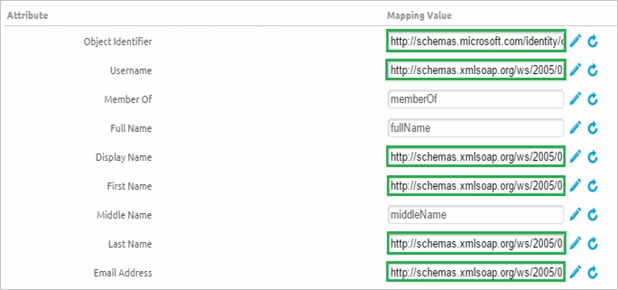

    1.  In the **Object Identifier** textbox, type **http://schemas.microsoft.com/identity/claims/objectidentifier**.
    2.  In the **Username** textbox, type **http://schemas.xmlsoap.org/ws/2005/05/identity/claims/emailaddress**.
    3.  In the **Display Name** textbox, type **http://schemas.xmlsoap.org/ws/2005/05/identity/claims/givenname**.
    4.  In the **First Name** textbox, type **http://schemas.xmlsoap.org/ws/2005/05/identity/claims/givenname**.
    5.  In the **Last Name** textbox, type **http://schemas.xmlsoap.org/ws/2005/05/identity/claims/surname**.
    6.  In the **Email** textbox, type **http://schemas.xmlsoap.org/ws/2005/05/identity/claims/emailaddress**.
    7.  Click **Save**.

14. On the Azure classic portal, select the single sign-on configuration confirmation, and then click **Complete** to close the **Configure Single Sign On** dialog.

    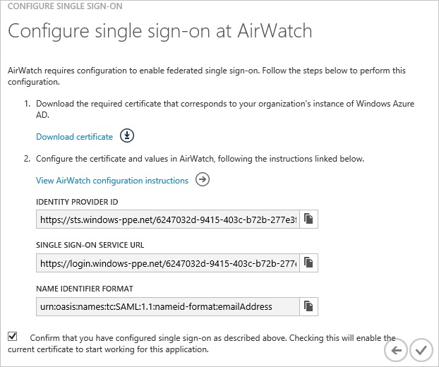
##Configuring user provisioning

In order to enable Azure AD users to log into AirWatch, they must be provisioned into AirWatch.  
In the case of AirWatch, provisioning is a manual task.

###To provision a user accounts, perform the following steps:

1.  Log in to your **AirWatch** company site as administrator.

2.  In the navigation pane on the left side, click **Accounts**, and then click **Users**.

    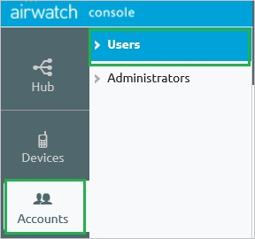

3.  In the **Users** menu, click **List View**, and then click **Add \> Add User**.

    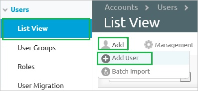

4.  On the **Add / Edit User** dialog, perform the following steps:

    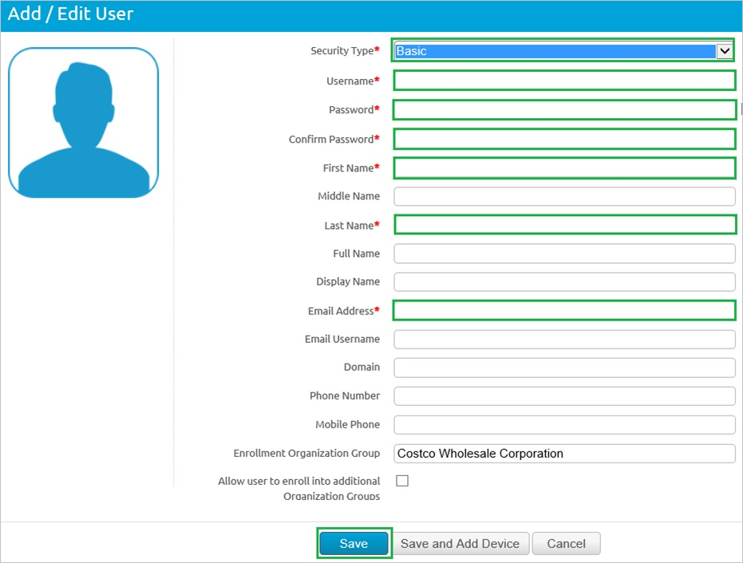

    1.  Type the **Username**, **Password**, **Confirm Password**, **First Name**, **Last Name**, **Email Address** of a valid Azure Active Directory account you want to provision into the related textboxes.
    2.  Click **Save**.

>[AZURE.NOTE] You can use any other AirWatch user account creation tools or APIs provided by AirWatch to provision AAD user accounts.

##Assigning users

To test your configuration, you need to grant the Azure AD users you want to allow using your application access to it by assigning them.

###To assign users to AirWatch, perform the following steps:

1.  In the Azure classic portal, create a test account.

2.  On the **AirWatch **application integration page, click **Assign users**.

    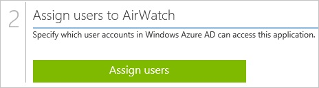

3.  Select your test user, click **Assign**, and then click **Yes** to confirm your assignment.

    

If you want to test your single sign-on settings, open the Access Panel. For more details about the Access Panel, see [Introduction to the Access Panel](active-directory-saas-access-panel-introduction.md).
