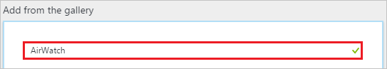
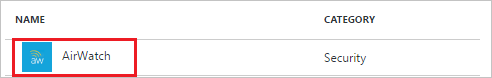
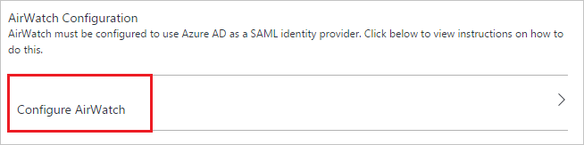
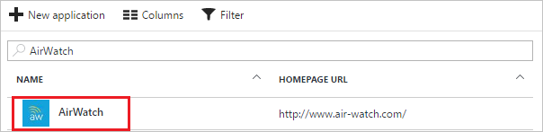

# Tutorial: Azure Active Directory integration with AirWatch

In this tutorial, you learn how to integrate AirWatch with Azure Active Directory (Azure AD).

Integrating AirWatch with Azure AD provides you with the following benefits:

- You can control in Azure AD who has access to AirWatch
- You can enable your users to automatically get signed-on to AirWatch (Single Sign-On) with their Azure AD accounts
- You can manage your accounts in one central location - the Azure portal

If you want to know more details about SaaS app integration with Azure AD, see [what is application access and single sign-on with Azure Active Directory](active-directory-appssoaccess-whatis.md).

## Prerequisites

To configure Azure AD integration with AirWatch, you need the following items:

- An Azure AD subscription
- An AirWatch single-sign on enabled subscription

> [!NOTE]
> To test the steps in this tutorial, we do not recommend using a production environment.

To test the steps in this tutorial, you should follow these recommendations:

- Do not use your production environment, unless it is necessary.
- If you don't have an Azure AD trial environment, you can get a one-month trial [here](https://azure.microsoft.com/pricing/free-trial/).

## Scenario description
In this tutorial, you test Azure AD single sign-on in a test environment. 
The scenario outlined in this tutorial consists of two main building blocks:

1. Adding AirWatch from the gallery
2. Configuring and testing Azure AD single sign-on

## Adding AirWatch from the gallery
To configure the integration of AirWatch into Azure AD, you need to add AirWatch from the gallery to your list of managed SaaS apps.

**To add AirWatch from the gallery, perform the following steps:**

1. In the **[Azure portal](https://portal.azure.com)**, on the left navigation panel, click **Azure Active Directory** icon. 

	![Active Directory][1]

2. Navigate to **Enterprise applications**. Then go to **All applications**.

	![Applications][2]
	
3. To add new application, click **New application** button on the top of dialog.

	![Applications][3]

4. In the search box, type **AirWatch**.

	

5. In the results panel, select **AirWatch**, and then click **Add** button to add the application.

	

##  Configuring and testing Azure AD single sign-on
In this section, you configure and test Azure AD single sign-on with AirWatch based on a test user called "Britta Simon."

For single sign-on to work, Azure AD needs to know what the counterpart user in AirWatch is to a user in Azure AD. In other words, a link relationship between an Azure AD user and the related user in AirWatch needs to be established.

This link relationship is established by assigning the value of the **user name** in Azure AD as the value of the **Username** in AirWatch.

To configure and test Azure AD single sign-on with AirWatch, you need to complete the following building blocks:

1. **[Configuring Azure AD Single Sign-On](#configuring-azure-ad-single-sign-on)** - to enable your users to use this feature.
2. **[Creating an Azure AD test user](#creating-an-azure-ad-test-user)** - to test Azure AD single sign-on with Britta Simon.
3. **[Creating a AirWatch test user](#creating-a-airwatch-test-user)** - to have a counterpart of Britta Simon in AirWatch that is linked to the Azure AD representation of user.
4. **[Assigning the Azure AD test user](#assigning-the-azure-ad-test-user)** - to enable Britta Simon to use Azure AD single sign-on.
5. **[Testing Single Sign-On](#testing-single-sign-on)** - to verify whether the configuration works.

### Configuring Azure AD single sign-on

In this section, you enable Azure AD single sign-on in the Azure portal and configure single sign-on in your AirWatch application.

**To configure Azure AD single sign-on with AirWatch, perform the following steps:**

1. In the Azure portal, on the **AirWatch** application integration page, click **Single sign-on**.

	![Configure Single Sign-On][4]

2. On the **Single sign-on** dialog, select **Mode** as	**SAML-based Sign-on** to enable single sign-on.
 
	

3. On the **AirWatch Domain and URLs** section, perform the following steps:

	

    a. In the **Sign-on URL** textbox, type a URL using the following pattern: `https://<subdomain>.awmdm.com/AirWatch/Login?gid=companycode`

    b. In the **Identifier** textbox, type the value as `AirWatch`

	> [!NOTE] 
	> This value is not the real. Update this value with the actual Sign-on URL. Contact [AirWatch Client support team](http://www.air-watch.com/company/contact-us/) to get this value. 
 
4. On the **SAML Signing Certificate** section, click **Metadata XML** and then save the XML file on your computer.

	 

5. On the **AirWatch Configuration** section, click **Configure AirWatch** to open **Configure sign-on** window. Copy the **SAML Single Sign-On Service URL** from the **Quick Reference section.**

	 

6. Click **Save** button.

	
<CS>
7. In a different web browser window, log in to your AirWatch company site as an administrator.

8. In the left navigation pane, click **Accounts**, and then click **Administrators**.
   
   

9. Expand the **Settings** menu, and then click **Directory Services**.
   
   

10. Click the **User** tab, in the **Base DN** textbox, type your domain name, and then click **Save**.
   
   

11. Click the **Server** tab.
   
   

12. Perform the following steps:
    
	   
    
    a. As **Directory Type**, select **None**.

    b. Select **Use SAML For Authentication**.

    c. To upload the downloaded certificate, click **Upload**.

13. In the **Request** section, perform the following steps:
    
      

    a. As **Request Binding Type**, select **POST**.

    b. In the Azure portal, on the **Configure single sign-on at Airwatch** dialog page, copy the **SAML Single Sign-On Service URL** value, and then paste it into the **Identity Provider Single Sign On URL** textbox.

    c. As **NameID Format**, select **Email Address**.

    d. Click **Save**.

14. Click the **User** tab again.
    
    

15. In the **Attribute** section, perform the following steps:
    
    

    a. In the **Object Identifier** textbox, type **http://schemas.microsoft.com/identity/claims/objectidentifier**.

    b. In the **Username** textbox, type **http://schemas.xmlsoap.org/ws/2005/05/identity/claims/emailaddress**.

    c. In the **Display Name** textbox, type **http://schemas.xmlsoap.org/ws/2005/05/identity/claims/givenname**.

    d. In the **First Name** textbox, type **http://schemas.xmlsoap.org/ws/2005/05/identity/claims/givenname**.

    e. In the **Last Name** textbox, type **http://schemas.xmlsoap.org/ws/2005/05/identity/claims/surname**.

    f. In the **Email** textbox, type **http://schemas.xmlsoap.org/ws/2005/05/identity/claims/emailaddress**.

    g. Click **Save**.

<CE>

### Creating an Azure AD test user
The objective of this section is to create a test user in the Azure portal called Britta Simon.

![Create Azure AD User][100]

**To create a test user in Azure AD, perform the following steps:**

1. In the **Azure portal**, on the left navigation pane, click **Azure Active Directory** icon.

	 

2. To display the list of users, go to **Users and groups** and click **All users**.
	
	 

3. To open the **User** dialog, click **Add** on the top of the dialog.
 
	 

4. On the **User** dialog page, perform the following steps:
 
	 

    a. In the **Name** textbox, type **BrittaSimon**.

    b. In the **User name** textbox, type the **email address** of Britta Simon.

	c. Select **Show Password** and write down the value of the **Password**.

    d. Click **Create**.
 
### Creating a AirWatch test user

To enable Azure AD users to log in to AirWatch, they must be provisioned in to AirWatch.

* When AirWatch, provisioning is a manual task.

**To provision a user account, perform the following steps:**

1. Log in to your **AirWatch** company site as administrator.
2. In the navigation pane on the left side, click **Accounts**, and then click **Users**.
   
   
3. In the **Users** menu, click **List View**, and then click **Add \> Add User**.
   
   
4. On the **Add / Edit User** dialog, perform the following steps:

      
   1. Type the **Username**, **Password**, **Confirm Password**, **First Name**, **Last Name**, **Email Address** of a valid Azure Active Directory account you want to provision into the related textboxes.
   2. Click **Save**.

>[!NOTE]
>You can use any other AirWatch user account creation tools or APIs provided by AirWatch to provision AAD user accounts.
>  

### Assigning the Azure AD test user

In this section, you enable Britta Simon to use Azure single sign-on by granting access to AirWatch.

![Assign User][200] 

**To assign Britta Simon to AirWatch, perform the following steps:**

1. In the Azure portal, open the applications view, and then navigate to the directory view and go to **Enterprise applications** then click **All applications**.

	![Assign User][201] 

2. In the applications list, select **AirWatch**.

	 

3. In the menu on the left, click **Users and groups**.

	![Assign User][202] 

4. Click **Add** button. Then select **Users and groups** on **Add Assignment** dialog.

	![Assign User][203]

5. On **Users and groups** dialog, select **Britta Simon** in the Users list.

6. Click **Select** button on **Users and groups** dialog.

7. Click **Assign** button on **Add Assignment** dialog.
	
### Testing single sign-on

In this section, you test your Azure AD single sign-on configuration using the Access Panel.

If you want to test your single sign-on settings, open the Access Panel. For more information about the Access Panel, see [Introduction to the Access Panel](active-directory-saas-access-panel-introduction.md).

## Additional resources

* [List of Tutorials on How to Integrate SaaS Apps with Azure Active Directory](active-directory-saas-tutorial-list.md)
* [What is application access and single sign-on with Azure Active Directory?](active-directory-appssoaccess-whatis.md)

<!--Image references-->

[1]: ./media/active-directory-saas-airwatch-tutorial/tutorial_general_01.png
[2]: ./media/active-directory-saas-airwatch-tutorial/tutorial_general_02.png
[3]: ./media/active-directory-saas-airwatch-tutorial/tutorial_general_03.png
[4]: ./media/active-directory-saas-airwatch-tutorial/tutorial_general_04.png

[100]: ./media/active-directory-saas-airwatch-tutorial/tutorial_general_100.png

[200]: ./media/active-directory-saas-airwatch-tutorial/tutorial_general_200.png
[201]: ./media/active-directory-saas-airwatch-tutorial/tutorial_general_201.png
[202]: ./media/active-directory-saas-airwatch-tutorial/tutorial_general_202.png
[203]: ./media/active-directory-saas-airwatch-tutorial/tutorial_general_203.png

