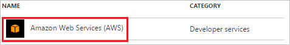
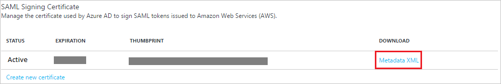
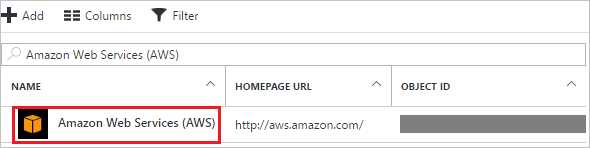

# Tutorial: Azure Active Directory integration with Amazon Web Services (AWS)

In this tutorial, you learn how to integrate Amazon Web Services (AWS) with Azure Active Directory (Azure AD).

Integrating Amazon Web Services (AWS) with Azure AD provides you with the following benefits:

- You can control in Azure AD who has access to Amazon Web Services (AWS)
- You can enable your users to automatically get signed-on to Amazon Web Services (AWS) (Single Sign-On) with their Azure AD accounts
- You can manage your accounts in one central location - the Azure portal

If you want to know more details about SaaS app integration with Azure AD, see [What is application access and single sign-on with Azure Active Directory](active-directory-appssoaccess-whatis.md).

<!--## Overview

To enable single sign-on with Amazon Web Services (AWS), it must be configured to use Azure Active Directory as an identity provider. This guide provides information and tips on how to perform this configuration in Amazon Web Services (AWS).

>[!Note]: 
>This embedded guide is brand new in the new Azure portal, and we’d love to hear your thoughts. Use the Feedback ? button at the top of the portal to provide feedback. The older guide for using the [Azure classic portal](https://manage.windowsazure.com) to configure this application can be found [here](https://github.com/Azure/AzureAD-App-Docs/blob/master/articles/en-us/_/sso_configure.md).-->

## Prerequisites

To configure Azure AD integration with Amazon Web Services (AWS), you need the following items:

- An Azure AD subscription
- Amazon Web Services (AWS) single-sign on enabled subscription

> [!NOTE]
> To test the steps in this tutorial, we do not recommend using a production environment.

To test the steps in this tutorial, you should follow these recommendations:

- You should not use your production environment, unless this is necessary.
- If you don't have an Azure AD trial environment, you can get an one-month trial [here](https://azure.microsoft.com/pricing/free-trial/).

## Scenario description
In this tutorial, you test Azure AD single sign-on in a test environment. 
The scenario outlined in this tutorial consists of two main building blocks:

1. Adding Amazon Web Services (AWS) from the gallery
2. Configuring and testing Azure AD single sign-on

## Adding Amazon Web Services (AWS) from the gallery
To configure the integration of Amazon Web Services (AWS) into Azure AD, you need to add Amazon Web Services (AWS) from the gallery to your list of managed SaaS apps.

**To add Amazon Web Services (AWS) from the gallery, perform the following steps:**

1. In the **[Azure Portal](https://portal.azure.com)**, on the left navigation panel, click **Azure Active Directory** icon. 

	![Active Directory][1]

2. Navigate to **Enterprise applications**. Then go to **All applications**.

	![Applications][2]
	
3. Click **Add** button on the top of the dialog.

	![Applications][3]

4. In the search box, type **Amazon Web Services (AWS)**.

	

5. In the results panel, select **Amazon Web Services (AWS)**, and then click **Add** button to add the application.

	

##  Configuring and testing Azure AD single sign-on
In this section, you configure and test Azure AD single sign-on with Amazon Web Services (AWS) based on a test user called "Britta Simon".

For single sign-on to work, Azure AD needs to know what the counterpart user in Amazon Web Services (AWS) is to a user in Azure AD. In other words, a link relationship between an Azure AD user and the related user in Amazon Web Services (AWS) needs to be established.

This link relationship is established by assigning the value of the **user name** in Azure AD as the value of the **Username** in Amazon Web Services (AWS).

To configure and test Azure AD single sign-on with Amazon Web Services (AWS), you need to complete the following building blocks:

1. **[Configuring Azure AD Single Sign-On](#configuring-azure-ad-single-sign-on)** - to enable your users to use this feature.
2. **[Creating an Azure AD test user](#creating-an-azure-ad-test-user)** - to test Azure AD single sign-on with Britta Simon.
3. **[Creating an Amazon Web Services test user](#creating-an-amazon-web-services-test-user)** - to have a counterpart of Britta Simon in Amazon Web Services (AWS) that is linked to the Azure AD representation of her.
4. **[Assigning the Azure AD test user](#assigning-the-azure-ad-test-user)** - to enable Britta Simon to use Azure AD single sign-on.
5. **[Testing Single Sign-On](#testing-single-sign-on)** - to verify whether the configuration works.

### Configuring Azure AD single sign-on

In this section, you enable Azure AD single sign-on in the Azure portal and configure single sign-on in your Amazon Web Services (AWS) application.

**To configure Azure AD single sign-on with Amazon Web Services (AWS), perform the following steps:**

1. In the Azure Portal, on the **Amazon Web Services (AWS)** application integration page, click **Single sign-on**.

	![Configure Single Sign-On][4]

2. On the **Single sign-on** dialog, as **Mode** select **SAML-based Sign-on** to enable single sign-on.
 
	

3. On the **Amazon Web Services (AWS) Domain and URLs** section, the user does not have to perform any steps as the app is already pre-integrated with Azure.

	

4. On the **SAML Signing Certificate** section, click **Metadata XML** and then save the XML file on your computer.
    
	

5. The Amazon Web Services (AWS) Software application expects the SAML assertions in a specific format. Please configure the following claims for this application. You can manage the values of these attributes from the "**User Attributes**" section on application integration page. The following screenshot shows an example for this.

	

6. In the **User Attributes** section on the **Single sign-on** dialog, configure SAML token attribute as shown in the image above and perform the following steps:
	
	| Attribute Name  | Attribute Value | Namespace |
	| --------------- | --------------- | --------------- |
	| rolesessionname | user.userprincipalname | https://aws.amazon.com/SAML/Attributes |
	| role 			  | user.assignedroles | keep it blank |
	
	>[!TIP]
	>You need to configure the user provisioning in Azure AD to fetch all the roles from AWS Console. Please refer the provisioning steps below.

	a. Click **Add attribute** to open the **Add Attribute** dialog.

	

	b. In the **Name** textbox, type the attribute name shown for that row.

	

	c. From the **Value** list, type the attribute value shown for that row. Add the Namespace value as given above.
	
	d. Click **Ok**.

7. Click **Save** button to save the settings on Azure.

	

8. In a different browser window, sign-on to your Amazon Web Services (AWS) company site as administrator.

9. Click **Console Home**.
   
    ![Configure Single Sign-On][11]

10. Click **IAM** from **Security, Identity & Compliance** service.
   
    ![Configure Single Sign-On][12]

11. Click **Identity Providers**, and then click **Create Provider**.
   
    ![Configure Single Sign-On][13]

12. On the **Configure Provider** dialog page, perform the following steps:
   
    ![Configure Single Sign-On][14]
 
  	a. As **Provider Type**, select **SAML**.

  	b. In the **Provider Name** textbox, type a provider name (e.g.: *WAAD*).

  	c. To upload your downloaded metadata file, click **Choose File**.

  	d. Click **Next Step**.

13. On the **Verify Provider Information** dialog page, click **Create**. 
    
    ![Configure Single Sign-On][15]

14. Click **Roles**, and then click **Create New Role**. 
    
    ![Configure Single Sign-On][16]

15. On the **Set Role Name** dialog, perform the following steps: 
    
    ![Configure Single Sign-On][17] 

  	a. In the **Role Name** textbox, type a role name (e.g.: *TestUser*). 

  	b. Click **Next Step**.

16. On the **Select Role Type** dialog, perform the following steps: 
    
    ![Configure Single Sign-On][18] 

  	a. Select **Role For Identity Provider Access**. 

  	b. In the **Grant Web Single Sign-On (WebSSO) access to SAML providers** section, click **Select**.

17. On the **Establish Trust** dialog, perform the following steps:  
    
    ![Configure Single Sign-On][19] 

  	a. As SAML provider, select the SAML provider you have created previously (e.g.: *WAAD*)
  
  	b. Click **Next Step**.

18. On the **Verify Role Trust** dialog, click **Next Step**.
    
    ![Configure Single Sign-On][32]

19. On the **Attach Policy** dialog, click **Next Step**.
    
    ![Configure Single Sign-On][33]

20. On the **Review** dialog, perform the following steps:
    
    ![Configure Single Sign-On][34]
 
  	a. Click **Create Role**.

    b. Create as many roles as needed and map them to the Identity Provider.

21. Now configure the user provisioning to fetch all the roles from AWS

    a. In the AWS Console login with your root account

    b. In the top right corner click your name and then click the **My Security Credentials** option. This will open up a screen as a warning message. Click the button **Security Credentials** button to pass the screen.
        
	   ![Configure Single Sign-On][36]

       ![Configure Single Sign-On][37]

    c. In the Access Keys section click the **Create New Access Key** button. This generates the Access Key ID and a token value.
    
       ![Configure Single Sign-On][38]

    d. Copy both these values and also download it, so that you don't lose it.

    e. In the Azure Portal, on the Amazon Web Services (AWS) application integration page, click **Provisioning**.
        
       ![Configure Single Sign-On][35]

    f. Set the Provisioning mode to **Automatic**
        
       ![Configure Single Sign-On][39]

    g. Now in the **clientsecret** and **Secret Token** paste the corresponding values, which you have copied from AWS Console.
    
    h. You can click the **Test Connection** button to test the connectivity. Once that is successful then you can start the provisioning connector.
       
       ![Configure Single Sign-On][40]

    i. Now enable the Provisioning Status to **On**. This starts fetching the roles from the application.

       ![Configure Single Sign-On][41]

	> [!NOTE]
	> Azure AD Provisioning service runs every after some time to sync the roles from AWS. You should see all the Identity Provider attached AWS roles into Azure AD and you can use them while assigning the application to users or groups.

<!--### Next steps

To ensure users can sign-in to Amazon Web Services (AWS) after it has been configured to use Azure Active Directory, review the following tasks and topics:

- User accounts must be pre-provisioned into Amazon Web Services (AWS) prior to sign-in. To set this up, see Provisioning.
 
- Users must be assigned access to Amazon Web Services (AWS) in Azure AD to sign-in. To assign users, see Users.
 
- To configure access polices for Amazon Web Services (AWS) users, see Access Policies.
 
- For additional information on deploying single sign-on to users, see [this article](https://docs.microsoft.com/azure/active-directory/active-directory-appssoaccess-whatis#deploying-azure-ad-integrated-applications-to-users).-->

### Creating an Azure AD test user
The objective of this section is to create a test user in the Azure portal called Britta Simon.

![Create Azure AD User][100]

**To create a test user in Azure AD, perform the following steps:**

1. In the **Azure portal**, on the left navigation pane, click **Azure Active Directory** icon.

	 

2. Go to **Users and groups** and click **All users** to display the list of users.
	
	 

3. At the top of the dialog click **Add** to open the **User** dialog.
 
	 

4. On the **User** dialog page, perform the following steps:
 
	 

    a. In the **Name** textbox, type **BrittaSimon**.

    b. In the **User name** textbox, type the **email address** of BrittaSimon.

	c. Select **Show Password** and write down the value of the **Password**.

    d. Click **Create**.
 
### Creating an Amazon Web Services test user

In order to enable Azure AD users to log in to Amazon Web Services (AWS), they must be provisioned into Amazon Web Services (AWS). In the case of Amazon Web Services (AWS), provisioning is a manual task.

**To provision a user account, perform the following steps:**

1. Log in to your **Amazon Web Services (AWS)** company site as administrator.

2. Click the **Console Home** icon. 
   
    ![Configure Single Sign-On][11]

3. Click Identity and Access Management. 
   
    ![Configure Single Sign-On][28]

4. In the Dashboard, click **Users**, and then click **Create New Users**. 
   
    ![Configure Single Sign-On][29]

5. On the Create User dialog, perform the following steps: 
   
    ![Configure Single Sign-On][30]   
	
	a. In the **Enter User Names** textboxes, type Brita Simon's user name (userprincipalname) in Azure AD.

	b. Click **Create.**
		
### Assigning the Azure AD test user

In this section, you enable Britta Simon to use Azure single sign-on by granting her access to Amazon Web Services (AWS).

![Assign User][200] 

**To assign Britta Simon to Amazon Web Services (AWS), perform the following steps:**

1. In the Azure portal, open the applications view, and then navigate to the directory view and go to **Enterprise applications** then click **All applications**.

	![Assign User][201] 

2. In the applications list, select **Amazon Web Services (AWS)**.

	 

3. In the menu on the left, click **Users and groups**.

	![Assign User][202] 

4. Click **Add** button. Then select **Users and groups** on **Add Assignment** dialog.

	![Assign User][203]

5. On **Users and groups** dialog, select **Britta Simon** in the Users list.

6. Click **Select** button on **Users and groups** dialog.

7. On **Select Role** tab, select the appropriate role for the user. All these roles are shown with the role name and identity provider name. This way you can easily identify the roles from AWS.

8. Click **Assign** button on **Add Assignment** dialog.
	
### Testing single sign-on

In this section, you test your Azure AD single sign-on configuration using the Access Panel.

When you click the Amazon Web Services (AWS) tile in the Access Panel, you should get automatically signed-on to your Amazon Web Services (AWS) application. 

## Additional resources

* [List of Tutorials on How to Integrate SaaS Apps with Azure Active Directory](active-directory-saas-tutorial-list.md)
* [What is application access and single sign-on with Azure Active Directory?](active-directory-appssoaccess-whatis.md)

<!--Image references-->

[1]: ./media/active-directory-saas-amazon-web-service-tutorial/tutorial_general_01.png
[2]: ./media/active-directory-saas-amazon-web-service-tutorial/tutorial_general_02.png
[3]: ./media/active-directory-saas-amazon-web-service-tutorial/tutorial_general_03.png
[4]: ./media/active-directory-saas-amazon-web-service-tutorial/tutorial_general_04.png

[100]: ./media/active-directory-saas-amazon-web-service-tutorial/tutorial_general_100.png

[200]: ./media/active-directory-saas-amazon-web-service-tutorial/tutorial_general_200.png
[201]: ./media/active-directory-saas-amazon-web-service-tutorial/tutorial_general_201.png
[202]: ./media/active-directory-saas-amazon-web-service-tutorial/tutorial_general_202.png
[203]: ./media/active-directory-saas-amazon-web-service-tutorial/tutorial_general_203.png
[11]: ./media/active-directory-saas-amazon-web-service-tutorial/ic795031.png
[12]: ./media/active-directory-saas-amazon-web-service-tutorial/ic795032.png
[13]: ./media/active-directory-saas-amazon-web-service-tutorial/ic795033.png
[14]: ./media/active-directory-saas-amazon-web-service-tutorial/ic795034.png
[15]: ./media/active-directory-saas-amazon-web-service-tutorial/ic795035.png
[16]: ./media/active-directory-saas-amazon-web-service-tutorial/ic795022.png
[17]: ./media/active-directory-saas-amazon-web-service-tutorial/ic795023.png
[18]: ./media/active-directory-saas-amazon-web-service-tutorial/ic795024.png
[19]: ./media/active-directory-saas-amazon-web-service-tutorial/ic795025.png
[20]: ./media/active-directory-saas-amazon-web-service-tutorial/ic7950351.png
[21]: ./media/active-directory-saas-amazon-web-service-tutorial/tutorial_general_80.png
[22]: ./media/active-directory-saas-amazon-web-service-tutorial/ic7950352.png
[23]: ./media/active-directory-saas-amazon-web-service-tutorial/tutorial_general_81.png
[24]: ./media/active-directory-saas-amazon-web-service-tutorial/ic7950353.png
[25]: ./media/active-directory-saas-amazon-web-service-tutorial/tutorial_general_15.png

[28]: ./media/active-directory-saas-amazon-web-service-tutorial/ic7950321.png
[29]: ./media/active-directory-saas-amazon-web-service-tutorial/ic795037.png
[30]: ./media/active-directory-saas-amazon-web-service-tutorial/ic795038.png
[32]: ./media/active-directory-saas-amazon-web-service-tutorial/ic7950251.png
[33]: ./media/active-directory-saas-amazon-web-service-tutorial/ic7950252.png
[34]: ./media/active-directory-saas-amazon-web-service-tutorial/ic7950253.png
[35]: ./media/active-directory-saas-amazon-web-service-tutorial/tutorial_amazonwebservices_provisioning.png
[36]: ./media/active-directory-saas-amazon-web-service-tutorial/tutorial_amazonwebservices_securitycredentials.png
[37]: ./media/active-directory-saas-amazon-web-service-tutorial/tutorial_amazonwebservices_securitycredentials_continue.png
[38]: ./media/active-directory-saas-amazon-web-service-tutorial/tutorial_amazonwebservices_createnewaccesskey.png
[39]: ./media/active-directory-saas-amazon-web-service-tutorial/tutorial_amazonwebservices_provisioning_automatic.png
[40]: ./media/active-directory-saas-amazon-web-service-tutorial/tutorial_amazonwebservices_provisioning_testconnection.png
[41]: ./media/active-directory-saas-amazon-web-service-tutorial/tutorial_amazonwebservices_provisioning_on.png