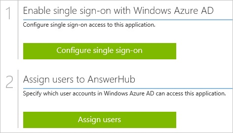
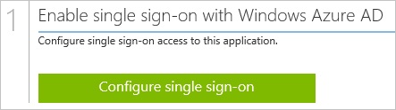
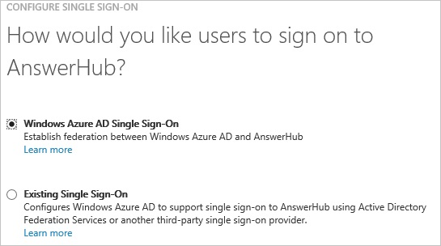
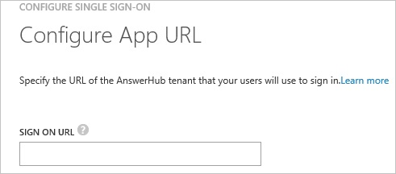
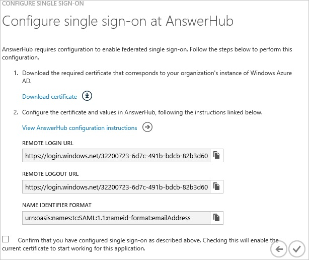
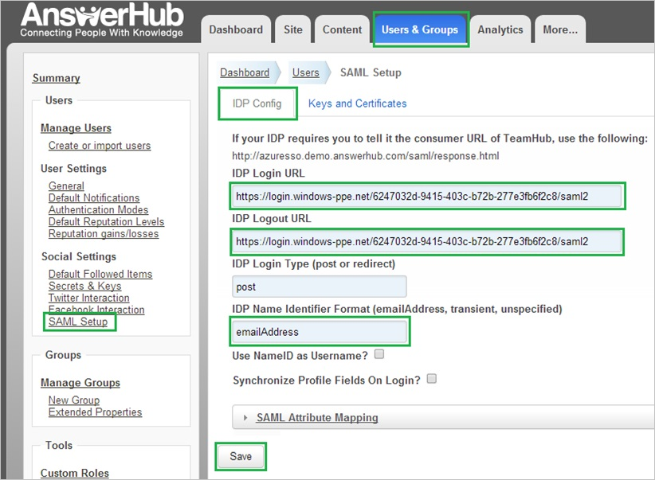
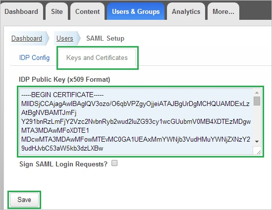
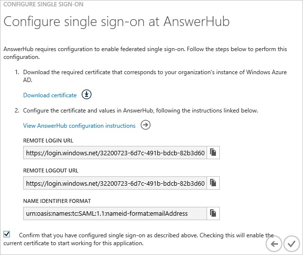
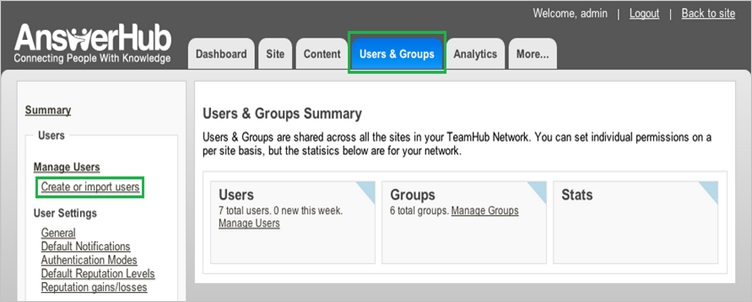
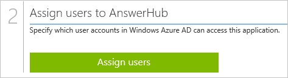

<properties 
    pageTitle="Tutorial: Azure Active Directory integration with AnswerHub | Microsoft Azure" 
    description="Learn how to use AnswerHub with Azure Active Directory to enable single sign-on, automated provisioning, and more!" 
    services="active-directory" 
    authors="jeevansd"  
    documentationCenter="na" 
    manager="femila"/>
<tags 
    ms.service="active-directory" 
    ms.devlang="na" 
    ms.topic="article" 
    ms.tgt_pltfrm="na" 
    ms.workload="identity" 
    ms.date="07/11/2016" 
    ms.author="jeedes" />

#Tutorial: Azure Active Directory integration with AnswerHub

The objective of this tutorial is to show the integration of Azure and AnswerHub.  
The scenario outlined in this tutorial assumes that you already have the following items:

-   A valid Azure subscription
-   An AnswerHub single sign-on enabled subscription

After completing this tutorial, the Azure AD users you have assigned to AnswerHub will be able to single sign into the application at your AnswerHub company site (service provider initiated sign on), or using the [Introduction to the Access Panel](active-directory-saas-access-panel-introduction.md).

The scenario outlined in this tutorial consists of the following building blocks:

1.  Enabling the application integration for AnswerHub
2.  Configuring single sign-on
3.  Configuring user provisioning
4.  Assigning users

##Enabling the application integration for AnswerHub

The objective of this section is to outline how to enable the application integration for AnswerHub.

###To enable the application integration for AnswerHub, perform the following steps:

1.  In the Azure classic portal, on the left navigation pane, click **Active Directory**.

    

2.  From the **Directory** list, select the directory for which you want to enable directory integration.

3.  To open the applications view, in the directory view, click **Applications** in the top menu.

    

4.  Click **Add** at the bottom of the page.

    

5.  On the **What do you want to do** dialog, click **Add an application from the gallery**.

    

6.  In the **search box**, type **AnswerHub**.

    

7.  In the results pane, select **AnswerHub**, and then click **Complete** to add the application.

    
##Configuring single sign-on

The objective of this section is to outline how to enable users to authenticate to AnswerHub with their account in Azure AD using federation based on the SAML protocol.  
As part of this procedure, you are required to create a base-64 encoded certificate file.  
If you are not familiar with this procedure, see [How to convert a binary certificate into a text file](http://youtu.be/PlgrzUZ-Y1o)

###To configure single sign-on, perform the following steps:

1.  In the Azure classic portal, on the **AnswerHub** application integration page, click **Configure single sign-on** to open the **Configure Single Sign On ** dialog.

    

2.  On the **How would you like users to sign on to AnswerHub** page, select **Microsoft Azure AD Single Sign-On**, and then click **Next**.

    

3.  On the **Configure App URL** page, in the **AnswerHub Sign In URL** textbox, type your URL using the following pattern "*https://company.answerhub.com*", and then click **Next**.

    

4.  On the **Configure single sign-on at AnswerHub** page, to download your certificate, click **Download certificate**, and then save the certificate file locally on your computer.

    

5.  In a different web browser window, log into your AnswerHub company site as an administrator.

6.  Go to **Administration**.

7.  Click the **User and Group** tab.

8.  In the navigation pane on the left side, in the **Social Settings** section, click **SAML Setup**.

9.  Click **IDP Config** tab.

10. On the **IDP Config** tab, perform the following steps:

    

    1.  In the Azure classic portal, on the **Configure single sign-on at AnswerHub** dialog page, copy the **Remote Login URL** value, and then paste it into the **IDP Login URL** textbox.
    2.  In the Azure classic portal, on the **Configure single sign-on at AnswerHub** dialog page, copy the **Remote Logout URL** value, and then paste it into the **IDP Logout URL** textbox.
    3.  In the Azure classic portal, on the **Configure single sign-on at AnswerHub** dialog page, copy the **Name Identifier Format** value, and then paste it into the **IDP Name Identifier Format** textbox.
    4.  Click **Keys and Certificates**.

11. On the Keys and Certificates tab, perform the following steps:

    

    1.  Create a **base-64 encoded** file from your downloaded certificate.  

		>[AZURE.TIP] For more details, see [How to convert a binary certificate into a text file](http://youtu.be/PlgrzUZ-Y1o)

    2.  Open your base-64 encoded certificate in notepad, copy the content of it into your clipboard, and then paste it to the **IDP Public Key (x509 Format)** textbox.
    3.  Click **Save**.

12. On the **IDP Config** tab, click **Save**.

13. On the Azure classic portal, select the single sign-on configuration confirmation, and then click **Complete** to close the **Configure Single Sign On** dialog.

    
##Configuring user provisioning

In order to enable Azure AD users to log into AnswerHub, they must be provisioned into AnswerHub.  
In the case of AnswerHub, provisioning is a manual task.

###To configure user provisioning, perform the following steps:

1.  Log in to your **AnswerHub** company site as administrator.

2.  Go to **Administration**.

3.  Click the **Users & Groups** tab.

4.  In the navigation pane on the left side, in the **Manage Users** section, click **Create or import users**.

    

5.  Type the **Email address**, **Username** and **Password** of a valid Azure Active Directory account you want to provision into the related textboxes, and then click **Save**.

>[AZURE.NOTE] You can use any other AnswerHub user account creation tools or APIs provided by AnswerHub to provision AAD user accounts.

##Assigning users

To test your configuration, you need to grant the Azure AD users you want to allow using your application access to it by assigning them.

###To assign users to AnswerHub, perform the following steps:

1.  In the Azure classic portal, create a test account.

2.  On the **AnswerHub **application integration page, click **Assign users**.

    

3.  Select your test user, click **Assign**, and then click **Yes** to confirm your assignment.

    

If you want to test your single sign-on settings, open the Access Panel. For more details about the Access Panel, see [Introduction to the Access Panel](active-directory-saas-access-panel-introduction.md).
