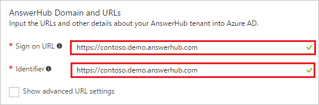
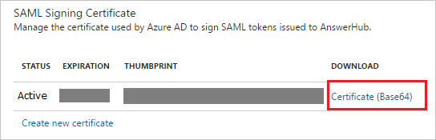

# Tutorial: Azure Active Directory integration with AnswerHub

In this tutorial, you learn how to integrate AnswerHub with Azure Active Directory (Azure AD).

Integrating AnswerHub with Azure AD provides you with the following benefits:

- You can control in Azure AD who has access to AnswerHub
- You can enable your users to automatically get signed-on to AnswerHub (Single Sign-On) with their Azure AD accounts
- You can manage your accounts in one central location - the Azure portal

If you want to know more details about SaaS app integration with Azure AD, see [what is application access and single sign-on with Azure Active Directory](active-directory-appssoaccess-whatis.md).

## Prerequisites

To configure Azure AD integration with AnswerHub, you need the following items:

- An Azure AD subscription
- An AnswerHub single sign-on enabled subscription

> [!NOTE]
> To test the steps in this tutorial, we do not recommend using a production environment.

To test the steps in this tutorial, you should follow these recommendations:

- Do not use your production environment, unless it is necessary.
- If you don't have an Azure AD trial environment, you can get a one-month trial [here](https://azure.microsoft.com/pricing/free-trial/).

## Scenario description
In this tutorial, you test Azure AD single sign-on in a test environment. 
The scenario outlined in this tutorial consists of two main building blocks:

1. Adding AnswerHub from the gallery
2. Configuring and testing Azure AD single sign-on

## Adding AnswerHub from the gallery
To configure the integration of AnswerHub into Azure AD, you need to add AnswerHub from the gallery to your list of managed SaaS apps.

**To add AnswerHub from the gallery, perform the following steps:**

1. In the **[Azure portal](https://portal.azure.com)**, on the left navigation panel, click **Azure Active Directory** icon. 

	![Active Directory][1]

2. Navigate to **Enterprise applications**. Then go to **All applications**.

	![Applications][2]
	
3. To add new application, click **New application** button on the top of dialog.

	![Applications][3]

4. In the search box, type **AnswerHub**.

	

5. In the results panel, select **AnswerHub**, and then click **Add** button to add the application.

	

##  Configuring and testing Azure AD single sign-on
In this section, you configure and test Azure AD single sign-on with AnswerHub based on a test user called "Britta Simon".

For single sign-on to work, Azure AD needs to know what the counterpart user in AnswerHub is to a user in Azure AD. In other words, a link relationship between an Azure AD user and the related user in AnswerHub needs to be established.

In AnswerHub, assign the value of the **user name** in Azure AD as the value of the **Username** to establish the link relationship.

To configure and test Azure AD single sign-on with AnswerHub, you need to complete the following building blocks:

1. **[Configuring Azure AD Single Sign-On](#configuring-azure-ad-single-sign-on)** - to enable your users to use this feature.
2. **[Creating an Azure AD test user](#creating-an-azure-ad-test-user)** - to test Azure AD single sign-on with Britta Simon.
3. **[Creating an AnswerHub test user](#creating-an-answerhub-test-user)** - to have a counterpart of Britta Simon in AnswerHub that is linked to the Azure AD representation of user.
4. **[Assigning the Azure AD test user](#assigning-the-azure-ad-test-user)** - to enable Britta Simon to use Azure AD single sign-on.
5. **[Testing Single Sign-On](#testing-single-sign-on)** - to verify whether the configuration works.

### Configuring Azure AD single sign-on

In this section, you enable Azure AD single sign-on in the Azure portal and configure single sign-on in your AnswerHub application.

**To configure Azure AD single sign-on with AnswerHub, perform the following steps:**

1. In the Azure portal, on the **AnswerHub** application integration page, click **Single sign-on**.

	![Configure Single Sign-On][4]

2. On the **Single sign-on** dialog, select **Mode** as	**SAML-based Sign-on** to enable single sign-on.
 
	

3. On the **AnswerHub Domain and URLs** section, perform the following steps:

	

    a. In the **Sign-on URL** textbox, type a URL using the following pattern: `https://<company>.answerhub.com`

	b. In the **Identifier** textbox, type a URL using the following pattern: `https://<company>.answerhub.com`

	> [!NOTE] 
	> These values are not real. Update these values with the actual Sign-On URL and Identifier. Contact [AnswerHub Client support team](mailto:success@answerhub.com) to get these values. 
 
4. On the **SAML Signing Certificate** section, click **Certificate(Base64)** and then save the certificate file on your computer.

	 

5. Click **Save** button.

	

6. On the **AnswerHub Configuration** section, click **Configure AnswerHub** to open **Configure sign-on** window. Copy the **Sign-Out URL, and SAML Single Sign-On Service URL** from the **Quick Reference section.**

	 

7. In a different web browser window, log into your AnswerHub company site as an administrator.
   
    >[!NOTE]
    >If you need help configuring AnswerHub, contact [AnswerHub's support team](mailto:success@answerhub.com.).
   
8. Go to **Administration**.

9. Click the **User and Group** tab.

10. In the navigation pane on the left side, in the **Social Settings** section, click **SAML Setup**.

11. Click **IDP Config** tab.

12. On the **IDP Config** tab, perform the following steps:

       
  
     a. In **IDP Login URL** textbox, paste **SAML Single Sign-On Service URL** which you have copied from Azure portal.
  
     b. In **IDP Logout URL** textbox, paste **Sign-Out URL** value which you have copied from Azure portal.
	 
     c. In **IDP Name Identifier Format** textbox, enter the user Identifier value same as selected in Azure portal in **User Attributes** section.
  
     d. Click **Keys and Certificates**.

13. On the Keys and Certificates tab, perform the following steps:
    
       
 
     a. Open your base-64 encoded certificate which you have downloaded from Azure portal in notepad, copy the content of it into your clipboard, and then paste it to the **IDP Public Key (x509 Format)** textbox.
  
     b. Click **Save**.

14. On the **IDP Config** tab, click **Save**.

> [!TIP]
> You can now read a concise version of these instructions inside the [Azure portal](https://portal.azure.com), while you are setting up the app!  After adding this app from the **Active Directory > Enterprise Applications** section, simply click the **Single Sign-On** tab and access the embedded documentation through the **Configuration** section at the bottom. You can read more about the embedded documentation feature here: [Azure AD embedded documentation]( https://go.microsoft.com/fwlink/?linkid=845985)

### Creating an Azure AD test user
The objective of this section is to create a test user in the Azure portal called Britta Simon.

![Create Azure AD User][100]

**To create a test user in Azure AD, perform the following steps:**

1. In the **Azure portal**, on the left navigation pane, click **Azure Active Directory** icon.

	 

2. To display the list of users, go to **Users and groups** and click **All users**.
	
	 

3. To open the **User** dialog, click **Add** on the top of the dialog.
 
	 

4. On the **User** dialog page, perform the following steps:
 
	 

    a. In the **Name** textbox, type **BrittaSimon**.

    b. In the **User name** textbox, type the **email address** of BrittaSimon.

	c. Select **Show Password** and write down the value of the **Password**.

    d. Click **Create**.
 
### Creating an AnswerHub test user

To enable Azure AD users to log in to AnswerHub, they must be provisioned into AnswerHub.  
In the case of AnswerHub, provisioning is a manual task.

**To provision a user account, perform the following steps:**

1. Log in to your **AnswerHub** company site as administrator.

2. Go to **Administration**.

3. Click the **Users & Groups** tab.

4. In the navigation pane on the left side, in the **Manage Users** section, click **Create or import users**.
   
   

5. Type the **Email address**, **Username** and **Password** of a valid Azure Active Directory account you want to provision into the related textboxes, and then click **Save**.

>[!NOTE]
>You can use any other AnswerHub user account creation tools or APIs provided by AnswerHub to provision AAD user accounts.

### Assigning the Azure AD test user

In this section, you enable Britta Simon to use Azure single sign-on by granting access to AnswerHub.

![Assign User][200] 

**To assign Britta Simon to AnswerHub, perform the following steps:**

1. In the Azure portal, open the applications view, and then navigate to the directory view and go to **Enterprise applications** then click **All applications**.

	![Assign User][201] 

2. In the applications list, select **AnswerHub**.

	 

3. In the menu on the left, click **Users and groups**.

	![Assign User][202] 

4. Click **Add** button. Then select **Users and groups** on **Add Assignment** dialog.

	![Assign User][203]

5. On **Users and groups** dialog, select **Britta Simon** in the Users list.

6. Click **Select** button on **Users and groups** dialog.

7. Click **Assign** button on **Add Assignment** dialog.
	
### Testing single sign-on

In this section, you test your Azure AD single sign-on configuration using the Access Panel.

When you click the AnswerHub tile in the Access Panel, you should get automatically signed-on to your AnswerHub application.
For more information about the Access Panel, see [Introduction to the Access Panel](active-directory-saas-access-panel-introduction.md).

## Additional resources

* [List of Tutorials on How to Integrate SaaS Apps with Azure Active Directory](active-directory-saas-tutorial-list.md)
* [What is application access and single sign-on with Azure Active Directory?](active-directory-appssoaccess-whatis.md)

<!--Image references-->

[1]: ./media/active-directory-saas-answerhub-tutorial/tutorial_general_01.png
[2]: ./media/active-directory-saas-answerhub-tutorial/tutorial_general_02.png
[3]: ./media/active-directory-saas-answerhub-tutorial/tutorial_general_03.png
[4]: ./media/active-directory-saas-answerhub-tutorial/tutorial_general_04.png

[100]: ./media/active-directory-saas-answerhub-tutorial/tutorial_general_100.png

[200]: ./media/active-directory-saas-answerhub-tutorial/tutorial_general_200.png
[201]: ./media/active-directory-saas-answerhub-tutorial/tutorial_general_201.png
[202]: ./media/active-directory-saas-answerhub-tutorial/tutorial_general_202.png
[203]: ./media/active-directory-saas-answerhub-tutorial/tutorial_general_203.png

