<properties 
    pageTitle="Tutorial: Azure Active Directory integration with AppDynamics | Microsoft Azure" 
    description="Learn how to use AppDynamics with Azure Active Directory to enable single sign-on, automated provisioning, and more!" 
    services="active-directory" 
    authors="jeevansd"  
    documentationCenter="na" 
    manager="femila"/>
<tags 
    ms.service="active-directory" 
    ms.devlang="na" 
    ms.topic="article" 
    ms.tgt_pltfrm="na" 
    ms.workload="identity" 
    ms.date="07/11/2016" 
    ms.author="jeedes" />

#Tutorial: Azure Active Directory integration with AppDynamics

The objective of this tutorial is to show the integration of Azure and AppDynamics. The scenario outlined in this tutorial assumes that you already have the following items:

-   A valid Azure subscription
-   An AppDynamics single sign-on enabled subscription

After completing this tutorial, the Azure AD users you have assigned to AppDynamics will be able to single sign into the application at your AppDynamics company site (service provider initiated sign on), or using the [Introduction to the Access Panel](active-directory-saas-access-panel-introduction.md).

The scenario outlined in this tutorial consists of the following building blocks:

1.  Enabling the application integration for AppDynamics
2.  Configuring single sign-on
3.  Configuring user provisioning
4.  Assigning users

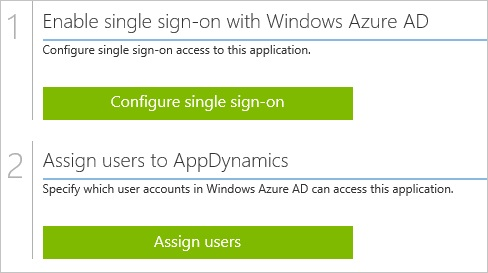
##Enabling the application integration for AppDynamics

The objective of this section is to outline how to enable the application integration for AppDynamics.

###To enable the application integration for AppDynamics, perform the following steps:

1.  In the Azure classic portal, on the left navigation pane, click **Active Directory**.

    

2.  From the **Directory** list, select the directory for which you want to enable directory integration.

3.  To open the applications view, in the directory view, click **Applications** in the top menu.

    

4.  Click **Add** at the bottom of the page.

    

5.  On the **What do you want to do** dialog, click **Add an application from the gallery**.

    

6.  In the **search box**, type **AppDynamics**.

    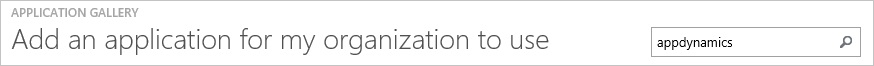

7.  In the results pane, select **AppDynamics**, and then click **Complete** to add the application.

    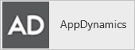
##Configuring single sign-on

The objective of this section is to outline how to enable users to authenticate to AppDynamics with their account in Azure AD using federation based on the SAML protocol.  
As part of this procedure, you are required to create a base-64 encoded certificate file.  
If you are not familiar with this procedure, see [How to convert a binary certificate into a text file](http://youtu.be/PlgrzUZ-Y1o).

###To configure single sign-on, perform the following steps:

1.  In the Azure classic portal, on the **AppDynamics** application integration page, click **Configure single sign-on** to open the **Configure Single Sign On ** dialog.

    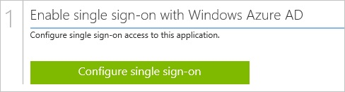

2.  On the **How would you like users to sign on to AppDynamics** page, select **Microsoft Azure AD Single Sign-On**, and then click **Next**.

    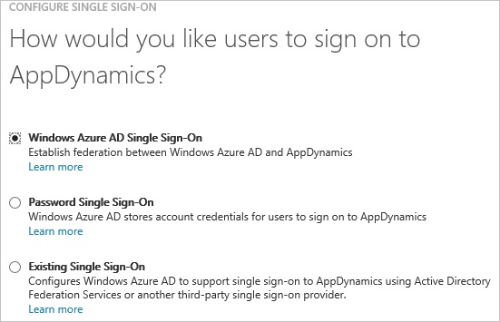

3.  On the **Configure App URL** page, in the **AppDynamics Sign On URL** textbox, type your URL used by your users to sign-on to AppDynamics ("*https://companyname.saas.appdynamics.com*"), and then click **Next**.

    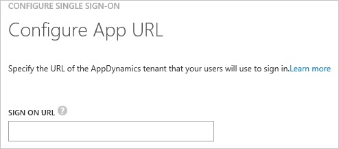

4.  On the **Configure single sign-on at AppDynamics** page, to download your certificate, click **Download certificate**, and then save the certificate file on your computer.

    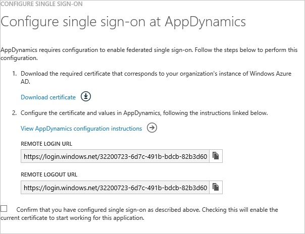

5.  In a different web browser window, log into your AppDynamics company site as an administrator.

6.  In the toolbar on the top, click **Settings**, and then click **Administration**.

    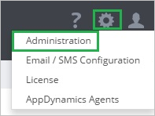

7.  Click the **Authentication Provider** tab.

    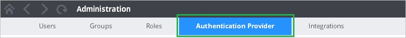

8.  In the **Authentication Provider** section, perform the following steps:

    

    1.  As **Authentication Provider**, select **SAML**.
    2.  In the Azure classic portal, on the **Configure single sign-on at AppDynamics** dialog page, copy the **Remote Login URL** value, and then paste it into the **Login URL** textbox.
    3.  In the Azure classic portal, on the **Configure single sign-on at AppDynamics** dialog page, copy the **Remote Logout URL** value, and then paste it into the **Logout URL** textbox.
    4.  Create a **base-64 encoded** file from your downloaded certificate.  

        >[AZURE.TIP] For more details, see [How to convert a binary certificate into a text file](http://youtu.be/PlgrzUZ-Y1o)

    5.  Open your base-64 encoded certificate in notepad, copy the content of it into your clipboard, and then paste it to the **Certificate** textbox
    6.  Click **Save**.
        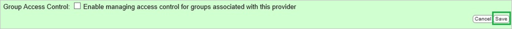

9.  On the Azure classic portal, select the single sign-on configuration confirmation, and then click **Complete** to close the **Configure Single Sign On** dialog.

    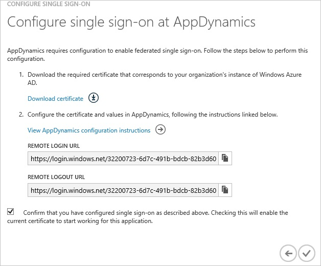
##Configuring user provisioning

In order to enable Azure AD users to log into AppDynamics, they must be provisioned into AppDynamics.  
In the case of AppDynamics, provisioning is a manual task.

###To configure user provisioning, perform the following steps:

1.  Log into your AppDynamics company site as an administrator.

2.  Go to **Users**, and then click **+** to open the **Create User** dialog.

    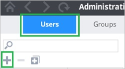

3.  In the **Create User** section, perform the following steps:

    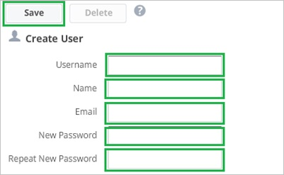

    1.  Type the **Username**, **Name**, **Email**, **New Password**, **Repeat New Password** of a valid AAD account you want to provision into the related textboxes.
    2.  Click **Save**.

>[AZURE.NOTE] You can use any other AppDynamics user account creation tools or APIs provided by AppDynamics to provision Azure AD user accounts.

##Assigning users

To test your configuration, you need to grant the Azure AD users you want to allow using your application access to it by assigning them.

###To assign users to AppDynamics, perform the following steps:

1.  In the Azure classic portal, create a test account.

2.  On the **AppDynamics **application integration page, click **Assign users**.

    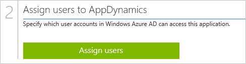

3.  Select your test user, click **Assign**, and then click **Yes** to confirm your assignment.

    

If you want to test your single sign-on settings, open the Access Panel. For more details about the Access Panel, see [Introduction to the Access Panel](active-directory-saas-access-panel-introduction.md).
