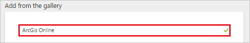
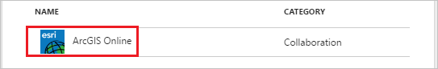
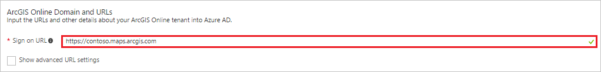
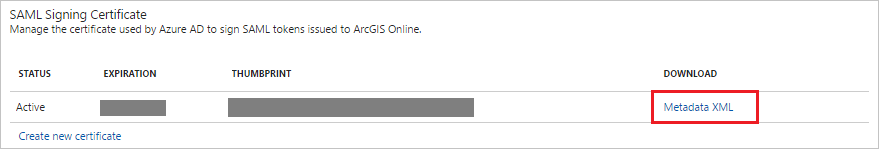
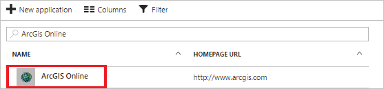

# Tutorial: Azure Active Directory integration with ArcGIS Online

In this tutorial, you learn how to integrate ArcGIS Online with Azure Active Directory (Azure AD).

Integrating ArcGIS Online with Azure AD provides you with the following benefits:

- You can control in Azure AD who has access to ArcGIS Online
- You can enable your users to automatically get signed-on to ArcGIS Online (Single Sign-On) with their Azure AD accounts
- You can manage your accounts in one central location - the Azure portal

If you want to know more details about SaaS app integration with Azure AD, see [what is application access and single sign-on with Azure Active Directory](active-directory-appssoaccess-whatis.md).

<!--## Overview

To enable single sign-on with ArcGIS Online, it must be configured to use Azure Active Directory as an identity provider. This guide provides information and tips on how to perform this configuration in ArcGIS Online.

>[!Note]: 
>This embedded guide is brand new in the new Azure portal, and we’d love to hear your thoughts. Use the Feedback ? button at the top of the portal to provide feedback. The older guide for using the [Azure classic portal](https://manage.windowsazure.com) to configure this application can be found [here](https://github.com/Azure/AzureAD-App-Docs/blob/master/articles/en-us/_/sso_configure.md).-->

## Prerequisites

To configure Azure AD integration with ArcGIS Online, you need the following items:

- An Azure AD subscription
- A ArcGIS Online single-sign on enabled subscription

> [!NOTE]
> To test the steps in this tutorial, we do not recommend using a production environment.

To test the steps in this tutorial, you should follow these recommendations:

- Do not use your production environment, unless it is necessary.
- If you don't have an Azure AD trial environment, you can get a one-month trial [here](https://azure.microsoft.com/pricing/free-trial/).

## Scenario description
In this tutorial, you test Azure AD single sign-on in a test environment. 
The scenario outlined in this tutorial consists of two main building blocks:

1. Adding ArcGIS Online from the gallery
2. Configuring and testing Azure AD single sign-on

## Adding ArcGIS Online from the gallery
To configure the integration of ArcGIS Online into Azure AD, you need to add ArcGIS Online from the gallery to your list of managed SaaS apps.

**To add ArcGIS Online from the gallery, perform the following steps:**

1. In the **[Azure portal](https://portal.azure.com)**, on the left navigation panel, click **Azure Active Directory** icon. 

	![Active Directory][1]

2. Navigate to **Enterprise applications**. Then go to **All applications**.

	![Applications][2]
	
3. Click **New application** button on the top of the dialog to add new application.

	![Applications][3]

4. In the search box, type **ArcGIS Online**.

	

5. In the results panel, select **ArcGIS Online**, and then click **Add** button to add the application.

	

##  Configuring and testing Azure AD single sign-on
In this section, you configure and test Azure AD single sign-on with ArcGIS Online based on a test user called "Britta Simon."

For single sign-on to work, Azure AD needs to know what the counterpart user in ArcGIS Online is to a user in Azure AD. In other words, a link relationship between an Azure AD user and the related user in ArcGIS Online needs to be established.

This link relationship is established by assigning the value of the **user name** in Azure AD as the value of the **Username** in ArcGIS Online.

To configure and test Azure AD single sign-on with ArcGIS Online, you need to complete the following building blocks:

1. **[Configuring Azure AD Single Sign-On](#configuring-azure-ad-single-sign-on)** - to enable your users to use this feature.
2. **[Creating an Azure AD test user](#creating-an-azure-ad-test-user)** - to test Azure AD single sign-on with Britta Simon.
3. **[Creating an ArcGIS Online test user](#creating-an-arcgis-online-test-user)** - to have a counterpart of Britta Simon in ArcGIS Online that is linked to the Azure AD representation of user.
4. **[Assigning the Azure AD test user](#assigning-the-azure-ad-test-user)** - to enable Britta Simon to use Azure AD single sign-on.
5. **[Testing Single Sign-On](#testing-single-sign-on)** - to verify whether the configuration works.

### Configuring Azure AD single sign-on

In this section, you enable Azure AD single sign-on in the Azure portal and configure single sign-on in your ArcGIS Online application.

**To configure Azure AD single sign-on with ArcGIS Online, perform the following steps:**

1. In the Azure portal, on the **ArcGIS Online** application integration page, click **Single sign-on**.

	![Configure Single Sign-On][4]

2. On the **Single sign-on** dialog, select **Mode** as	**SAML-based Sign-on** to enable single sign-on.
 
	

3. On the **ArcGIS Online Domain and URLs** section, perform the following step:

	

    In the **Sign-on URL** textbox, type the value using the following pattern: `https://<company>.maps.arcgis.com`

	> [!NOTE] 
	> This value is not the real. Update this value with the actual Sign-On URL. Contact [ArcGIS Online Client support team](http://support.esri.com/) to get this value. 

4. On the **SAML Signing Certificate** section, click **Metadata XML** and then save the XML file on your computer.

	 

5. Click **Save** button.

	

6. In a different web browser window, log into your ArcGIS company site as an administrator.

7. Click **EDIT SETTINGS**.

    

8. Click **Security**.

    

9. Under **Enterprise Logins**, click **SET IDENTITY PROVIDER**.

    

10. On the **Set Identity Provider** configuration page, perform the following steps:
   
    
   
    a. In the **Name** textbox, type your organization’s name.

    b. For **Metadata for the Enterprise Identity Provider will be supplied using**, select **A File**.

    c. To upload your downloaded metadata file, click **Choose file**.

    d. Click **SET IDENTITY PROVIDER**.

> [!TIP]
> You can now read a concise version of these instructions inside the [Azure portal](https://portal.azure.com), while you are setting up the app!  After adding this app from the **Active Directory > Enterprise Applications** section, simply click the **Single Sign-On** tab and access the embedded documentation through the **Configuration** section at the bottom. You can read more about the embedded documentation feature here: [Azure AD embedded documentation]( https://go.microsoft.com/fwlink/?linkid=845985)

### Creating an Azure AD test user
The objective of this section is to create a test user in the Azure portal called Britta Simon.

![Create Azure AD User][100]

**To create a test user in Azure AD, perform the following steps:**

1. In the **Azure portal**, on the left navigation pane, click **Azure Active Directory** icon.

	 

2. Go to **Users and groups** and click **All users** to display the list of users.
	
	 

3. At the top of the dialog click **Add** to open the **User** dialog.
 
	 

4. On the **User** dialog page, perform the following steps:
 
	 

    a. In the **Name** textbox, type **BrittaSimon**.

    b. In the **User name** textbox, type the **email address** of Britta Simon.

	c. Select **Show Password** and write down the value of the **Password**.

    d. Click **Create**.
 
### Creating an ArcGIS Online test user

In order to enable Azure AD users to log into ArcGIS Online, they must be provisioned into ArcGIS Online.  
In the case of ArcGIS Online, provisioning is a manual task.

**To provision a user account, perform the following steps:**

1. Log in to your **ArcGIS** tenant.

2. Click **INVITE MEMBERS**.
   
    

3. Select **Add members automatically without sending an email**, and then click **NEXT**.
   
    

4. On the **Members** dialog page, perform the following steps:
   
     
    
	 a. Enter the **Email**, **First Name**, and **Last Name** of a valid AAD account you want to provision.
  
     b. Click **ADD AND REVIEW**.
5. Review the data you have entered, and then click **ADD MEMBERS**.
   
    
		
	> [!NOTE]
    > The Azure Active Directory account holder will receive an email and follow a link to confirm their account before it becomes active.

### Assigning the Azure AD test user

In this section, you enable Britta Simon to use Azure single sign-on by granting access to ArcGIS Online.

![Assign User][200] 

**To assign Britta Simon to ArcGIS Online, perform the following steps:**

1. In the Azure portal, open the applications view, and then navigate to the directory view and go to **Enterprise applications** then click **All applications**.

	![Assign User][201] 

2. In the applications list, select **ArcGIS Online**.

	 

3. In the menu on the left, click **Users and groups**.

	![Assign User][202] 

4. Click **Add** button. Then select **Users and groups** on **Add Assignment** dialog.

	![Assign User][203]

5. On **Users and groups** dialog, select **Britta Simon** in the Users list.

6. Click **Select** button on **Users and groups** dialog.

7. Click **Assign** button on **Add Assignment** dialog.
	
### Testing single sign-on

In this section, you test your Azure AD single sign-on configuration using the Access Panel.

When you click the ArcGIS Online tile in the Access Panel, you should get automatically signed-on to your ArcGIS Online application.
For more information about the Access Panel, see [Introduction to the Access Panel](active-directory-saas-access-panel-introduction.md).

## Additional resources

* [List of Tutorials on How to Integrate SaaS Apps with Azure Active Directory](active-directory-saas-tutorial-list.md)
* [What is application access and single sign-on with Azure Active Directory?](active-directory-appssoaccess-whatis.md)

<!--Image references-->

[1]: ./media/active-directory-saas-arcgis-tutorial/tutorial_general_01.png
[2]: ./media/active-directory-saas-arcgis-tutorial/tutorial_general_02.png
[3]: ./media/active-directory-saas-arcgis-tutorial/tutorial_general_03.png
[4]: ./media/active-directory-saas-arcgis-tutorial/tutorial_general_04.png

[100]: ./media/active-directory-saas-arcgis-tutorial/tutorial_general_100.png

[200]: ./media/active-directory-saas-arcgis-tutorial/tutorial_general_200.png
[201]: ./media/active-directory-saas-arcgis-tutorial/tutorial_general_201.png
[202]: ./media/active-directory-saas-arcgis-tutorial/tutorial_general_202.png
[203]: ./media/active-directory-saas-arcgis-tutorial/tutorial_general_203.png

