<properties 
    pageTitle="Tutorial: Azure Active Directory Integration with ArcGIS | Microsoft Azure" 
    description="Learn how to use ArcGIS with Azure Active Directory to enable single sign-on, automated provisioning, and more!" 
    services="active-directory" 
    authors="jeevansd"  
    documentationCenter="na" 
    manager="femila"/>
<tags 
    ms.service="active-directory" 
    ms.devlang="na" 
    ms.topic="article" 
    ms.tgt_pltfrm="na" 
    ms.workload="identity" 
    ms.date="07/11/2016" 
    ms.author="jeedes" />

#Tutorial: Azure Active Directory Integration with ArcGIS

The objective of this tutorial is to show the integration of Azure and ArcGIS. The scenario outlined in this tutorial assumes that you already have the following items:

-   A valid Azure subscription
-   An ArcGIS single sign-on enabled subscription

After completing this tutorial, the Azure AD users you have assigned to ArcGIS will be able to single sign into the application at your ArcGIS company site (service provider initiated sign on), or using the [Introduction to the Access Panel](active-directory-saas-access-panel-introduction.md).

The scenario outlined in this tutorial consists of the following building blocks:

1.  Enabling the application integration for ArcGIS
2.  Configuring single sign-on
3.  Configuring user provisioning
4.  Assigning users

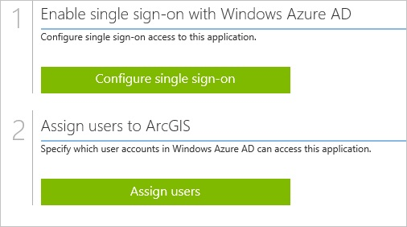
##Enabling the application integration for ArcGIS

The objective of this section is to outline how to enable the application integration for ArcGIS.

###To enable the application integration for ArcGIS, perform the following steps:

1.  In the Azure classic portal, on the left navigation pane, click **Active Directory**.

    

2.  From the **Directory** list, select the directory for which you want to enable directory integration.

3.  To open the applications view, in the directory view, click **Applications** in the top menu.

    

4.  Click **Add** at the bottom of the page.

    

5.  On the **What do you want to do** dialog, click **Add an application from the gallery**.

    

6.  In the **search box**, type **ArcGIS**.

    

7.  In the results pane, select **ArcGIS**, and then click **Complete** to add the application.

    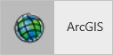
##Configuring single sign-on

The objective of this section is to outline how to enable users to authenticate to ArcGIS with their account in Azure AD using federation based on the SAML protocol.

###To configure single sign-on, perform the following steps:

1.  In the Azure classic portal, on the **ArcGIS** application integration page, click **Configure single sign-on** to open the **Configure Single Sign On ** dialog.

    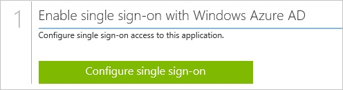

2.  On the **How would you like users to sign on to ArcGIS** page, select **Microsoft Azure AD Single Sign-On**, and then click **Next**.

    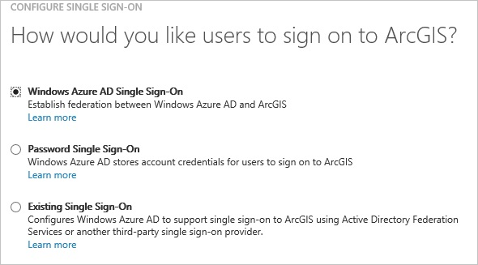

3.  On the **Configure App URL** page, in the **ArcGIS Sign In URL** textbox, type the URL used by your users to sign in using the following pattern "*https://company.maps.arcgis.com*", and then click **Next**.

    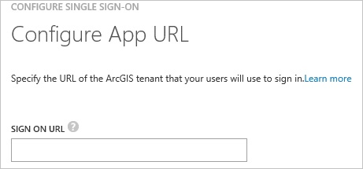

4.  On the **Configure single sign-on at ArcGIS** page, click **Download metadata**, and then save the metadata file locally on your computer.

    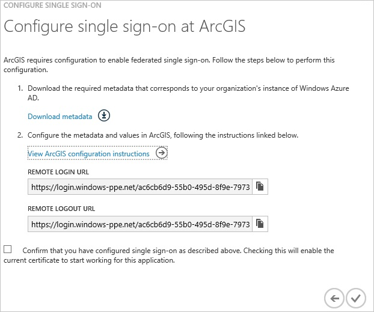

5.  In a different web browser window, log into your ArcGIS company site as an administrator.

6.  Click **Edit Settings**.

    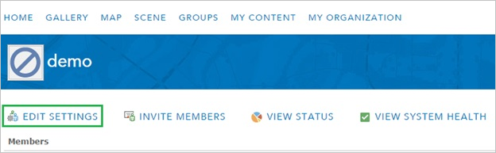

7.  Click **Security**.

    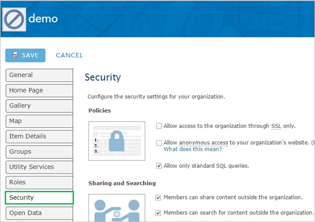

8.  Under **Enterprise Logins**, click **Set Identity Provider**.

    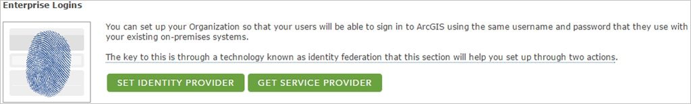

9.  On the **Set Identity Provider** configuration page, perform the following steps:

    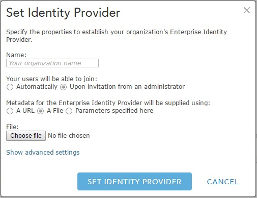

    1.  In the Name textbox, type your organization’s name.
    2.  For **Metadata for the Enterprise Identity Provider will be supplied using**, select **A File**.
    3.  To upload your downloaded metadata file, click **Choose file**.
    4.  Click **Set Identity Provider**.

10. On the Azure classic portal, select the single sign-on configuration confirmation, and then click **Complete** to close the **Configure Single Sign On** dialog.

    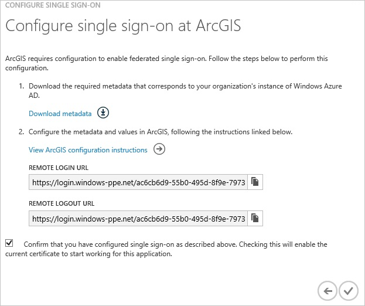
##Configuring user provisioning

In order to enable Azure AD users to log into ArcGIS, they must be provisioned into ArcGIS.  
In the case of ArcGIS, provisioning is a manual task.

###To configure user provisioning, perform the following steps:

1.  Log in to your **ArcGIS** tenant.

2.  Click **Invite Members**.

    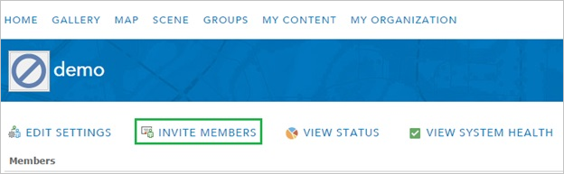

3.  Select **Add members automatically without sending an email**, and then click **Next**.

    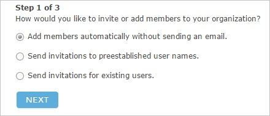

4.  On the **Members** dialog page, perform the following steps:

    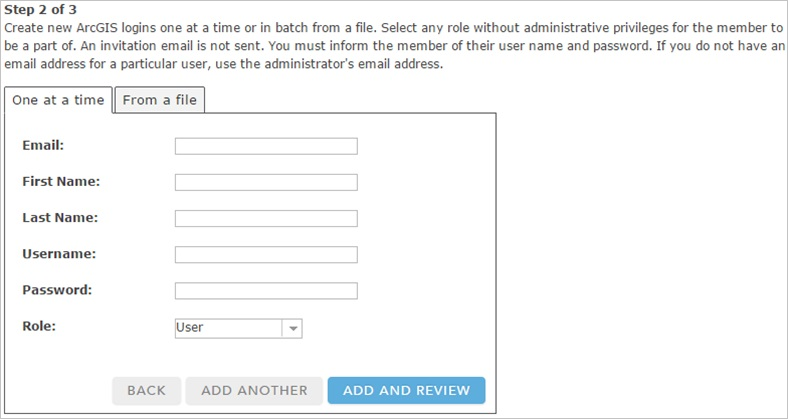

    1.  Enter the **First Name**, **Last Name** and **Email** of a valid AAD account you want to provision.
    2.  Click **Add And Review**.

5.  Review the data you have entered, and then click **Add Members**.

    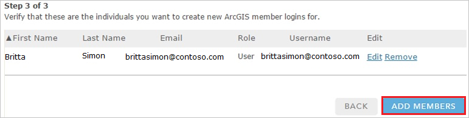

>[AZURE.NOTE] You can use any other ArcGIS user account creation tools or APIs provided by ArcGIS to provision AAD user accounts.

##Assigning users

To test your configuration, you need to grant the Azure AD users you want to allow using your application access to it by assigning them.

###To assign users to ArcGIS, perform the following steps:

1.  In the Azure classic portal, create a test account.

2.  On the **ArcGIS **application integration page, click **Assign users**.

    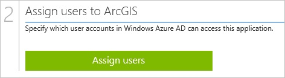

3.  Select your test user, click **Assign**, and then click **Yes** to confirm your assignment.

    

If you want to test your single sign-on settings, open the Access Panel. For more details about the Access Panel, see [Introduction to the Access Panel](active-directory-saas-access-panel-introduction.md).
