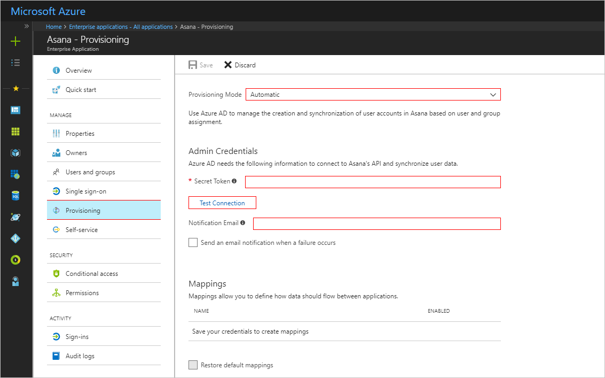

---

title: 'Tutorial: Configure Asana for automatic user provisioning with Azure Active Directory | Microsoft Docs'
description: Learn how to configure Azure Active Directory to automatically provision and de-provision user accounts to Asana.
services: active-directory
documentationcenter: ''
author: asmalser-msft
writer: asmalser-msft
manager: sakula

ms.assetid: 0b38ee73-168b-42cb-bd8b-9c5e5126d648
ms.service: active-directory
ms.workload: identity
ms.tgt_pltfrm: na
ms.devlang: na
ms.topic: article
ms.date: 01/26/2018
ms.author: asmalser
ms.reviewer: asmalser

---

# Tutorial: Configure Asana for automatic user provisioning

The objective of this tutorial is to show you the steps you need to perform in Asana and Azure AD to automatically provision and de-provision user accounts from Azure AD to Asana.

## Prerequisites

The scenario outlined in this tutorial assumes that you already have the following items:

*   An Azure Active Active directory tenant
*   An Asana tenant with [Enterprise](https://www.asana.com/pricing) plan or better enabled 
*   A user account in Asana with Admin permissions 

> [!NOTE] 
> The Azure AD provisioning integration relies on the [Asana API](https://app.asana.com/api/1.0/scim/Users) which is available to Asana.

## Assigning users to Asana

Azure Active Directory uses a concept called "assignments" to determine which users should receive access to selected apps. In the context of automatic user account provisioning, only the users that have been "assigned" to an application in Azure AD will be synchronized. 

Before configuring and enabling the provisioning service, you will need to decide what users in Azure AD represent the users who need access to your Asana app. Once decided, you can assign these users to your Asana app by following the instructions here:

[Assign a user to an enterprise app](active-directory-coreapps-assign-user-azure-portal.md)

### Important tips for assigning users to Asana

*	It is recommended that a single Azure AD user be assigned to Asana to test the provisioning configuration. Additional users may be assigned later.

## Configuring user provisioning to Asana 

This section guides you through connecting your Azure AD to Asana user account provisioning API, and configuring the provisioning service to create, update and disable assigned user accounts in Asana based on user assignment in Azure AD.

> [!TIP]
> You may also choose to enabled SAML-based Single Sign-On for Asana, following the instructions provided in [Azure portal](https://portal.azure.com). Single sign-on can be configured independently of automatic provisioning, though these two features compliment each other.

### To configure automatic user account provisioning to Asana in Azure AD:

1)	In the [Azure portal](https://portal.azure.com), browse to the **Azure Active Directory > Enterprise Apps > All applications**  section.

2) If you have already configured Asana for single sign-on, search for your instance of Asana using the search field. Otherwise, select **Add** and search for **Asana** in the application gallery. Select **Asana** from the search results, and add it to your list of applications.

3)	Select your instance of Asana, then select the **Provisioning** tab.

4)	Set the **Provisioning Mode** to **Automatic**.

5) Under the Admin Credentials section, follow below instructions to generate the token and enter it in the **Secret Token** textbox.

* Login to [Asana](https://app.asana.com) using admin account
* Click the profile photo from the top bar and select current organization-name Settings
* Navigate to the Service Accounts tab
* Click Add Service Account
* Update Name, About and profile photo as needed, copy **Token** and click on Save Changes

6) In the Azure portal, click **Test Connection** to ensure Azure AD can connect to your Asana app. If the connection fails, ensure your Asana account has Admin permissions and try the **"Test Connection"** step again.

7) Enter the email address of a person or group who should receive provisioning error notifications in the **Notification Email** field, and check the checkbox below.

8) Click **Save**. 

9) Under the Mappings section, select **Synchronize Azure Active Directory Users to Asana**.

10) In the **Attribute Mappings** section, review the user attributes that will be synchronized from Azure AD to Asana. Note that the attributes selected as **Matching** properties will be used to match the user accounts in Asana for update operations. Select the **Save** button to commit any changes. See [Customizing User Provisioning Attribute Mappings](active-directory-saas-customizing-attribute-mappings.md) for more details

11) To enable the Azure AD provisioning service for Asana, change the **Provisioning Status** to **On** in the **Settings** section

12) Click **Save**. 

This starts the initial synchronization of any users assigned to Asana in the Users section. The initial takes longer to perform than subsequent syncs, which occur approximately every 20 minutes as long as the service is running. You can use the **Synchronization Details** section to monitor progress and follow links to provisioning activity reports, which describe all actions performed by the provisioning service on your Asana app.

For more information on how to read the Azure AD provisioning logs, see [Reporting on automatic user account provisioning](active-directory-saas-provisioning-reporting.md).

## Additional Resources

* [Managing user account provisioning for Enterprise Apps](active-directory-enterprise-apps-manage-provisioning.md)
* [What is application access and single sign-on with Azure Active Directory?](active-directory-appssoaccess-whatis.md)
* [Configure Single Sign-on](active-directory-saas-asana-tutorial.md)
