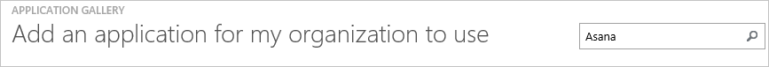
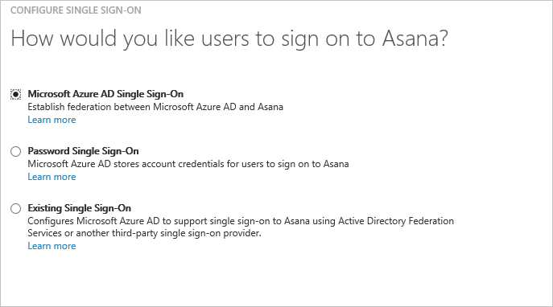
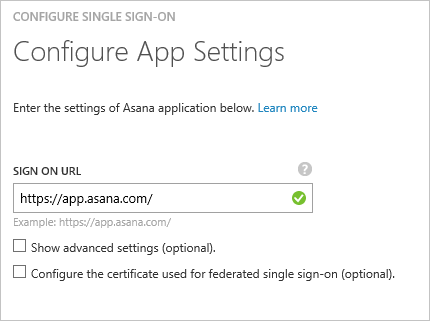
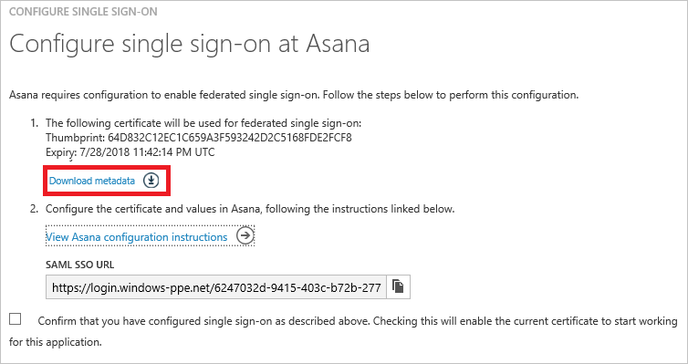
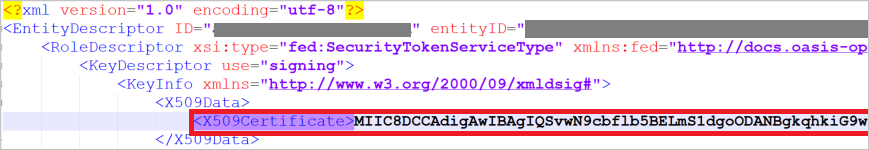
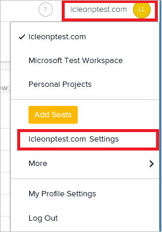
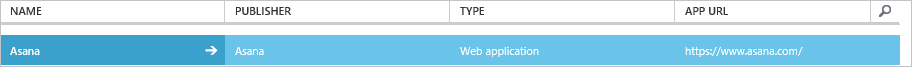

<properties
	pageTitle="Tutorial: Azure Active Directory integration with Asana | Microsoft Azure"
	description="Learn how to configure single sign-on between Azure Active Directory and Asana."
	services="active-directory"
	documentationCenter=""
	authors="jeevansd"
	manager="femila"
	editor=""/>

<tags
	ms.service="active-directory"
	ms.workload="identity"
	ms.tgt_pltfrm="na"
	ms.devlang="na"
	ms.topic="article"
	ms.date="08/08/2016"
	ms.author="jeedes"/>

# Tutorial: Azure Active Directory integration with Asana

In this tutorial, you learn how to integrate Asana with Azure Active Directory (Azure AD).

Integrating Asana with Azure AD provides you with the following benefits:

- You can control in Azure AD who has access to Asana
- You can enable your users to automatically get signed-on to Asana (Single Sign-On) with their Azure AD accounts
- You can manage your accounts in one central location - the Azure classic portal

If you want to know more details about SaaS app integration with Azure AD, see [What is application access and single sign-on with Azure Active Directory](active-directory-appssoaccess-whatis.md).

## Prerequisites

To configure Azure AD integration with Asana, you need the following items:

- An Azure AD subscription
- A **Asana** single-sign on enabled subscription

> [AZURE.NOTE] To test the steps in this tutorial, we do not recommend using a production environment.

To test the steps in this tutorial, you should follow these recommendations:

- You should not use your production environment, unless this is necessary.
- If you don't have an Azure AD trial environment, you can get a one-month trial [here](https://azure.microsoft.com/pricing/free-trial/).

## Scenario description
In this tutorial, you test Azure AD single sign-on in a test environment. 
The scenario outlined in this tutorial consists of two main building blocks:

1. Adding Asana from the gallery
2. Configuring and testing Azure AD single sign-on

## Adding Asana from the gallery
To configure the integration of Asana into Azure AD, you need to add Asana from the gallery to your list of managed SaaS apps.

**To add Asana from the gallery, perform the following steps:**

1. In the **Azure classic portal**, on the left navigation pane, click **Active Directory**. 

	![Active Directory][1]

2. From the **Directory** list, select the directory for which you want to enable directory integration.

3. To open the applications view, in the directory view, click **Applications** in the top menu.

	![Applications][2]

4. Click **Add** at the bottom of the page.

	![Applications][3]

5. On the **What do you want to do** dialog, click **Add an application from the gallery**.

	![Applications][4]

6. In the search box, type **Asana**.

	

7. In the results pane, select **Asana**, and then click **Complete** to add the application.

	

##  Configuring and testing Azure AD single sign-on
In this section, you configure and test Azure AD single sign-on with Asana based on a test user called "Britta Simon".

For single sign-on to work, Azure AD needs to know what the counterpart user in Asana is to a user in Azure AD. In other words, a link relationship between an Azure AD user and the related user in Asana needs to be established.
This link relationship is established by assigning the value of the **user name** in Azure AD as the value of the **Username** in Asana.

To configure and test Azure AD single sign-on with Asana, you need to complete the following building blocks:

1. **[Configuring Azure AD Single Sign-On](#configuring-azure-ad-single-single-sign-on)** - to enable your users to use this feature.
2. **[Creating an Azure AD test user](#creating-an-azure-ad-test-user)** - to test Azure AD single sign-on with Britta Simon.
4. **[Creating an Asana test user](#creating-an-Asana-test-user)** - to have a counterpart of Britta Simon in Asana that is linked to the Azure AD representation of her.
5. **[Assigning the Azure AD test user](#assigning-the-azure-ad-test-user)** - to enable Britta Simon to use Azure AD single sign-on.
5. **[Testing Single Sign-On](#testing-single-sign-on)** - to verify whether the configuration works.

### Configuring Azure AD single Sign-On

The objective of this section is to enable Azure AD single sign-on in the Azure classic portal and to configure single sign-on in your Asana application.

**To configure Azure AD single sign-on with Asana, perform the following steps:**

1. In the menu on the top, click **Quick Start**.

	![Configure Single Sign-On][6]
2. In the classic portal, on the **Asana** application integration page, click **Configure single sign-on** to open the **Configure Single Sign-On**  dialog.

	![Configure Single Sign-On][7] 

3. On the **How would you like users to sign on to Asana** page, select **Azure AD Single Sign-On**, and then click **Next**.
 	
	

4. On the **Configure App Settings** dialog page, perform the following steps: 

	

    a. In the **Sign On URL** textbox, type a URL using the following pattern: `https://app.asana.com`

	c. Click **Next**.

5. On the **Configure single sign-on at Asana** page, Click **Download metadata**, and then save the file on your computer. Also, copy the value for SAML SSO URL.
	
	

8. Open the metadata file and locate the tag **<X509Certificate\>**. Copy and save the content inside the tag. This is the X.509 certificate, we will need it later to configure SSO with Asana.

	

6. In a different browser window, sign-on to your Asana application. To configure SSO in Asana, access the workspace settings by clicking on the workspace name on the top right corner of the screen. Then, click on **<your workspace name\> Settings**. 

	

7. On the **Organization settings** window, click **Administration**. Then, click **Members must log in via SAML** to enable the SSO configuration.

	

8. Paste the value you have copied for SAML Sign on URL into the Sign-in page URL textbox and the X.509 Certificate you have copied from the metadata file into the X.509 Certificate textbox.

9. Click **Save**. Go to [Asana guide for setting up SSO](https://asana.com/guide/help/premium/authentication#gl-saml) if you need further assistance.

7. Go to **Configure single sign-on at Asana** page in Azure AD, select the single sign-on configuration confirmation, and then click **Next**.
	
	![Azure AD Single Sign-On][10]

8. On the **Single sign-on confirmation** page, click **Complete**.  
  	
	![Azure AD Single Sign-On][11]

### Creating an Azure AD test user
In this section, you create a test user in the classic portal called Britta Simon.

![Create Azure AD User][20]

**To create a test user in Azure AD, perform the following steps:**

1. In the **Azure classic portal**, on the left navigation pane, click **Active Directory**.
	
	 

2. From the **Directory** list, select the directory for which you want to enable directory integration.

3. To display the list of users, in the menu on the top, click **Users**.
	
	 

4. To open the **Add User** dialog, in the toolbar on the bottom, click **Add User**.

	 

5. On the **Tell us about this user** dialog page, perform the following steps:
 
	 

    a. As Type Of User, select New user in your organization.

    b. In the User Name **textbox**, type **BrittaSimon**.

    c. Click **Next**.

6.  On the **User Profile** dialog page, perform the following steps:

	 

    a. In the **First Name** textbox, type **Britta**.  

    b. In the **Last Name** textbox, type, **Simon**.

    c. In the **Display Name** textbox, type **Britta Simon**.

    d. In the **Role** list, select **User**.

    e. Click **Next**.

7. On the **Get temporary password** dialog page, click **create**.

	 

8. On the **Get temporary password** dialog page, perform the following steps:

	 

    a. Write down the value of the **New Password**.

    b. Click **Complete**.   

### Creating an Asana test user

In this section, you create a user called Britta Simon in Asana.

1. On **Asana**, go to the **Teams** section on the left panel. Click the plus sign button. 

	 

2. Type the email britta.simon@contoso.com in the textbox and then select **Invite**.
3. Click **Send Invite**. The new user will recceive an email into her email account. She will need to create and validate the account.

### Assigning the Azure AD test user

In this section, you enable Britta Simon to use Azure single sign-on by granting her access to Asana.

![Assign User][200] 

**To assign Britta Simon to Asana, perform the following steps:**

1. On the classic portal, to open the applications view, in the directory view, click **Applications** in the top menu.

	![Assign User][201] 

2. In the applications list, select **Asana**.

	 

1. In the menu on the top, click **Users**.

	![Assign User][203] 

1. In the All Users list, select **Britta Simon**.

2. In the toolbar on the bottom, click **Assign**.

	![Assign User][205]

### Testing single sign-on

The objective of this section is to test your Azure AD single sign-on.

Go to Asana login page. In the Email address text box insert the email address britta.simon@contoso.com. Leave the password text box in blank and then click **Log In**. You will be redirected to Azure AD login page. Complete your Azure AD credentials. Now, you are logged in on Asana.

## Additional resources

* [List of Tutorials on How to Integrate SaaS Apps with Azure Active Directory](active-directory-saas-tutorial-list.md)
* [What is application access and single sign-on with Azure Active Directory?](active-directory-appssoaccess-whatis.md)

<!--Image references-->

[1]: ./media/active-directory-saas-asana-tutorial/tutorial_general_01.png
[2]: ./media/active-directory-saas-asana-tutorial/tutorial_general_02.png
[3]: ./media/active-directory-saas-asana-tutorial/tutorial_general_03.png
[4]: ./media/active-directory-saas-asana-tutorial/tutorial_general_04.png

[5]: ./media/active-directory-saas-asana-tutorial/tutorial_general_05.png
[6]: ./media/active-directory-saas-asana-tutorial/tutorial_general_06.png
[7]:  ./media/active-directory-saas-asana-tutorial/tutorial_general_050.png
[10]: ./media/active-directory-saas-asana-tutorial/tutorial_general_060.png
[11]: ./media/active-directory-saas-asana-tutorial/tutorial_general_070.png
[20]: ./media/active-directory-saas-asana-tutorial/tutorial_general_100.png

[200]: ./media/active-directory-saas-asana-tutorial/tutorial_general_200.png
[201]: ./media/active-directory-saas-asana-tutorial/tutorial_general_201.png
[203]: ./media/active-directory-saas-asana-tutorial/tutorial_general_203.png
[204]: ./media/active-directory-saas-asana-tutorial/tutorial_general_204.png
[205]: ./media/active-directory-saas-asana-tutorial/tutorial_general_205.png
